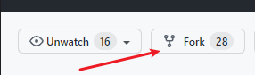
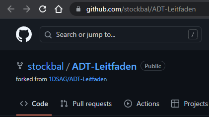
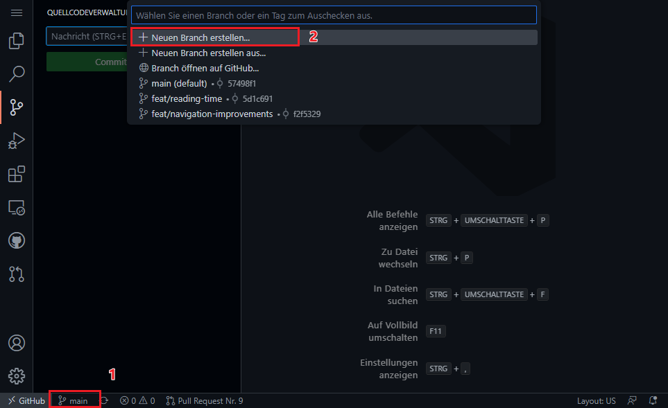
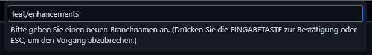
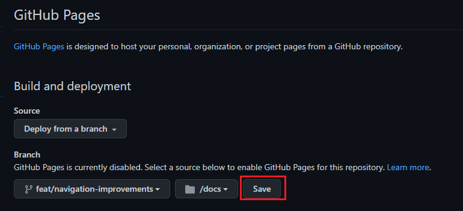

# DSAG's ADT-Leitfaden


dies ist nicht der Leitfaden selbst (dieser ist über <https://1dsag.github.io/ADT-Leitfaden> erreichbar), sondern das zugehörige Repository mit Anweisungen wie man zum Leitfaden beitragen kann.

Der DSAG ADT Leitfaden ist ein lebendiges Dokument 👨‍💻 - es lebt von und mit seiner Community 🥳.

Der Leitfaden ist in `markdown` (Variante `kramdown`) geschrieben und wird mittels `jekyll` in `GitHub Pages` (<https://1dsag.github.io/ADT-Leitfaden>) bereit gestellt.

## Inhalte

- [DSAG's ADT-Leitfaden](#dsags-adt-leitfaden)
  - [Inhalte](#inhalte)
  - [Erste Schritte](#erste-schritte)
    - [Schnellstart mit GitHub Web-Editor](#schnellstart-mit-github-web-editor)
    - [Entwicklung mit Docker-Container](#entwicklung-mit-docker-container)
      - [Installationsschritte für Docker Container](#installationsschritte-für-docker-container)
    - [Lokale Installation](#lokale-installation)
      - [Vorbedingungen für Windows](#vorbedingungen-für-windows)
      - [Installationsschritte für Lokale Installation](#installationsschritte-für-lokale-installation)
  - [Mitwirken](#mitwirken)
  - [Lizenzierung](#lizenzierung)

## Erste Schritte

### Schnellstart mit GitHub Web-Editor

:point_right: Keine Lokale Installation  
:point_right: Alles im Browser  
:point_right: Vorschau nach jedem Commit

----

Der [webbasierte Editor](https://docs.github.com/de/codespaces/the-githubdev-web-based-editor) ist eine IDE, die vollständig in Ihrem Browser ausgeführt wird. Mit dem webbasierten Editor können Sie durch Dateien und Quellcode-Repositories von GitHub navigieren und Codeänderungen vornehmen und übertragen. Sie können jedes Repository, jeden Fork und jede Pull-Anfrage mit dem Editor öffnen.
Außerdem können Sie Markdown-Dateien während der Bearbeitung in der Vorschau anzeigen.
Dies macht den Einstieg sehr einfach, da keine lokale Installation erforderlich ist.
Sie können das Endergebnis nicht sofort sehen, aber auch das kann GitHub für Sie generieren.

1. Fork erstellen  
   
2. Navigieren Sie zu dem erstellten Fork  
   
3. Drücken sie `.` auf Ihrer Tastatur um in die IDE zu wechseln
4. Erstellen Sie einen neuen Branch  
   
5. Vergeben Sie einen Namen für den Branch  
   
6. Fangen sie an zu schreiben  
   Im Ordner `/docs` ist der Inhalt des Leitfadens abgespeichert. Ändern Sie einfach den Inhalt einer bestehenden Markdown-Seite (`.md`-Datei) oder erstellen Sie ein neues Unterkapitel.
7. Vorschau der Seite  
   Sie können sich die finale Seite auch auf GitHub ansehen.

   Wechseln Sie einfach in die Einstellungen Ihres Repositories und dann auf `Pages`.
   Der Link dahin setzt sich wie folgt zusammen <https://github.com/YOURUSERNAME/ ADT-Leitfaden/settings/pages>.
   Wählen Sie Ihren Branch aus auf dem Sie gerade arbeiten und wählen Sie den `docs` Ordner.
   Nachdem Sie gespeichert haben, dauert es ein paar Minuten bis die Seite unter der angegeben URL erreichbar ist.
   Von da an wird die Seite nach jedem Commit neu erzeugt.  

   

### Entwicklung mit Docker-Container

:point_right: Nur Visual Studio Code und Docker werden benötigt  
:point_right: Sofortige Vorschau ihrer Änderungen

----

Dies ist der einfachste Weg, um Ihre Entwicklungsumgebung in kürzester Zeit bereitzustellen.
Sie erhalten einen gebrauchsfertig konfigurierten Debian-Container, der von Visual Studio Code transparent verwendet wird.

#### Installationsschritte für Docker Container

Install the following programs:

- [Visual Studio Code](https://code.visualstudio.com/)
- [Remote Containers Extension](https://marketplace.visualstudio.com/items?itemName=ms-vscode-remote.remote-containers)
- [Docker](https://code.visualstudio.com/docs/remote/containers)

Klonen Sie das Repository mit dem Befehl command _[Remote-Containers: Clone Repository in Container Volume...](https://code.visualstudio.com/docs/remote/containers-advanced#_use-clone-repository-in-container-volume)_

Dadurch werden die folgenden Aufgaben ausgeführt:

- Klonen des Repositories in einem Container-Volume
- Erzeugung des Docker Abbilds
- Starten des Docker Containers und Zuweisung der die erforderlichen Ports
- Mounten des erstellten Container Laufwerks
- Installation der benötigten `npm` Pakete
- Installation der benötigten `ruby` gems

Jetzt müssen Sie nur noch die Konsole in Visual Studio Code öffnen (sie ist mit dem laufenden Entwicklungscontainer verbunden), in den Ordner `docs` navigieren und den Entwicklungsserver starten:

```shell
cd docs
bundle exec jekyll serve --livereload
```

### Lokale Installation

:point_right: Genau wie Docker Container  
:point_right: Vollständige Kontrolle über Entwicklungsumgebung

----

#### Vorbedingungen für Windows

- <https://chocolatey.org/> installieren
- MSYS2 mit Chocaletey installieren  
  `choco install msys2` <https://chocolatey.org/packages/msys2>
- Ruby installieren  
  `choco install ruby` <https://chocolatey.org/packages/ruby>
- Build Toolchain aktualisieren:  
  `ridk install 3`
- Siehe auch [GitHub Pages-Website lokal mit Jekyll testen](https://docs.github.com/de/pages/setting-up-a-github-pages-site-with-jekyll/testing-your-github-pages-site-locally-with-jekyll)

#### Installationsschritte für Lokale Installation

- Stellen Sie sicher dass `ruby` 2.7 auf Ihrem System installiert ist
- Klonen Sie das Repository
- Wechseln Sie in den Root-Ordner der Seite  
  `$ cd docs`
- Führen Sie den Befehl `bundle install` im Terminal aus, um alle notwendigen Pakete für Jekyll und GitHub Pages zu installieren
- Starten Sie die lokale `gh-pages` Instanz, einschließlich des Live-Reloads des Webbrowsers

  ```shell
    bundle exec jekyll serve --livereload
    Configuration file: /Users/you/ADT-Leitfaden/docs/_config.yml
                Source: /Users/you/ADT-Leitfaden/docs
           Destination: /Users/you/ADT-Leitfaden/docs/_site
     Incremental build: disabled. Enable with --incremental
          Generating...
           Jekyll Feed: Generating feed for posts
                        done in 0.233 seconds.
     Auto-regeneration: enabled for '/Users/you/ADT-Leitfaden/docs'
     LiveReload address: http://127.0.0.1:35729
        Server address: http://127.0.0.1:4000/
      Server running... press ctrl-c to stop.
  ```

- Öffnen Sie die URL <http://localhost:4000> in Ihrem bevorzugten Webbrowser

## Mitwirken

Alle Informationen über den Entwicklungsprozess und bewährte Verfahren für die Erstellung von Inhalten finden Sie unter [Mitwirken](contributing.md)

## Lizenzierung

Dieses Projekt verwendet die CC BY 4.0 [Lizenz](LICENSE).
