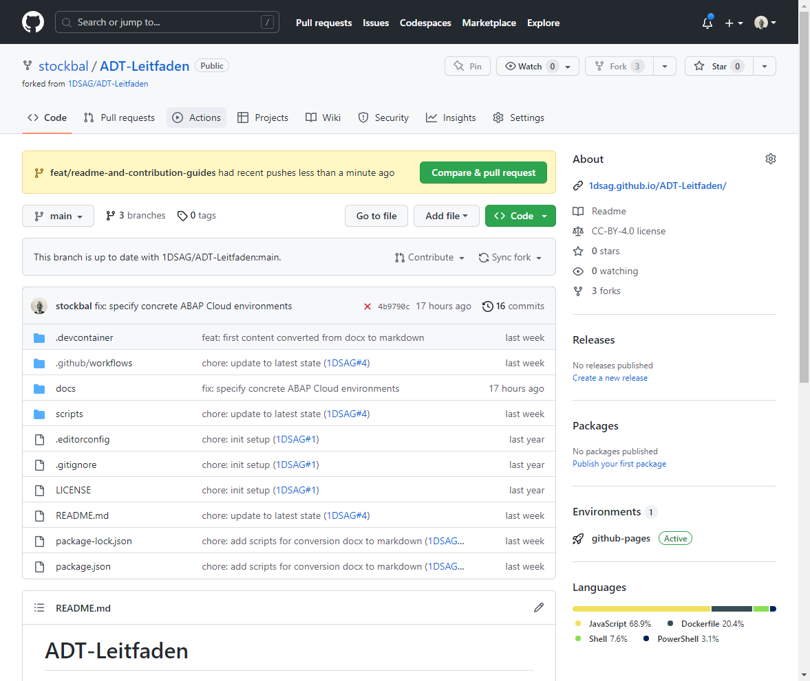
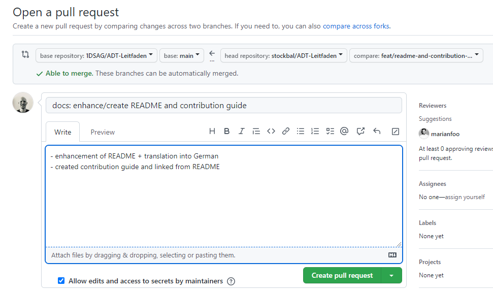
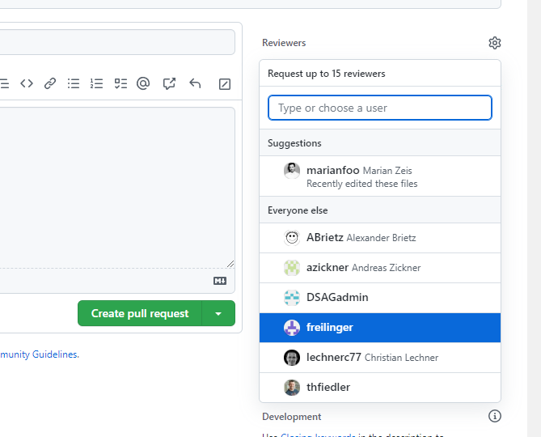
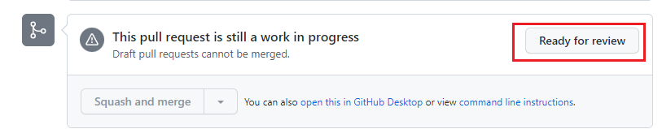

# Inhaltsverzeichnis

- [Inhaltsverzeichnis](#inhaltsverzeichnis)
  - [Allgemeine Tips](#allgemeine-tips)
  - [Inhalte erstellen](#inhalte-erstellen)
    - [Struktur eines Kapitels](#struktur-eines-kapitels)
    - [Metadaten einer Seite](#metadaten-einer-seite)
    - [Bilder hinzufügen](#bilder-hinzufügen)
  - [Mitwirken](#mitwirken)
    - [Wie verwendet man Pull-Requests in GitHub](#wie-verwendet-man-pull-requests-in-github)

## Allgemeine Tips

- Bitte **lesen Sie diesen Leitfaden sorgfältig**, damit am Anfang nichts schief geht. Wenn Sie Fragen haben oder etwas unklar ist, können Sie uns gerne kontaktieren, damit wir diese Anleitung verbessern können.

- Seien Sie nicht schüchtern mit neuen Inhalten. Sie werden mindestens eine Rückmeldung erhalten, wenn Sie Ihre PR überprüfen. Hier wird der Inhalt nach und nach aufgebaut.

- Committen Sie oft, wenn etwas funktioniert und ein Schritt in die richtige Richtung ist, machen Sie einen Commit oder Pull-Requests (PR). Auf diese Weise können andere Mitwirkende die Änderungen sehen, und das Risiko von Konflikten beim Zusammenführen wird minimiert.

- Machen Sie sich keine Sorgen, wenn Sie auf Probleme stoßen. Wir sind eine Gemeinschaft und werden Ihnen auf jeden Fall helfen.

- Wenn Sie Inhalte von SAP oder von anderen Seiten verwenden, geben Sie dies bitte deutlich an.

## Inhalte erstellen

Hier folgt eine kurze Beschreibung um Inhalte im Leitfaden zu erstellen

### Struktur eines Kapitels

Jedes Kapitel des Leitfadens befindet sich in einem extra Unterordner unter dem Ordner `docs`.

```markdown
   /docs
     |-- working-with-adt 
        |-- img  (Bilder für Kapitel)
           |-- bild1.png
           |-- ....
        |-- index.md (Startseite des Kapitels)
        |-- features
           |-- index.md (Startseite eines Unterkapitels)
           |-- abap-doc.md (Seite eines Unterkaptitels)
```

- `index.md` &rarr; Diese Datei ist in jedem Kapitel-/Unterkapitelordner zu finden und stellt die Startseite eines Kapitels da

### Metadaten einer Seite

Es gibt verschiedene Metadaten (siehe [Front Matter](https://jekyllrb.com/docs/front-matter/)) mit denen verschiedene Aspekte einer Seite beeinflußt werden können.

| Einstellung  | Beschreibung                                                                                                     |
| ------------ | ---------------------------------------------------------------------------------------------------------------- |
| layout       | Das Standard Layout für eine Seite ist `page`                                                                    |
| title        | Der Titel der Seite. Dieser wird in der seitlichen Navigationsleiste und in der Breadcrumbs-Navigation angezeigt |
| permalink    | Der permanente Link einer Seite. Er muss zwischen 2 Slashes stehen und kleingeschrieben sein.<br/>               |
| has_children | `true` oder `false`. Gibt an ob die Seite Unterseiten besitzt                                                    |
| nav_order    | Gibt die Reihenfolge an wo die Seite in der Navigationsleiste angezeigt werden soll                              |
| parent       | Bezeichnung der übergeordneten Seite (`title`-Attribut) falls die Seite eine Unterseite ist                      |
| grand_parent | Bezeichnung der übergeordneten Seite in der 3. Stufe - siehe `parent`                                            |

Außerdem gibt es noch die folgenden Einstellungen für die Navigation im Fußbereich einer Seite, um zur nächsten bzw. voherigen Kapitel navigieren zu können.

| Einstellung     | Beschreibung                                                                             |
| --------------- | ---------------------------------------------------------------------------------------- |
| next_page_link  | `permalink` auf die nächste Seite                                                        |
| next_page_title | Titel der nächsten Seite. Kann vom Wert des `title`-Attributes der Zielseite abweichen   |
| prev_page_link  | `permalink` auf die vorherige Seite                                                      |
| prev_page_title | Titel der vorherigen Seite. Kann vom Wert des `title`-Attributes der Zielseite abweichen |

Beispiel:

```text
---
layout: page
title: ABAP Views
parent: Funktionen von ADT
grand_parent: Arbeiten mit ADT
permalink: /working-with-adt/features/abap-views/
prev_page_link: /working-with-adt/features/other-object-types/
prev_page_title: Andere Objekttypen
next_page_link: /working-with-adt/features/refactoring/
next_page_title: Refactoring
nav_order: 5
---
```

### Bilder hinzufügen

Jedes Kapitel hat seinen eigenen Unterordner.
Für Bilder muss ein extra Unterordner mit dem Namen `img` angelegt werden (z.B. <https://github.com/1DSAG/ADT-Leitfaden/tree/main/docs/plug-ins>).

Für Bilder sollte außerdem immer eine Bildunterschrift hinzugefügt werden. Über Markdown funktioniert das folgendermaßen:

```markdown
  

Einstieg in die globalen Einstellungen
{: .img-caption}
```

Sollen kleinere Bilder (siehe 1. Absatz im Kapitel [Debugger](docs/troubleshooting/debugger.md)) direkt im Absatz eingefügt werden, sollte die folgende Syntax verwendet werden

```markdown
Wechsel in die Debugging-Perspektive <span class="inline-img"></span>.
```

## Mitwirken

### Wie verwendet man Pull-Requests (PR) in GitHub

Siehe [Schnellstart mit GitHub Web](README.md#schnellstart-mit-github-web-editor).  
Nachdem Sie nun Ihre Änderungen gepusht haben folgt nun die Aufgabe einen PR zu erstellen damit die Änderungen in den Haupt-Branch im Originalrepository aufgenommen werden können.

1. Erstellen Sie einen neuen PR  
   

2. Verwenden Sie eine sprechende Nachricht für den PR  
     
   wenn möglich bzw. zutreffend, verweisen sie auf einen Issue in Ihrem PR (<https://docs.github.com/en/free-pro-team@latest/github/managing-your-work-on-github/linking-a-pull-request-to-an-issue#linking-a-pull-request-to-an-issue-using-a-keyword>)

3. Fügen Sie einen Reviewer zu Ihrem PR hinzu  
   

4. Gibt es noch Änderungsbedarf nachdem Sie Ihren PR erstellt haben?  
   Kein Problem, erstellen Sie einfach zusätzliche Commits auf Ihrem Branch und pushen Sie diese  
   &rarr; der PR wird automatisch aktualisiert  
   &rarr; stellen Sie den PR auf `draft` bis er bereit für ein Review ist (dann ändern Sie den Status auf `ready for review`)  
   

5. Wurde das PR-Review erfolgreich beendet?  
   Der PR wird dann von einem der Maintainer gemerged und es ist Zeit für 🎉
