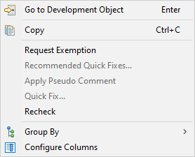

Autoren: [Florian Henninger, Peter Luz, Dominik Panzer, Björn Schulz, Sven Treutler, Armin Junge, Jörg Brandeis, Wolfgang Wöhrle]{.underline}

**Kapitelstatus:** "In Arbeit"

Review von Sebastian am 11/12.01.23 auf alle Kapitel

*(zum Beispiel "Nicht gestartet" \| "In Arbeit" \| "Fertig zum Review" \| "Review durchgeführt von x am y" \| "Review eingearbeitet am y" \| "Finaler Zustand" \|*

*\<was aus eurer Sicht sinnvoll erscheint, evtl. Unterkapitel nennen, falls ihr die Arbeit verteilt\> )*

# Inhaltsverzeichnis

**[Inhaltsverzeichnis](#inhaltsverzeichnis) 2**

**[Inhalt des Kapitels](#inhalt-des-kapitels) 4**

**[Einführung: Grundlagen der Arbeit mit ADT (Peter, DONE)](#einführung-grundlagen-der-arbeit-mit-adt-peter-done) 5**

> [Der Einstieg in das Arbeiten mit den ABAP Development Tools](#der-einstieg-in-das-arbeiten-mit-den-abap-development-tools) 5
>
> [Der Umstieg von der formularbasierten zur textorientierten Code-Erstellung](#der-umstieg-von-der-formularbasierten-zur-textorientierten-code-erstellung) 5
>
> [Kontext des hier gezeigten Übungsbeispiel:](#kontext-des-hier-gezeigten-übungsbeispiel) 6
>
> [Verbinden des Entwicklungssystems - Neues Projekt](#verbinden-des-entwicklungssystems---neues-projekt) 6
>
> [Das Erstellen einer Klasse im Textmodus](#das-erstellen-einer-klasse-im-textmodus) 9
>
> [Definition einer Methode in der Klasse](#definition-einer-methode-in-der-klasse) 12
>
> [Automatische Ergänzung und Formatierung des Codes](#automatische-ergänzung-und-formatierung-des-codes) 14
>
> [Implementierung der Methode](#implementierung-der-methode) 15
>
> [Quick Fix Funktionalität](#quick-fix-funktionalität) 15
>
> [Umbenennung von Parametern - Refactoring](#umbenennung-von-parametern---refactoring) 18

**[Funktionen von ADT](#funktionen-von-adt) 22**

> [Arbeiten mit Working Sets im Project Explorer](#arbeiten-mit-working-sets-im-project-explorer) 24
>
> [Suche und Navigation (Björn, DONE)](#suche-und-navigation-björn-done) 27
>
> [Objekte suchen](#objekte-suchen) 27
>
> [Objekte filtern](#objekte-filtern) 28
>
> [Navigation](#navigation) 30
>
> [ABAP Repository Tree anzeigen](#abap-repository-tree-anzeigen) 30
>
> [Code-Template (Björn, DONE)](#code-template-björn-done) 31
>
> [Template View](#template-view) 31
>
> [Template verwenden](#template-verwenden) 32
>
> [Template anlegen](#template-anlegen) 32
>
> [Verfügbarkeit von Templates](#verfügbarkeit-von-templates) 33
>
> [Dokumentation mit den ABAP Doc (Peter, DONE)](#dokumentation-mit-den-abap-doc-peter-done) 33
>
> [Was sind ABAP Doc?](#was-sind-abap-doc) 33
>
> [Nutzung der Quick Fixes zur Erstellung von ABAP Doc](#nutzung-der-quick-fixes-zur-erstellung-von-abap-doc) 35
>
> [Weitergehende Informationen zum ABAP Doc](#weitergehende-informationen-zum-abap-doc) 35
>
> [Übergreifende Features](#übergreifende-features) 35
>
> [Project Explorer (Björn, DONE)](#project-explorer-björn-done) 35
>
> [Favorite Packages](#favorite-packages) 36
>
> [Transport Organizer (Björn, DONE)](#transport-organizer-björn-done) 37
>
> [Feed Reader (Armin, DONE)](#feed-reader-armin-done) 38
>
> [Ausführen von Sourcecode (Dominik, DONE)](#ausführen-von-sourcecode-dominik-done) 39
>
> [Verwendungsnachweis / Where-Used List (Dominik, DONE)](#verwendungsnachweis-where-used-list-dominik-done) 42
>
> [Quick Fixes (Dominik, DONE)](#quick-fixes-dominik-done) 43
>
> [Teilen von ADT Links (Dominik, DONE)](#teilen-von-adt-links-dominik-done) 44
>
> [Element Info (Dominik, DONE)](#element-info-dominik-done) 46
>
> [Data Preview (Armin, DONE)](#data-preview-armin-done) 48
>
> [Versionsverwaltung und vergleichen (Jörg, DONE )](#versionsverwaltung-und-vergleichen-jörg-done) 50
>
> [Local History - Die lokale Versionsverwaltung](#local-history---die-lokale-versionsverwaltung) 50
>
> [Revision History - Die Versionsverwaltung des ABAP](#revision-history---die-versionsverwaltung-des-abap) 51
>
> [Anderer Projektname - Systemübergreifend vergleichen](#anderer-projektname---systemübergreifend-vergleichen) 51
>
> [Comparison View](#comparison-view) 51
>
> [Refactoring von Code mit ADT (Dominik, DONE)](#refactoring-von-code-mit-adt-dominik-done) 53
>
> [Quelltextformatierung aka. Pretty Printer (Jörg, Review Björn DONE)](#quelltextformatierung-aka.-pretty-printer-jörg-review-björn-done) 55
>
> [Einstellung des ABAP Formatters](#einstellung-des-abap-formatters) 55
>
> [Andere Objekttypen](#andere-objekttypen) 56
>
> [Programme und Funktionsgruppen (Jörg, DONE )](#programme-und-funktionsgruppen-jörg-done) 56
>
> [ABAP Editor](#abap-editor) 57
>
> [ABAP Views](#abap-views) 57
>
> [Outline (Björn, DONE)](#outline-björn-done) 57
>
> [ABAP Type Hierarchy (Armin, DONE)](#abap-type-hierarchy-armin-done) 58
>
> [ABAP Unit (Armin, DONE)](#abap-unit-armin-done) 59
>
> [ABAP Coverage (Armin, DONE)](#abap-coverage-armin-done) 61
>
> [ATC und Exemption (Björn DONE)](#atc-und-exemption-björn-done) 62
>
> [ABAP Language Help (Jörg, Review Florian)](#abap-language-help-jörg-done) 64
>
> [Der ABAP Language Help View](#der-abap-language-help-view) 65
>
> [Application Help (Wolfgang W., DONE)](#application-help-wolfgang-w.-done) 66
>
> [Properties (Dominik, DONE)](#properties-dominik-done) 69
>
> [Problems (Dominik, DONE)](#problems-dominik-done) 71
>
> [Bookmarks (Dominik, DONE)](#bookmarks-dominik-done) 73
>
> [Core Data Services (Jörg, DONE )](#core-data-services-jörg-done) 75
>
> [Element Info für CDS](#element-info-für-cds) 77
>
> [CDS Navigator (Jörg, DONE )](#_d6z3kiesux7z) 77
>
> [Dependency Analyzer (Jörg, DONE )](#dependency-analyzer-jörg-done) 78
>
> [Active Annotations (Jörg, DONE )](#active-annotations-jörg-done) 80

# Inhalt des Kapitels

Die ABAP Development Tools bieten sehr viele Funktionen, die auch entsprechend zahlreiche Möglichkeiten der Nutzung bieten. Dies kann für Entwickler, die noch nicht mit den ADT vertraut sind, verwirrend sein.

Der erste Schritt ist immer der schwerste.

Zu Beginn dieses Kapitels möchten wir dem Einsteiger den Start in die ADT Welt am Beispiel der Erstellung einer Klasse erleichtern. Die hier gezeigte Vorgehensweise lässt sich dann auf andere Entwicklungsobjekte übertragen und der Einstieg ist geschafft.

Die weiteren Funktionalitäten werden im darauf folgenden Abschnitt übersichtsartig beschrieben und es werden Hinweise gegeben und Best Practices erläutert, wie die zahlreichen Werkzeuge und auch Hilfen in der täglichen Arbeit eingesetzt werden und einen Mehrwert bieten können.

Neben den ADT-Einsteigern werden aber auch in ADT erfahrene Entwickler viele nützliche Hinweise und vielleicht auch Neues für die tägliche Arbeit mit den ABAP Develop Tools finden.

Mit dem [[SAP - ABAP Development User Guide]{.underline}](https://help.sap.com/docs/ABAP_PLATFORM_NEW/c238d694b825421f940829321ffa326a/4b190c90ceba4d02a99e0a2286b89358.html), im Folgenden User-Guide bezeichnet, stellt SAP die offizielle Dokumentation zu den ADT zur Verfügung. Für weitergehende Informationen zu einzelnen Funktionen sind die Links zu dem entsprechenden Abschnitt im User Guide vermerkt.

# 

#  

#  

# Einführung: Grundlagen der Arbeit mit ADT (Peter, DONE)

## Der Einstieg in das Arbeiten mit den ABAP Development Tools

Dieser Abschnitt richtet sich an Entwickler, die bisher noch nicht mit den ADT gearbeitet haben und die ersten Schritte gehen möchten.\
Im ADT User Guide von SAP befindet sich im Abschnitt "[[Getting Started]{.underline}](https://help.sap.com/docs/ABAP_PLATFORM_NEW/c238d694b825421f940829321ffa326a/12bdb73f7f6a4bfe95540b31af29ac10.html)" ein Abschnitt zum Einstieg in ADT, in dem alle Funktionen ausführlich erläutert werden.\
In diesem Leitfaden möchten wir mittels einer Schritt-für-Schritt Beschreibung zur Erstellung einer ABAP Klasse den Einstieg so leicht wie möglich gestalten und die Vorteile der Nutzung der ABAP Development Tools aufzeigen.

Folgende Arbeitsschritte werden hierbei Schritt für Schritt beschrieben:

-   Einrichtung des Projekts

-   Einrichtung der Favoriten-Pakete

-   Erstellung einer Klasse mit einer Methode

-   Arbeiten am Code und Refactoring

Zum Zweck der generellen Nachvollziehbarkeit werden die hier gezeigten Beispiele in einer Instanz des BTP Trial Accounts dargestellt, diese können aber in gängigen On-Premise Systemen problemlos angewendet werden.

Entwickler, die bereits den Einstieg geschafft haben und sich einen Überblick über die einzelnen Funktionen verschaffen möchten oder detaillierte Arbeitshinweise suchen, können diesen Abschnitt überspringen.

## Der Umstieg von der formularbasierten zur textorientierten Code-Erstellung

Im Gegensatz zu den SAP GUI basierten Transaktionen wie SE80 oder SE24, findet sich in ADT kein formularbasierter Editor. Die Erstellung von Klassen (und auch Funktionsbausteinen etc.) erfolgt in ADT rein textbasiert. Für Entwicklungswerkzeuge, die abhängig von ADT und Backend-Version noch nicht in Eclipse zur Verfügung stehen, kann aus Eclipse auf diese Transaktionen integriert zugegriffen werden.

Gewöhnungsbedürftig ist auch der Tausch der Tasten F2 + F3. Während im SAP-GUI die F3 Taste als Zurück Taste verwendet wird, dient die F3 Taste in den ADTs zur Vorwärtsnavigation, die F2 Taste zur kontextsensitiven Hilfe.

Dies stellt für den Einstieg mitunter auch die größte Hürde dar, da lang eingeübte Praxis und gewohnte Arbeitsprozesse sich mit dem Umstieg auf ADT ändern. Und wenn es schnell gehen soll, greift man gerne auf gewohnte und bestens vertraute Arbeitsweisen zurück.

Der Einstieg und die Umstellung erfordert also erstmal Zeit und Bedarf der Einübung. Doch der anfängliche Mehraufwand zahlt sich bereits nach kurzer Zeit wieder aus. Denn nach etwas Eingewöhnung und Übung stellen die beschriebenen Punkte kein Problem mehr dar.

Die zahlreichen Funktionen, die die ABAP Development Tools bieten, erleichtern das Schreiben und Überarbeiten von ABAP Code und erhöhen damit die Effizienz beim Entwickeln.

Daher sollte der Umstieg von SE80 & Co. auf ADT in Eclipse als ein persönliches Investment in eine effiziente und zukunftsfähige Arbeitsweise betrachtet werden.

## Kontext des hier gezeigten Übungsbeispiel:

Das hier gezeigte Beispiel ist bewusst einfach gewählt, da vorrangig die grundlegenden Funktionen und Arbeitsweisen der ADT dargestellt werden sollen.

Wir möchten eine kleine Klasse anlegen, die folgende Funktionen anbietet:

1.  Ermittlung von Flügen aus der Tabelle ***/DMO/FLIGHT*** gemäß Eingabe.

2.  Berechnung der verfügbaren Plätze des Fluges.

3.  Berechnung des Flugpreises auf Basis einer zusätzlichen prozentualen Gebühr.

Die Klasse dient als interne Service-Klasse und bietet keine UI bzw. Ausgabe von Daten an.

Dabei werden die grundlegenden Arbeitsweisen und meistgenutzten Funktionen gezeigt, die zum Effizienzgewinn während der Code-Erstellung und Änderung führen.

## Verbinden des Entwicklungssystems - Neues Projekt

Ein Entwicklungssystem wird in den ADT in Form eines Projekts dargestellt. Um ein Entwicklungssystem mit den ADT zu verknüpfen, müssen wir daher ein neues Projekt anlegen.

In einer neuen Installation von ADT wird ein neues Projekt über

**File → New → ABAP Projekt angelegt.**

{width="4.942708880139983in" height="4.019070428696413in"}

*Erstellung eines ABAP Projekts in Eclipse (File: ADT-New_Project.png)*

Bei Anlage eines ABAP Projekts für On-Premise Systeme wird die Liste der im SAP Logon verknüpften Systeme angezeigt. Die Login-Daten sind zu hinterlegen, sofern kein SSO verwendet wird und im letzten Schritt kann dem Projekt noch ein sprechender Name vergeben werden. Als Default ist die Sprache Englisch gewählt, diese muss ggf. angepasst werden.

Das neu erstellte Projekt und damit das verbundene Entwicklungssystem, wird im sogenannten **[[Projektexplore]{.underline}](#project-explorer-björn-done)r** dargestellt.

{width="4.09375in" height="2.3854166666666665in"}

*Der Project Explorer (File: 22-11-project_explorer.png)*

Der Project Explorer ist der zentrale Einstiegspunkt und Objektkatalog, nachdem das entsprechende Entwicklungssystem geöffnet wurde. Die Objekte werden basierend auf den Paketen in hierarchischer Form dargestellt, wie man es bereits aus der SE80 kennt. In der täglichen Arbeit werden die zu bearbeitenden Objekte hieraus geöffnet.

Der Hauptarbeitsbereich ist der Knoten "[**[Favorite Packages]{.underline}**](https://help.sap.com/docs/ABAP_PLATFORM_NEW/c238d694b825421f940829321ffa326a/4ec55bf96e391014adc9fffe4e204223.html)". Um das Paket zu den Favorite Packages hinzuzufügen, in das die zu erstellende Klasse eingefügt werden soll, führen Sie den Befehl "Add Package" mittels des Kontextmenüs aus.

{width="6.5in" height="5.722222222222222in"}

*Hinzufügen von Packages zu den Favoriten (File: project explorer02.png)*

## Das Erstellen einer Klasse im Textmodus 

Zur [**[Erstellung einer neuen ABAP Klasse]{.underline}**](https://help.sap.com/docs/ABAP_PLATFORM_NEW/c238d694b825421f940829321ffa326a/4ec66fda6e391014adc9fffe4e204223.html) navigieren Sie im Project Explorer in das gewünschte Paket, erreichen das Kontextmenü mittels der rechten Maustaste und finden dort den Befehl

**New → ABAP Class**

{width="6.5in" height="3.4444444444444446in"}*Erstellen einer neuen ABAP Klasse im Projekt Explorer (File: 22_11_new_class_01.png)*

Es öffnet sich ein Fenster, in dem die Daten der Klasse angegeben werden können/müssen.

{width="5.463542213473316in" height="4.991642607174104in"}

*Eigenschaftsdialog: Erstellung ABAP Klasse (File: 22-11-new_class_form_01.png)*

Hier können bei Bedarf bereits die Super-Klasse und zu referenzierende Interfaces angegeben werden. Dies kann aber auch später textbasiert direkt im Quellcode erfolgen. Es öffnet sich nach Klick auf "Next" das Fenster zur Auswahl bzw. Anlage des Transportauftrages.

{width="6.5in" height="5.930555555555555in"}

*Transportauftragsdialog (File: 22-11-class_TR.png)*

Nach Klick auf "Finish" wird die Klasse angelegt und diese findet sich sowohl im Project Explorer im Objektbaum, als auch im Quellcode-Editor auf der rechten Seite der ADT.

{width="6.5in" height="5.305555555555555in"}

*Anzeige der neuen Klasse in den ADT (File: 22-11-complete_class_01)*

Alle weiteren Operationen an der Klasse werden nun im Quellcode durchgeführt, d.h. alle Typen, Datendefinitionen und Methoden werden textbasiert als Quellcode in der Klasse geschrieben. Dies erscheint anfangs kompliziert und ungewohnt, die ADTs bieten aber einige Funktionen an, die die Ausarbeitung der Klasse sehr effizient gestaltet.

## Definition einer Methode in der Klasse 

Nun möchten wir die erste Methode der Klasse erstellen, die Daten aus der Tabelle /DMO/FLIGHTS liest und die Anzahl der freien Plätze zu einem definierten Flug ausgibt.

Wir beschränken uns hier nur auf die Kernfunktionalitäten und werden keine zusätzlichen Funktionen für Output etc. bereitstellen.

Eine ABAP-Klasse ist in ADT in die Hauptbereiche "Definition" und "Implementierung" aufgeteilt. Dementsprechend werden wir für unsere erste Methode zuerst im Bereich "Definition" die Methode mit ihren Parametern definieren und anschließend die Implementierung mit dem Quellcode durchführen. Die sogenannte "Quick fix" Funktion wird uns dabei Tipparbeit ersparen.

Um eine Methode zu erstellen, navigiert man im Reiter/Tab "Global Class" in den Bereich

CLASS \<c*lassname\>* DEFINITION

und platziert den Cursor in den Sichtbarkeitsbereich der Klasse, in der die Methode zur Verfügung steht. In unserem Fall soll die Methode für andere Verwender sichtbar sein und daher im Bereich PUBLIC definiert werden. Die Definition der Methode wird mit dem Schlüsselwort METHODS eingeleitet.

{width="6.5in" height="5.305555555555555in"}

*Bearbeiten der Klasse (File: 22-11-class_error_01.png)*

Bereits zu diesem Zeitpunkt zeigt sich einer der Hauptvorteile von ADT gegenüber der SE80. Sobald Code eingeben wurde, läuft automatisch der Syntax Check und zeigt an, ob der Code syntaktisch korrekt ist.

Da der Abschlusspunkt nicht vorhanden ist, zeigt ADT sowohl im linken Balken einen Hinweis (als Hover Message), als auch die View Problems den Syntax Fehler an. Ein extra auszuführender Syntax Check ist nicht erforderlich. Nur eine Kleinigkeit, die in der täglichen Arbeit eine signifikante Effizienzsteigerung bedeutet. Spätestens wenn man aus diversen Gründen eine Änderung in den GUI-basierten Tools vornimmt, wird man diese Funktion vermissen.

## Automatische Ergänzung und Formatierung des Codes

Wir schließen die Methodendefinition mit Erstellung der Parameter und des Abschlusspunkts ab. Durch die Nutzung der Code-Completion wird uns die Arbeit dabei sehr erleichtert. Dazu geben wir jeweils nur die ersten zwei bis drei Buchstaben des gewünschten Schlüsselwortes an. Die Tastenkombination **STRG+LEERTASTE** zeigt uns die passenden Schlüsselworte an. Diese können daraufhin mittels TAB + "Pfeiltasten" aus der Vorschlagsliste ausgewählt werden. Zur weiteren Automatisierung der Code-Erstellung bietet sich die Nutzung von Templates an (s. Abschnitt [[Code Template]{.underline}](#code-template-björn-done) ...... )

{width="5.182292213473316in" height="4.378310367454068in"}

*Beispiel Code Completion für den Import Parameter (File: 22-11-class_importing.png)*

Nachdem die Importparameter und der Return-Parameter definiert sind, wird der Cursor im Textbereich des Codes positioniert und die Formatierung des Codes mittels des Kontextmenüs\
**Rechte Maustaste → Source Code → Format** bzw. der Tastenkombination\
**Shift-F1\
a**usgeführt. Dies entspricht dem Pretty Printer in den GUI-Transaktionen. Anschließend wird der Code mittels**\
STRG+S**\
gespeichert.

Sollte ein Syntaxfehler vorliegen, zeigt das Problem View und die farbliche Markierung im Code den Fehler an. Ist der Code syntaktisch korrekt, kann das Artefakt anschließend mittels **STRG+F3** aktiviert werden.

Nach Einübung der neuen, vor allem tastatur-basierten, Arbeitsweise entsteht nach kurzer Zeit ein Automatismus, der nach dem Schreiben einiger Codezeilen und anschließender Abfolge der o.g. Tastenkombinationen einen formatierten, geprüften und gesicherten Code als Ergebnis hat. Zeitraubende Überraschungen in Form von Syntaxfehlern beim Aktivieren, wie es in den GUI Tools vorkommen kann, bleiben dadurch erspart.

## 

## Implementierung der Methode

Die Methode ist nun definiert, aufgrund der fehlenden Implementierung zeigt ADT im Problems View folgenden Fehler an:\
"Implementation missing for method \"CALC_FREE_SEATS_FOR_FLIGHT\".

Dieses "Problem" lässt sich sehr effizient mit Hilfe der Quick Fixes beheben.

## Quick Fix Funktionalität

Zur Methodenimplementierung, nutzen Sie die "[**[Quick Fix]{.underline}**](https://help.sap.com/docs/ABAP_PLATFORM_NEW/c238d694b825421f940829321ffa326a/4ec5668b6e391014adc9fffe4e204223.html)" Funktion, die sich über das Kontextmenü oder die Tastenkombination **STRG+1** aufrufen lässt.

{width="6.5in" height="5.5in"}

*Nutzung des Quick Fix zur Methodenimplementierung (File: 22_11_impl_method_qf_01.png)*

Sie wählen "Add Implementation for .." aus und bestätigen mit ENTER. Zum Ausführen der Quickfix-Befehle sollte der Code gespeichert und fehlerfrei sein, da manche Quick Fixes (automatische Code-Korrekturen / Refactorings) dies als Voraussetzungen haben.

Die Methodenimplementierung bedeutet hier, dass automatisiert die Sektion

> **METHOD**
>
> **ENDMETHOD**

im Bereich der "Class Implementation\" durch ADT erstellt wird und somit eine leere Methodenimplementierung vorhanden ist. Die Ausprägung der Methodenlogik innerhalb dieses Bereiches ist dann Ihre Aufgabe als Entwickler.

Zwischen Definition und Implementierung kann einfach durch Drücken der F3 Taste hin- und her gesprungen werden.

Mit Platzierung des Cursors auf den Methodenname und "F2" kann man sich die Parameter der Methoden anzeigen lassen. Dies erleichtert das Schreiben des Codes und erspart umständliches Navigieren in den Definitionsbereich. Alternativ steht hierfür die View [**["ABAP Element Info]{.underline}**](https://help.sap.com/docs/ABAP_PLATFORM_NEW/c238d694b825421f940829321ffa326a/a8c361f8cc6040f79f52375fb6a9d333.html?q=abap%20element%20inf#loiof7c8d6d10279483ebb625e2e3e31c3d0)" zur Verfügung.

In unserem Übungsbeispiel verwenden wir die Import-Parameter, um mittels eines SELECT-Befehl den gewünschten Datensatz zu lesen. Anschließend werden die Anzahl der freien Sitze kalkuliert und als Returning-Parameter an den Verwender zurückgegeben.

Auch hier hilft die Verwendung der Code Completion, die mit der Tastenkombination "STRG+LEERTASTE" aufgerufen wird, um den Code effizient und frei von Tippfehlern zu erstellen.

Um den Returning-Parameter "r_f_free_seats" nicht ausschreiben zu müssen und Typinformationen zu bekommen, schreiben wir die Struktur und den Komponentenseperator "-" und bekommen mittels der Tastenkombination STRG+Leertaste die Komponenten angezeigt, die dann ausgewählt und in den Code eingefügt werden können.

{width="6.109375546806649in" height="4.706557305336833in"}

*Auswahl der Komponente mittels Code Completion (File: 22-11-impl_meth_get_comp.png)*

Diese Möglichkeiten der Vorwärtsnavigation und Inline-Anzeige weitergehender Elementinformationen sind in dieser Form in SE80 nicht vorhanden und ein weiterer Baustein zur Steigerung des Effizienten Entwickelns in ADT.

Wir haben damit die Klasse mit der ersten Methode in ADT definiert und implementiert.

## Umbenennung von Parametern - Refactoring

Die laufende Optimierung von bestehenden Code ist eine wichtige Aufgabe jedes Entwicklers. Dies wird von ADT bestens unterstützt. Die verschiedenen Möglichkeiten des Refactoring werden im Abschnitt: [[Refactoring von Code mit ADT (Dominik, REVIEWED Peter 091122)]{.underline}](#refactoring-von-code-mit-adt-dominik-done) ausführlich erläutert. Weitere Informationen finden sich auch im [**[User Guide]{.underline}**](https://help.sap.com/docs/ABAP_PLATFORM_NEW/c238d694b825421f940829321ffa326a/4ec859406e391014adc9fffe4e204223.html)

Wir möchten die generelle Vorgehensweise des Refactorings anhand einer Umbenennung im Detail darstellen.

Gewohnheitsgemäß haben wir die ungarische Notation verwendet und möchten nun die Parameter der Methode umbenennen, um die Präfixe zu entfernen (vgl. ABAP-Clean Code - [[https://github.com/SAP/styleguides/blob/main/clean-abap/CleanABAP.md]{.underline}](https://github.com/SAP/styleguides/blob/main/clean-abap/CleanABAP.md)).

Während eine solche Aktion sich im SAP GUI Umfeld u.U. sehr aufwändig und fehleranfällig gestalten kann, bietet hier die Rename Funktion in ADT eine sehr komfortable Möglichkeit, die Umbenennungen von Variablen, Parametern und Methodennamen über alle Verwendungen durchzuführen. Das bedeutet, dass in allen Entwicklungsobjekten, welche die Methode aufrufen, die Parameter automatisiert umbenannt werden. Eine aufwendige Suche nach Verwendern über den Verwendungsnachweiß entfällt. Dies funktioniert aber natürlich nur, wenn keine dynamischen Methodenaufrufe verwendet werden. Solche Fälle kann ADT nicht erkennen.

Somit sind Code-Cleaning und Refactoring mit ADT sehr effizient durchzuführen und das Risiko von dadurch entstehenden Fehlern ist gegenüber der manuellen Methode deutlich reduziert.

Zur Umbenennung der Parameter wird die Rename Funktion aus dem Kontextmenü über Rechte Maustaste -\> Source Code -\> Rename oder die Tastenkombination

ALT + SHIFT + R oder per Quickfix Auswahl über

STRG + 1

ausgeführt.

{width="6.380208880139983in" height="5.386476377952756in"}*Umbenennung von Methodenparametern (File: 22-11-class_rename_param_01.png)*

Zuerst muss der Code gespeichert werden. Falls dies nicht erfolgt ist, erscheint eine Abfrage zum Speichern, die bestätigt werden muss.

{width="4.733614391951006in" height="1.3341852580927385in"}

*Abfragedialog zum Speichern des Code (File: 2023_01_Save_flight.png)*

Es erscheint eine Dialogbox zur Eingabe des Parameternamens

{width="6.270833333333333in" height="3.0625in"}

*Eingabe neuer Parametername (File: 2023_01_new_name.png )*

Sofern das Objekt bereits einem Transport zugeordnet ist, kann mit **"Finish"** die Umbenennung direkt durchgeführt werden.\
Mit **"Next"** können weitere optionale Einstellungen, wie der zu verwendende Transport und die Aktivierungsoption, vorgenommen werden.

{width="6.270833333333333in" height="3.0625in"}

*Auswahl des Transports und Optionen (File: 2023_01_TR_and_Activate.png)*

Vor der finalen Durchführung kann eine Vorschau auf die Änderung angezeigt werden.{width="6.5in" height="4.583333333333333in"}

*Vorschau der Umbenennung (File: 22-11-rename_preview )*

Nach Klick auf **"Finish"** sind sowohl die Parameter in der Definition, die Verwendung in der Methode, als auch die Parameternamen an den Stellen, an denen die Methode verwendet wird, passend abgeändert.Die hier gezeigte Umbenennung funktioniert analog in gleicher Weise für Variablen, Methoden und sogar Klassennamen.

Somit zeigt sich hier ein sehr starker Vorteil gegenüber den SAP GUI basierten Entwicklungswerkzeugen, in denen eine objektübergreifende Umbenennung nicht automatisiert möglich ist.

Damit sind die ersten Schritte gemacht, die grundlegenden Funktionen und Arbeitsweisen in ADT sind bekannt und können nun angewendet werden.\
Somit ist die erste Hürde genommen und die Basis für die Anwendung der zahlreichen Funktionen der ABAP Development Tools, die in den folgenden Abschnitten detailliert erläutert werden, geschaffen.

# Funktionen von ADT

Der vorige Abschnitt dient vor allem dem Einstieg in die Arbeitsweise und dem Entwickeln mit den ABAP Development Tools in Eclipse. Der Abschnitt Funktionen widmet sich vorrangig der Beschreibung der zahlreichen Features und der Vermittlung von Best Practices im Umgang mit ADT im täglichen Arbeiten.

Nachdem ADT erfolgreich eingerichtet und ein Projekt, d.h. eine Verbindung zu einem Netweaver On Premise oder eine ABAP Cloud Environment in der SAP BTP hergestellt wurde, kann mit der Entwicklung begonnen werden. In den nachfolgenden Kapiteln bieten wir einen Überblick über die Möglichkeiten, welche die ADT bei der Entwicklung von neuen Objekten und auch bei der Erweiterung / Überarbeitung ("Refactoring") von bestehenden Objekten bietet.

\*\* \* \*\* LOGISCHE SORTIERUNG der Funktionen \*\*\* definition logische sortierung noch zu erledigen! \*\*\*

Workspaces

Als Hauptebene der Arbeitsstrukturierung und Ablage der Eclipse- und ADT Konfiguration dienen die sogenannten Workspaces.

Beim ersten Start von Eclipse erscheint die Abfrage in Welchem Verzeichnis der Workspaces abgelegt werden soll.

{width="6.4375in" height="2.8541666666666665in"}

Bild: Abfrage des Workspace Verzeichnis (file: 2023_02_workspace_initial.png)

Eine Möglichkeit, wie die Verzeichnisstruktur gestaltet sein kann, findet sich in Kap. 3 ....

In diesem Verzeichnis werden zahlreiche Konfigurationseinstellungen abgelegt. Dies sind z.B.

-   Die Projekte und damit zugreifbaren SAP-Systeme,

-   Welche Favorite Packages in den Projekten verwendet werden

-   welche Perspektiven verwendet werden,

-   Welche Sichten und Objekte geöffnet sind

Zusätzlich werden weitere Einstellungen wie das generelle Layout und andere zahlreiche Konfigurationseinstellungen im Workspace abgelegt.

Wer mit einem Workspace auskommt, kann den Haken bei "Use this as default ..." anklicken, damit zukünftig dieser Workspace ohne Nachfrage verwendet wird. Diese Einstellung ist in den Einstellungen jederzeit änderbar.

Für die meisten Fälle ist ein Workspace ausreichend. Arbeiten Sie in mehreren Projekten mit unterschiedlichen Systemlinien oder mit unterschiedlichen Kunden, können die Workspaces helfen, die jeweils genutzte Systemumgebung übersichtlich zu halten und für jede Situation die effizienteste Konfiguration zur Verfügung zu haben.

Falls Bedarf besteht einen neuen Workspace zu erstellen oder zu wechseln, wird mittels

**File → Switch Workspace**

Entweder ein vormals geöffneter Workspace aus der Liste ausgewählt oder mittels

**File → Switch Workspace → Other**

Der Workspace Dialog aufgerufen

{width="5.401042213473316in" height="5.084534120734908in"}

Bild: Wechseln des Workspace (File: 2023_02-change_Ws.png)

{width="6.4375in" height="4.208333333333333in"}

Bild: der Workspace Dialog (File: 2023_02-WS-Dialog.png)

Wenn Sie einen neuen Workspace anlegen möchten, geben sie im Feld Workspace einen neuen Namen ein. Dadurch wird nach Klick auf Launch ein neuer Workspace mit den aktuellen Einstellungen angelegt. Welche Settings aus dem Quell Workspace übernommen werden sollen, legen Sie mittels der Copy Settings fest.

Alternativ können Sie hier einen der angezeigten Workspaces unter REcent Workspaces direkt über das Anklicken der blau hinterlegten Links aufrufen.

## Arbeiten mit Working Sets im Project Explorer

Wenn Sie als Entwickler mit mehreren Systemlinien arbeiten, empfehlen wir die Verwendung der Working Sets. Diese ermöglichen es, Projekte in Eclipse zu gruppieren und somit mehrere Systeme übersichtlich darzustellen.

Über das 3 Punkte Icon in der rechten oberen Ecke des "Project Explorer" finden sich diverse Einstellungsmöglichkeiten. Unter anderem können hier die Working Sets erstellt und konfiguriert werden.

{width="5.098958880139983in" height="2.7129068241469816in"}

Working Sets Einstellungen (File: 22-11-Working_sets_setting)

Über den Dialog können nun Working Sets angelegt (New) werden und die Zuordnungen erfolgen (Edit).

{width="3.0364588801399823in" height="3.55330271216098in"}

*Anlage und Bearbeitung der Working Sets (File: 22-11-Working_sets_edit.png)*

Über den Edit Button können im Folge-Dialog die gewünschten Projekte dem Working Set zugeordnet werden.

{width="4.687425634295713in" height="4.494792213473316in"}

*Zuordnung Projekt zu Working Set (File: 22-11-Working_sets_assign.png)*

Diese Funktion ermöglicht eine übersichtliche Strukturierung der Systeme nach Systemlandschaft oder ggf. nach Projekt bzw. Kunde.

Abschließend muss noch die Anzeige der Top Level Elements auf Working Sets eingestellt werden.

{width="3.7239588801399823in" height="2.8944510061242346in"}

*Einstellung der Projekt Explorer Anzeige (File: 22-11-Working_sets_display.png)*

{width="4.010416666666667in" height="1.53125in"}

*Darstellung Projekte in Working Sets (File: 22-11-Working_sets_in_pe.png)*

## Suche und Navigation (Björn, DONE)

Die Suche nach Objekten in Eclipse ist zentraler Bestandteil der täglichen Arbeit, ebenso wie die Navigation zwischen den Objekten oder auch die Vorwärtsnavigation. In diesem Abschnitt erfahren Sie mehr über die Suche und Navigation zwischen ABAP Objekten.

### Objekte suchen

Um ein Objekt im System zu suchen bzw. zu öffnen, können Sie den Dialog "Open ABAP Development Object" nutzen, den man über die Tastenkombination "STRG + SHIFT + A" erreicht.

{width="3.8125in" height="5.072916666666667in"}

Im Dialog haben sie die Möglichkeit, im oberen Teil das ABAP Projekt zu ändern und damit zu entscheiden, auf welchem System sie nach dem Objekt suchen möchten. Wurde im Suchfeld nichts eingegeben, erhalten sie eine Historie der zuletzt geöffneten Objekte. Über das *Fragezeichen* im unteren Bereich erhalten Sie weitere Informationen, Tipps und Tricks zur Nutzung der Suche. Detaillierte Informationen zur Objektsuche finden sie im [**[ADT- User Guide]{.underline}**](https://help.sap.com/docs/ABAP_PLATFORM_NEW/c238d694b825421f940829321ffa326a/4ec7eed86e391014adc9fffe4e204223.html)

### Objekte filtern

In der Objektsuche haben Sie nun die Möglichkeit, mit Suchstrings und Pattern zu arbeiten, um die Ergebnismenge weiter einzuschränken. Das Feld unterstützt den "Content Assist" (STRG + Leertaste), um weitere Einschränkungen und Filter zu verwenden. Eine einfache Suche könnte wie folgt aussehen:

{width="3.46875in" height="2.1041666666666665in"}

Allerdings werden mehr als 50 Ergebnisse (Standardeinstellung) angezeigt und wahrscheinlich ist das gewünschte Ergebnis nicht mit in der Ergebnismenge erhalten. In diesem Fall können Sie den "Content Assist" aufrufen, um weitere Optionen zum Filtern zu erhalten.

{width="3.15625in" height="1.25in"}

Wenn Sie zum Beispiel nun auf Tabellentypen einschränken möchten, dann würden Sie weiter nach dem Typ ("TYPE") einschränken. Der "Content Assist" schlägt weiterhin auch die verschiedenen Typen von Objekten vor, sodass Sie auch den Tabellentyp (TTYP) finden.

{width="3.46875in" height="2.09375in"}

Die weiteren Filter und Typen können frei miteinander kombiniert werden, um die gewünschte Zielmenge oder das Zielobjekt zu finden. Mit einem Doppelklick auf den gewünschten Eintrag wird das Objekt dann im Editor angezeigt.

Um die Suche zu beschleunigen, empfiehlt es sich, den Typ des gewünschten Objektes vorzugeben, da sonst die Suche - verglichen mit der gewohnten Geschwindigkeit in der SE80/SE11/etc. sehr lange dauert.

### Navigation

In der ABAP-Workbench funktioniert die [**[Navigation]{.underline}**](https://help.sap.com/docs/ABAP_PLATFORM_NEW/c238d694b825421f940829321ffa326a/ec2da130ce43409fbb2f6a072f9ba07c.html) zum nächsten Objekt über einen Doppelklick auf den entsprechenden Ausdruck im Quellcode. In Eclipse wird hier lediglich der Quelltext markiert. Um die Vorwärtsnavigation auszulösen gibt es drei Möglichkeiten:

-   Cursor auf dem Objekt platzieren, F3 drücken

-   Mit gedrückter STRG Taste das Objekt anklicken

-   In der Oberfläche wird ein klickbarer Link angeboten (z.B. Datenelement → Domäne)

Das Objekt wird in einem neuen Tab innerhalb des Editors geöffnet, das Quellobjekt bleibt weiterhin geöffnet und Sie können zwischen den zuletzt geänderten Objekten sehr einfach über die Tastenkombinationen navigieren:

-   Alt + Pfeil rechts - Vorwärts

-   Alt + Pfeil links - Rückwärts

Dies kann analog auch mit den Pfeiltasten im Bereich der Drucktastenleiste durchgeführt werden. Im Bereich der Drucktastenleiste gibt es dafür auch verschiedene Optionen, um zum letzten verwendeten Tab (ALT + Pfeil Links) zu gelangen.

{width="1.3125in" height="0.3125in"}

### ABAP Repository Tree anzeigen

Nachdem Sie ein Objekt gefunden haben, möchten Sie in vielen Fällen in diesem Paket weiter arbeiten oder recherchieren. Dazu können Sie sich den Objektbaum laden lassen, indem Sie im "Project Explorer" den doppelten Pfeil ("Link with Editor") aktivieren.

{width="3.6979166666666665in" height="0.2708333333333333in"}

In diesem Fall wird die Pakethierarchie zu dem im Editor fokussierten Objekt geladen. Im Anschluss können Sie im "Project Explorer" über die weiteren Objekte und Strukturen navigieren.

Die Arbeit mit dem Repository Tree ist detailliert im [**[ADT User-Guide beschrieben]{.underline}**](https://help.sap.com/docs/ABAP_PLATFORM_NEW/c238d694b825421f940829321ffa326a/f831fc6e18984a8a864da4c0591e996b.html).

## Code-Template (Björn, DONE)

[**[Code Templates]{.underline}**](https://help.sap.com/docs/ABAP_PLATFORM_NEW/c238d694b825421f940829321ffa326a/4ec116596e391014adc9fffe4e204223.html) sind vorgefertigte Muster an Quellcode, die beliebig in eine Anwendung implementiert werden können. Diese Muster geben statischen Quellcode wieder und besitzen dynamische Elemente in Form von Variablen. In der Standardauslieferung der ADT werden einige Templates ausgeliefert.

### Template View

Templates werden über einen eigenen View zur Verfügung gestellt (Window → Show View → Templates) und können auch über die Einstellungen angepasst werden (General → ABAP Development → Editors → Source Code Editors → ABAP Templates).

{width="6.21875in" height="4.510416666666667in"}

Der View besteht im oberen Bereich aus einer Buttonleiste, einer Liste der Code-Templates und im unteren Teil aus einem Preview des Templates.

### Template verwenden

Das [**[Template]{.underline}**](https://help.sap.com/docs/ABAP_PLATFORM_NEW/c238d694b825421f940829321ffa326a/4ecd257e6e391014adc9fffe4e204223.html) kann direkt im Quellcode verwendet werden. Beginnen Sie den Namen zu tippen und wählen Sie mit Hilfe des "Content Assist" das passende Template aus (hier die ersten beiden Einträge).

{width="6.072916666666667in" height="2.28125in"}

Das gesamte Template wird eingefügt und Sie können damit beginnen, die Platzhalter (Variablen) zu befüllen. Mit dem Tabulator springen Sie zwischen den einzelnen Platzhaltern hin und her.

Häufig verwendete Templates zur Nutzung sind beispielsweise:

-   lcl - Anlage einer lokalen Klasse

-   testClass - Anlage einer Testklasse

-   functionModuleParameter - Beispiel-Schnittstelle für Funktionsbausteine

Die Anlage von eigenen Templates eignet sich sehr gut zur Einsparung von Entwicklungsaufwand bei wiederholenden Aufgaben oder ähnlichen Code-Abschnitten. Weiterhin können sie in Schulungen hilfreich sein, wenn Sie größere Codeabschnitte einfügen möchten, ohne per Copy&Paste zu arbeiten.

### Template anlegen

Ein **Template** kann grundsätzlich mit allen in ABAP verwendeten Sprachbefehlen definiert werden (Quellcode, Kommentare). Variable Teile des Templates können Sie mit Platzhaltern versehen ("\${placeholder}"). Zur Ableitung von kontextspezifischen Informationen stehen auch Variablen zur Verfügung. Diese gibt es für die folgenden Szenarien:

-   Name des Objekts

-   Name des Pakets

-   ID des Systems

-   User, Datum und Uhrzeit

-   Aktuelles Jahr

-   Cursorposition nach dem Einfügen

Gleichnamige Platzhalter werden nach dem Einfügen immer einheitlich angepasst (z.B. der Name der Klasse).

### Verfügbarkeit von Templates

Templates stehen innerhalb eines Eclipse Workspace zur Verfügung, sind im Gegensatz zu eigenen Mustern, aber über Systeme hinweg verfügbar. Templates können über die Einstellungen importiert und exportiert werden, um sie unter Kollegen/Mitarbeitern auszutauschen. Eine zentrale An- und Ablage von Templates für alle Entwickler ist nicht möglich.

## Dokumentation mit den ABAP Doc (Peter, DONE)

### Was sind ABAP Doc?

[**[ABAP Doc]{.underline}**](https://help.sap.com/docs/ABAP_PLATFORM_NEW/c238d694b825421f940829321ffa326a/a7b235922f6944bbaf3b36949e500b12.html) ermöglicht die Code-basierte Dokumentation wie z.B. von Methoden und deren Parametern.

{width="6.5in" height="5.805555555555555in"}

*ABAP Doc Documentation der Methode (File: 2023_01_ABAP_DOC_example.png)*

ABAP Doc ist ein Feature, das nur in den ADT unterstützt wird. Anstatt des formularbasierten Editor mit der Möglichkeit der Kurzbeschreibung von Methoden, der in den ADT nicht mehr verfügbar ist, wurde mit den ABAP Docs ein deutlich mächtigerer Ersatz etabliert, der in ähnlicher Form auch in anderen Programmiersprachen verfügbar ist (z.B. JavaDoc).

Im Folgenden wird für die bessere Lesbarkeit des Texts detailliert auf den Einsatz der ABAP Docs im Kontext von Klassen/Methoden eingegangen. Die ABAP Docs sind aber auch auf andere Entwicklungartefakte wie z.B. Funktionsbausteine anwendbar (s. SAP Hilfe).

Mit Hilfe der ABAP Doc Funktion können für Klassen und deren Methoden textuelle Beschreibungen erfasst werden. Des Weiteren können auch für die einzelnen Parameter und Ausnahmen Beschreibungen in ABAP Doc hinterlegt werden.

Die mit ABAP Doc zu erstellenden Hinweise werden im Bereich der Definition angelegt. Der Mehrwert entsteht aber vor allem durch den einfachen Aufruf dieser Dokumentation durch den Verwender. Dies ist sowohl an der Aufrufstelle als auch im Bereich der Implementierung von Entwicklungsartefakten mittels der Taste F2 möglich.

Zusätzlich können die in ABAP Docs erstellten Texte sogar mittels HTML-Tags formatiert werden. So können die Dokumentationen mit Überschriften oder Textformatierungen angereichert und somit noch ansprechender und strukturierter dargestellt werden.

Um in ABAP Doc erstellte Beschreibungen in die SAP GUI angezeigten Kurztexte zu übernehmen, wird das "[**[syncronized]{.underline}**](https://help.sap.com/docs/ABAP_PLATFORM_NEW/c238d694b825421f940829321ffa326a/8327c3ff3fcb424584636bbc33211d53.html)" Tag verwendet, so dass auch bei Betrachtung mittels SE24/SE80 die Überschriften sichtbar sind.

Dies kann sinnvoll sein falls Objekte Enhancements enthalten die nicht direkt in ADT editiert

werden können und darum die Modifikation noch in den GUI-basierten Tools erfolgen muss.

Eine Mischung von ABAP Doc und GUI-Kurztexten empfehlen wir nicht. Die Nutzung von ABAP Doc ist das Mittel der Wahl um den funktionalen Code von Kommentaren zu entlasten und dem Verwender hilfreiche Hinweise zu den Entwicklungsartefakten zu geben.

### Nutzung der Quick Fixes zur Erstellung von ABAP Doc

Die Erstellung der ABAP Doc ist über den Aufruf der Quick Fixes einfach. Dazu markiert man die Methodendefinition, ruft die Quick Fixes auf und wählt "Add ABAP Doc" aus.

Wurde eine Methodendefinition geändert, z.B. in dem ein Parameter ergänzt wurde, und es ist eine Aktualisierung der Dokumentation erforderlich, kann die ABAP Doc aktualisiert werden, indem hier nicht die Methodensignatur, sondern der ABAP Doc Bereich direkt markiert wird und damit die Quick Fixes aufgerufen werden.

### Weitergehende Informationen zum ABAP Doc

Weitergehende Informationen zu den ABAP Docs finden sich in der offiziellen SAP Hilfe (z.B.)

unter [[ABAP Doc - ABAP-Schlüsselwortdokumentation (sap.com)]{.underline}](https://help.sap.com/doc/abapdocu_750_index_htm/7.50/de-de/abendoccomment.htm) (7.50), in der Beispielklasse CL_DEMO_ABAP_DOC und im **[[ADT User Guide]{.underline}](https://help.sap.com/docs/ABAP_PLATFORM_NEW/c238d694b825421f940829321ffa326a/a7b235922f6944bbaf3b36949e500b12.html).**

## Übergreifende Features 

### Project Explorer (Björn, DONE)

Der [**[Project Explorer]{.underline}**](https://help.sap.com/docs/ABAP_PLATFORM_NEW/c238d694b825421f940829321ffa326a/7135530f575b4f87bff9ae9f0fde4488.html) ist ein zentraler Bestandteil zur Navigation in den eingebundenen Systemen. Sobald Sie ein neues System als "ABAP Project" einbinden, taucht es in der Liste auf. Wenn Sie sich an einem System anmelden und aufklappen, erhalten Sie je nach System weitere Informationen zu freigegebenen Objekten, Favoriten, inaktiven Objekte, etc. Diese "[**[Repository Trees]{.underline}**](https://help.sap.com/docs/ABAP_PLATFORM_NEW/c238d694b825421f940829321ffa326a/c5660c7ea8ae4955bc565a6256ea061d.html)" können frei definiert und angepasst werden. Auf Ebene des Pakets, verhält sich der View wie die SE80 und bildet Objekt-Hierarchien ab, durch die Sie navigieren können.

### Favorite Packages

Für die tägliche Arbeit empfiehlt es sich, Pakete als Favoriten hinzuzufügen, in denen man regelmäßig tätig ist oder die in die persönliche Zuständigkeit fallen. Damit hat man eine gute Übersicht und findet schnell "seine" Objekte.

{width="6.5in" height="5.722222222222222in"}

*Hinzufügen von Packages zu den Favoriten (File: project explorer02.png)*

Für eine Ablage und Organisation von Favoriten auf Objektebene kann das Plugin "ABAP Favorites" empfohlen werden, das über den Plugin Installationsmechanismus in Eclipse installiert werden kann.

S. Kapitel [[Kapitel 7 - Plug-Ins]{.underline}](https://docs.google.com/document/u/0/d/1fKzErsZ4AaeOuU9JjJM585bLN8kMpPn9DDPbXvFywiU/edit)

{width="3.40625in" height="3.0104166666666665in"}

In der Buttonleiste gibt es noch einige nützliche Funktionen mit denen Sie Einstellungen an der View vornehmen können:

-   Doppelpfeil (Link with Editor) - Objekte, die im Editor im Fokus sind, werden im Project Explorer angezeigt, es wird dazu die Hierarchie geladen.

-   Drei Punkte (View Menü) - Weitere Einstellungen der Views, um zum Beispiel Working Sets anzulegen. Hierbei handelt es sich um Ordner, mit denen man Systeme gruppieren kann (siehe Screenshot oben)

### Transport Organizer (Björn, DONE)

Der [**[Transport Organizer]{.underline}**](https://help.sap.com/docs/ABAP_PLATFORM_NEW/c238d694b825421f940829321ffa326a/4ecc6dd96e391014adc9fffe4e204223.html) zeigt eine Übersicht der geöffneten ABAP Projekte. Unter den Systemen finden Sie die aktuellen Transporte im System. In der Standardeinstellung sehen Sie alle eigenen Transporte. Über einen Rechts-Klick auf ein System und den Punkt "Configure Tree ..." können diese Einstellungen überschrieben werden und auch Transporte von anderen Entwicklern eingesehen werden.

{width="6.5in" height="2.2777777777777777in"}

Es stehen alle Funktionen des Transport Organizer (SE09/SE10) aus der SAP GUI zur Verfügung:

-   Doppelklick - Details zu Auftrag/Aufgabe in eigenem View anzeigen

-   Rechts-Klick - Verschiedene Funktionen wie zum Beispiel: Benutzer ändern, Konsistenzprüfung, Freigeben

### Feed Reader (Armin, DONE)

Der [**[Feed Reader]{.underline}**](https://help.sap.com/docs/ABAP_PLATFORM_NEW/c238d694b825421f940829321ffa326a/4ec3b0cd6e391014adc9fffe4e204223.html) kann im Zusammenhang mit ADT genutzt werden, um bestimmte Benachrichtigungen vom SAP System zu erhalten. Standardmäßig werden bei einem ABAP Projekt folgende Benachrichtigungen konsumiert:

-   Laufzeitfehler (Dump) verursacht durch den eigenen User

-   Laufzeitfehler für Objekte, für die der eigene User verantwortlich ist

-   System-Meldungen

Beispiel für einen Laufzeitfehler:

{width="6.5in" height="1.7777777777777777in"}

Beispiel für eine Systemmeldung:

{width="6.5in" height="1.5138888888888888in"}

Über den Button "Add feed..." kann man weitere Benachrichtigungen konsumieren. Welche Art von Benachrichtigung zur Verfügung steht, hängt vom Releasestand des verknüpften SAP Systems ab. Bei den meisten Benachrichtigungen kann man verschiedene Filterkriterien angeben.

Zusätzlich kann man auch einen normalen Atom- oder RSS Feed per URL hinzufügen und somit konsumieren.

Details dazu findet man im [[SAP - ABAP Development User Guide]{.underline}](http://127.0.0.1:65395/help/topic/com.sap.adt.abapdev.guide.doc.user/html/4b190c90ceba4d02a99e0a2286b89358.html) in den Hilfefunktionen von Eclipse. Der Artikel [[Getting Feeds]{.underline}](http://127.0.0.1:65395/help/topic/com.sap.adt.abapdev.guide.doc.user/html/4ec3b0cd6e391014adc9fffe4e204223.html) ist dabei ein guter Einstiegspunkt.

### Ausführen von Sourcecode (Dominik, DONE)

Auch in den ADT kann geöffneter Sourcecode weiterhin komfortabel ausgeführt werden. Über F8 wird eine SAP GUI Instanz des jeweiligen Systems initialisiert und das geöffnete Entwicklungsobjekt ausgeführt. Bei Klassen entspricht dies beispielsweise der Funktion "Testen Klasse X", bei Reports wird normal der Report ausgeführt.

{width="4.65625in" height="3.6666666666666665in"}

{width="5.5625in" height="2.2083333333333335in"}

Soll ein beliebiges Entwicklungsobjekt ausgeführt werden, so kann mit ALT+F8 ein Objekt über den Object Finder gesucht werden. Dabei kann ein beliebiges Projekt ausgewählt werden, d.h. ein an ADT angebundenes SAP System. Dies muss nicht das System sein, in dem gerade entwickelt wird - es kann auch ein Qualitätssicherungssystem sein. Wichtig ist hierbei, dass die ADT-Funktionen für dieses System freigeschaltet sind bzw. die entsprechenden Berechtigungen existieren.

{width="6.5in" height="4.166666666666667in"}

Über den Menüpunkt "Run -\> Run History" stehen zusätzlich Informationen über bereits ausgeführte Objekte zur Verfügung, so dass deren Ausführung komfortabel wiederholt werden kann.

Klassen, die das Interface if_oo_adt_classrun implementieren, können ebenfalls direkt über F9 als [**[Konsolen-Applikation]{.underline}**](https://help.sap.com/docs/ABAP_PLATFORM_NEW/c238d694b825421f940829321ffa326a/520a4e84024b4a96b3793775bf9e6844.html) ausgeführt werden und erzeugen somit Output in der Console.

Reports, die eine Write-Ausgabe erzeugen, können über F9 ausgeführt werden. Die WRITE-Ausgabe wird dann ebenfalls in die Konsole umgeleitet.

{width="4.802083333333333in" height="7.166666666666667in"}

### Verwendungsnachweis / Where-Used List (Dominik, DONE)

Der [**[Verwendungsnachweis]{.underline}**](https://help.sap.com/docs/ABAP_PLATFORM_NEW/c238d694b825421f940829321ffa326a/4ecc9bf86e391014adc9fffe4e204223.html) findet alle statischen Verwendungen eines Entwicklungsobjektes im Sourcecode des aktuellen Projektes. Der Verwendungsnachweis ist über die Tastenkombination **STRG+SHIFT+G** (Get Where Used List) erreichbar. Das Ergebnis wird im Reiter "Search" dargestellt:

{width="4.885416666666667in" height="2.125in"}

Durch die Verwendung der Filter-Funktion mit Hilfe des Filter-Icons kann hierbei auf Pakete, Objekttypen und Benutzer eingeschränkt werden. Auch hier kann per **STRG+SPACE** die automatische Vervollständigung genutzt werden, um Objekte schneller zu finden.

{width="5.3125in" height="3.2604166666666665in"}

Über "STRG + ." und "STRG + ," lassen sich die Fundstellen komfortabel browsen, d.h. die jeweils nächste oder vorherige Fundstelle anzeigen.

### Quick Fixes (Dominik, DONE)

Quick Fixes sind automatisierte Lösungen für gängige Probleme im Rahmen der Softwareentwicklung mit ABAP. Quick Fixes werden dabei nativ durch die ADT angeboten, können aber auch durch verschiedene PlugIns erweitert werden. Die Verwendung durch die Vielzahl der verfügbaren Quick Fixes macht das Arbeiten mit den ADT wesentlich effizienter als mit der SE80. Zusätzlich wird das Risiko von Fehlern durch manuelle Anpassungen reduziert. Die ADT erledigen die Anpassungen automatisiert und immer identisch.

Quick Fixes liefern Funktionen für zwei Bereiche:

-   Automatisches Anlegen von nicht vorhandenen Objekten (z.B. Methoden-Implementierungen)

-   Automatisches Verändern von bestehenden Objekten ohne Veränderung der Funktionalität (sog. Refactoring, z.B. "Methode extrahieren")

{width="6.5in" height="1.7638888888888888in"}

Aufgrund der Vielzahl an Quick Fixes und der ständigen Änderungen in diesem Bereich, werden die einzelnen Quick Fixes hier nicht beschrieben. Ein Überblick ist in der [[Dokumentation zu finden.]{.underline}](https://help.sap.com/docs/ABAP_PLATFORM_NEW/c238d694b825421f940829321ffa326a/ce178e5425364f51994f2c7f634cb56c.html)

### Teilen von ADT Links (Dominik, DONE)

Im Entwickler Alltag kommt es oft vor, dass gemeinsam über Code gesprochen werden muss (z.B. bei Reviews) oder ein Problem in einem Stück Coding gefunden wird, welches in der Verantwortung einer anderen entwickelnden Person liegt (kein Shared Code Ownership). Oft heißt es dann "Kannst du mal bitte in der Klasse *XYZ Methode ABC Zeile 1203* schauen... Ich glaube, da ist ein Bug?". Der andere Entwickler muss aufwändig durch die IDE navigieren, bis er die erwähnte Stelle findet.

ADT bietet die Möglichkeit, einen Link zu versenden, der den Empfänger direkt an die passende Code-Stelle führt, wenn er auf diesen klickt. Hierzu muss ein Bereich im Source Code markiert und dann im Kontextmenü "Share Link" ausgewählt werden.

{width="3.5208333333333335in" height="8.354166666666666in"}

{width="5.666666666666667in" height="2.1770833333333335in"}

Der entsprechend generierte Link kann dann an den Kollegen per Mail versendet oder in die Zwischenablage kopiert und beispielsweise über ein Chatprogramm versendet werden. Man hat die Auswahl zwischen HTTP Link und ADT Link. HTTP Links werden direkt im Browser geöffnet, ADT Links verzweigen in die ADT (Eclipse).

Aufbau eines ADT Links (URI):

*adt://\<System\>/sap/bc/adt/oo/classes/\<Klasse\>/source/\<Methode\>#start=18,0*

Mehr Details sind im [[SAP ADT User Guide]{.underline}](https://help.sap.com/docs/ABAP_PLATFORM_NEW/c238d694b825421f940829321ffa326a/4ec63adf6e391014adc9fffe4e204223.html) zu finden.

### Element Info (Dominik, DONE)

Über die Positionierung des Cursors auf einem Objekt und dem Shortcut F2 erscheint ein Popup mit Zusatzinformationen. Hier am Beispiel einer Methode und eines Datenelements:

{width="6.5in" height="1.5416666666666667in"}

{width="6.5in" height="1.6944444444444444in"}

In der [**[Element Info]{.underline}**](https://help.sap.com/docs/ABAP_PLATFORM_NEW/c238d694b825421f940829321ffa326a/4ec724ce6e391014adc9fffe4e204223.html) sind somit direkt Details ersichtlich, für die man in der alten Welt noch im System navigieren musste. Zusätzlich lässt sich im Element Info weiter navigieren, um Details tieferer Ebenen zu sichten, z.B. die hinterlegte Domäne etc.

Die ABAP Element Info existiert auch als eigenständige View. Diese kann über das Menü Windows -\> Show View -\> ABAP Element Info aktiviert werden. Danach wird über "[**[Link with Selection]{.underline}**](https://help.sap.com/docs/ABAP_PLATFORM_NEW/c238d694b825421f940829321ffa326a/4ec5bb496e391014adc9fffe4e204223.html)" {width="0.25in" height="0.21875in"} bei jedem Klick auf ein relevantes Entwicklungsobjekt automatisch dessen Element Info sowie die Dokumentation aus ABAP Doc angezeigt:

{width="6.5in" height="6.361111111111111in"}

Über "Pin this view" {width="0.22916666666666666in" height="0.22916666666666666in"} wird die Information dauerhaft angezeigt, auch wenn auf ein anderes Element geklickt oder die Element Info per F2 für ein anderes Entwicklungsobjekt geöffnet wird.

### Data Preview (Armin, DONE)

Die View [**[Data Preview]{.underline}**](https://help.sap.com/docs/ABAP_PLATFORM_NEW/c238d694b825421f940829321ffa326a/2fd1241b187b4d6c989e1ff8b1f00ba1.html) kann man nutzen, um sich Daten von Datenbanktabellen und (CDS-)Views anzeigen zu lassen. Die View öffnet sich, indem man entweder im Project Explorer ein entsprechendes Objekt markiert und den Shortcut F8 drückt, oder das Kontextmenü nutzt.

{width="6.5in" height="3.5833333333333335in"}

Der Shortcut F8 funktioniert auch, wenn man ein entsprechendes Objekt geöffnet hat und der Fokus auf dem Objekt liegt.

Die View führt beim Öffnen unverzüglich die Datenselektion aus und listet dann die selektierten Daten in Tabellenform auf. Zusätzlich zeigt sie die Anzahl der selektierten Zeilen und die benötigte Zeit dafür an.

{width="6.5in" height="1.0in"}

Man hat in der View diverse Möglichkeiten, die Selektion anzupassen. Dazu zählen:

-   Anzahl der selektierten Zeilen

-   Selektierte Spalten

-   Filter Kriterien

-   Sortierung (Anklicken der Spaltenüberschrift)

Außerdem kann man nach einem Muster in den angezeigten Daten suchen (inkl. ? und \* als Jokerzeichen). Passende Daten werden dann farbig und fett hervorgehoben. Darüber hinaus können die Gesamtanzahl der betroffenen Einträge und ein Log über ausgeführte Aktionen eingesehen werden. Über den Speichern-Button kann man die angezeigten Werte in unterschiedlichen Formaten innerhalb einer Datei speichern. Es ist sogar möglich ein ABAP Value Statement dadurch zu generieren, was sehr nützlich zur Erstellung von Testdaten sein kann.

Bei [**[CDS-Views mit Associations]{.underline}**](https://help.sap.com/docs/ABAP_PLATFORM_NEW/f2e545608079437ab165c105649b89db/d70c7d8e6e81438e836c96f1aa61a259.html) ist es möglich, den Associations zu folgen und somit die verknüpften Daten anzuzeigen. Dazu markiert man eine der Datensätze und wählt oben über den Pfeil die gewünschte Association aus.

{width="6.5in" height="1.4861111111111112in"}

Ein Highlight des Data Preview Views ist die [**[SQL Console]{.underline}**](https://help.sap.com/docs/ABAP_PLATFORM_NEW/c238d694b825421f940829321ffa326a/c672ec1c94964bb8837075f4f4ecea66.html). Anhand der selektierten Spalten, angegebenen Filtern und der Sortierung wird ein SQL-Select-Statement generiert, welches dann zur Selektion der Daten verwendet wird.

{width="6.5in" height="1.0833333333333333in"}

Dieses SQL Statement kann man individuell anpassen, prüfen und ausführen. Dabei gelten folgende Regeln und Einschränkungen:

-   Es sind nur SELECT Statements gemäß ABAP Open SQL Syntax erlaubt.

-   Es ist möglich, Aggregationen und komplexe Selektionen, wie z.B. mit JOIN und UNION, zu erstellen.

-   Es sind nur lesende Zugriffe möglich (keine SQL Statements mit Datenänderung)

-   Schlüsselwörter mit Bezug zu internen Tabellen können nicht verwendet werden

Man kann die SQL Console auch direkt aufrufen, indem man im Project Explorer das Kontextmenü für das ABAP Projekt öffnet und den Menüpunkt SQL Console auswählt. Der View zeigt das zuletzt verwendete SQL-Statement an und führt es unverzüglich aus.

Alles in allem ist die SQL Console ein mächtiges Tool, mit dem man unkompliziert Selektionen ausführen, Daten auswerten oder Anpassungen an Selects testen kann.

Details zum Data Preview sind in der [[Eclipse Hilfe für ADT]{.underline}](http://127.0.0.1:50422/help/topic/com.sap.adt.abapdev.guide.doc.user/html/2fd1241b187b4d6c989e1ff8b1f00ba1.html?cp=17_2_13) zu finden.

## 

## Versionsverwaltung und vergleichen (Jörg, DONE )

Hinter dem Kontextmenüpunkt "[**[Compare with]{.underline}**](https://help.sap.com/docs/ABAP_PLATFORM_NEW/c238d694b825421f940829321ffa326a/3fbf95542e784e4d9e01ce75386b642b.html)" verstecken sich einige der wichtigsten Features für die tägliche Arbeit. Diese funktionieren bei allen Quelltexteditoren in den ADTs, nicht nur bei der Entwicklung von ABAP-Code.

{width="6.5in" height="1.9861111111111112in"}

*Kontextmenü zum Vergleichen von Versionen*

#### Local History - Die lokale Versionsverwaltung

Die ***Local History*** ermöglicht den Zugriff auf ältere Versionen des aktuellen Quelltextdokuments aus dem Eclipse Workspace, mit dem der Benutzer gerade arbeitet. Mit jedem Speichern des Objektes wird eine Version gezogen. Das bedeutet, dass man sehr komfortabel seine eigene Arbeit im Laufe der Stunden und Tage nachverfolgen und ohne Weiteres auch wieder auf ältere Versionen zurück wechseln kann.

Da sich die lokale Versionshistorie nur auf den eigenen Eclipse Workspace bezieht, kann es passieren, dass man Änderungen ggf. auch auf einem anderen Gerät hat oder ein Kollege zuletzt Änderungen durchgeführt hat.

#### Revision History - Die Versionsverwaltung des ABAP 

Unter dem Menüpunkt Revision History erreicht man die "normale" Quelltextverwaltung des ABAP Servers, die auch schon in der SAP GUI zur Verfügung stand. Hier werden standardmäßig Versionen gezogen, wenn ein Transportauftrag freigegeben wird.

Die Versionen der Revisions History sind entsprechend global für alle User zugänglich, unabhängig vom Workspace der Eclipse Installation.

#### Anderer Projektname - Systemübergreifend vergleichen

Wenn man sich ein Projekt aus der Liste rauspickt, kann man systemübergreifend vergleichen. Das kann ein System aus der gleichen Systemlandschaft sein, z. B. das Produktivsystem oder auch ein ganz anderes System. Somit kann aus ADT heraus Code von unterschiedlichen Systemen miteinander verglichen werden, die keine RFC Verbindung zueinander haben. Dies bietet in komplexen Systemlandschaften einen großen Vorteil gegenüber den GUI-basierten Vergleichsmöglichkeiten.

### Comparison View

In der Comparsion-View kann man links den aktuellen Stand des Quelltextes sehen und rechts die zum Vergleich ausgewählte Version. Die Abweichungen werden hervorgehoben:

-   Grün sind die Dinge, die in der aktuellen Version neu sind

-   Rot sind die Dinge, die gelöscht wurden und in

-   Grau sind die Änderungen hinterlegt

Mit den Buttons {width="0.3951148293963255in" height="0.20833333333333334in"} kann der alte Zustand durch Kopieren von Rechts nach Links wieder hergestellt werden. Es ist aber auch möglich, dass man direkt in dieser Vergleichs-View auf der linken Seite Änderungen durchführt. Nach dem Speichern wird der Vergleich wiederholt.

{width="6.5in" height="3.861111111111111in"}

*Comparison View - Vergleich von zwei Versionen*

Wenn man eine alte Version vollständig übernehmen will, kann man aus dem Kontextmenü mittels *Replace With ⇒ Local History* direkt die passende Version auswählen.

{width="6.052083333333333in" height="1.1354166666666667in"}

*Kontextmenü zum kompletten Übernehmen einer Version aus der Lokalen Versionsverwaltung*

## Refactoring von Code mit ADT (Dominik, DONE)

Wie bereits im [[Kapitel 2 - Motivation für ADT]{.underline}](https://docs.google.com/document/u/0/d/1HzJ-rXLLmOWDvYIGvNkWtHZsverPuZAOIkoOMZokFoo/edit) kurz erwähnt, ermöglichen die zahlreichen Funktionen in ADT auch das Refactoring von Code. Doch was ist [**[Refactoring]{.underline}**](https://help.sap.com/docs/ABAP_PLATFORM_NEW/c238d694b825421f940829321ffa326a/b2ffd9b6ac5c41d2b0cda4858d4a6c9b.html), welche Vorteile bietet es und welche Funktionen werden hierfür von ADT bereitgestellt? Diese Fragen sollen im folgenden Abschnitt detailliert beantwortet werden.

Refactoring bezeichnet die Veränderung von Source Code, um dessen Struktur und Lesbarkeit zu verbessern, ohne dabei die Funktionen zu ändern. Dies bedeutet, es kommen keine neuen Funktionalitäten hinzu, es fallen keine Funktionalitäten weg und es bleibt die Korrektheit der Lösung erhalten, d.h. sie liefert weiterhin das korrekte Ergebnis - es werden keine neuen Bugs eingeführt.

Die Erhaltung der Korrektheit ist hierbei sicherlich der wichtigste und auch in der SAP-Welt am schwersten zu erreichende Aspekt. Korrektheit kann am einfachsten über automatisierte Tests bewiesen werden. Leider sind diese im SAP Kosmos kaum verbreitet, wurden in der Vergangenheit nur wenig unterstützt und sind oft schwierig zu implementieren, da die Strukturen von historischem ABAP Code dafür schwer geeignet sind. Somit stellt allerdings das Herstellen einer automatisierten Testbarkeit ein primäres Ziel von Refactorings dar.

Darüber hinaus gibt es noch weitere Gründe für ein Refactoring:

-   Erhöhung der Verständlichkeit des Codes ("Clean Code")

-   Verbesserung der Anpassbarbarkeit des Codes für Erweiterungen

-   Abbau von technischen Schulden

-   Aktualisierungen von veralteten Befehlen / Modulen

Refactoring ist ein integraler Bestandteil der Softwareentwicklung und sollte beim täglichen Entwickeln durchgeführt werden, um einen gewissen Qualitätsstandard zu halten. Es ist davon abzuraten, spezielle "Refactoring Sprints" o.ä. durchzuführen, da diese oft von Geldgebern skeptisch betrachtet oder gar nicht genehmigt werden. Die Autoren empfehlen daher die Boy Scout Rule zu beachten: "Always leave the code better than you found it.".

In der Vergangenheit war dies mit der SE80 meist mit hohem Aufwand verbunden. Durch die mangelnde Unterstützung der IDE mussten die Refactorings zu großen Teilen händisch durchgeführt werden. Dieser hohe manuelle Aufwand und deren Fehleranfälligkeit führten zu einer geringen Akzeptanz dieses Prozesses und von Clean Code im Allgemeinen.

Mit den ADT hat sich diese Situation nun verändert. Existieren keine automatisierten Tests als doppelter Boden, so ist es immer noch möglich, sogenannte "save refactorings" durchzuführen, die wir an dieser Stelle beschreiben möchten. Ein "save refactoring" kennzeichnet sich dadurch, dass es toolgestützt, d.h. durch Funktionen der IDE oder auch mit zusätzlichen Plugins, durchgeführt wird. Dadurch entfällt das Risiko, durch manuelle Änderungen neue Fehler in den Code einzubauen. Durch die Automatisierung können Refactorings leicht durchgeführt werden und damit zum Bestandteil der täglichen Arbeit werden.

Die ADT bieten über die Quick Assists (STRG+1) folgende Refactorings an:

1.  Rename Identifier - Umbenennung innerhalb eines Codeblocks oder global

2.  Extract Method - Extrahieren einer Methode aus dem Sourcecode oder aus einem Ausdruck

3.  Extract Constants - Textliterale in Konstanten umwandeln

4.  Extract Variables - Variablen extrahieren und Konvertieren

5.  Move member - Attribute von Klassen verändern und bewegen

6.  Exception Handling - Automatisiertes Anlegen / Transformieren von Exception-Blöcken

Insbesondere die Rename und die Extract Method Funktion unterstützen den Entwickler dabei, den Code sauber zu halten und Code Redundanzen zu vermeiden bzw. zu reduzieren.

Da z.B. die Rename Funktion Identifier nicht nur innerhalb der Einheit, sondern über alle Verwender hinweg behandelt, ist es nun ein leichtes, einen unpassend gewählten Namen in einen besser zum Gesamtkontext passenden Namen zu ändern. Dabei wird nicht das Risiko eingegangen, dass Verwender vergessen werden und so Fehler im Code eingebaut werden.

Die Extract-Funktion analysiert den markierten Code, bietet Hilfestellung bei der Parameter-Vergabe und ersetzt die Stelle des Codes mit dem Aufruf der neu erstellten Methode. Wenn die zu extrahierende Methode mit einem Kommentar versehen ist, wird dieser als Vorschlag für die Benennung der Methode herangezogen.

Weiterhin empfehlen die Autoren die Verwendung des PlugIns "ABAP Quick Fix" (https://marketplace.eclipse.org/content/abap-quick-fix) von Lukasz Pegiel, welches im Kapitel [[Kapitel 7 - Plug-Ins]{.underline}](https://docs.google.com/document/u/0/d/1fKzErsZ4AaeOuU9JjJM585bLN8kMpPn9DDPbXvFywiU/edit) beschrieben wird. Generell ermöglichen die mittels Quick Fixes bereitgestellten Refactoring Tools in ADT sowohl bei der Erstellung als auch bei der Überarbeitung von bestehendem Code eine enorme Hilfe.

Die Nutzung dieses hilfreichen Plugins verbessert auf diese Weise einerseits den aktuell bearbeiteten Code, hilft aber auch bei der Erstellung von neuem Code die neueren Sprachkonstrukte selbst anzuwenden, falls man darin noch wenig geübt ist.

### Quelltextformatierung aka. Pretty Printer (Jörg, Review Björn DONE)

In der SAP GUI heißt das Werkzeug zum Formatieren des Quellcodes Pretty Printer. Das Pendant in ADT ist der **[[ABAP Formatter]{.underline}](https://help.sap.com/docs/ABAP_PLATFORM_NEW/c238d694b825421f940829321ffa326a/4ec799106e391014adc9fffe4e204223.html).** Er wird entweder über die Tastenkombination Shift + F1 oder über das Kontextmenü im Quelltext aufgerufen, siehe [Abbildung X]{.mark}. {width="6.5in" height="2.3194444444444446in"}

*[Abbildung X:]{.mark} Kontextmenü für die Formatierung*

Damit der ABAP Formatter seinen Dienst leisten kann, muss er vorab konfiguriert werden. Dabei legt man analog zu den Pretty Printer-Einstellungen in der SAP GUI fest, ob Einrückungen gemacht werden sollen und wie die Groß-/Kleinschreibung formatiert wird. Dies geschieht für jedes ABAP-Projekt separat.

#### Einstellung des ABAP Formatters

Falls die Einstellungen noch nicht vorgenommen wurden, erscheint ein Popup-Fenster mit der Meldung, dass dies zuvor erledigt werden muss. In diesem Popup-Fenster ist auch ein Link zu den Einstellungen enthalten. Alternativ kann man diese auch direkt über den Kontextmenü-Eintrag *Properties* des entsprechenden Projektes aufrufen. In der folgenden [Abbildung Y]{.mark} sehen Sie die Position in den Einstellungen.

*[Abbildung Y:]{.mark} Einstellungen für den ABAP Formatter*{width="6.5in" height="4.319444444444445in"}

Die Einstellungen entsprechen denen in der SAP GUI. Wenn man die einzelnen Optionen durchprobiert, sieht man im Vorschaufenster das jeweilige Ergebnis. Neu ist die Möglichkeit, dass CamelCase Bezeichner beibehalten werden. Das ist gerade im Zusammenhang mit den CDS Views sehr praktisch, da diese im Virtuellen Datenmodell der SAP (VDM) konsequent verwendet werden.

## Andere Objekttypen 

### Programme und Funktionsgruppen (Jörg, DONE )

Programme und Funktionsgruppen werden in der Navigation des Project Explorers im Ordner *Source Code Library* angezeigt, siehe [Abbildung Z]{.mark}. Unter den entsprechenden Objekttypen werden alle Komponenten entsprechend der SAP GUI angezeigt.

{width="6.5in" height="3.1666666666666665in"}

*[Abbildung Z:]{.mark} Vergleich Funktionsgruppen im Project Explorer der ADT und in der SE80*

Es wird der gleiche Quelltexteditor wie für ABAP-Klassen verwendet. Damit sind alle Features vom ABAP Formatter bis zur Language Help weitgehend identisch.

## ABAP Editor

Der [**[ABAP Editor]{.underline}**](https://help.sap.com/docs/ABAP_PLATFORM_NEW/c238d694b825421f940829321ffa326a/79d78f0268484b59a1f6a0e7994316d3.html) ist ein einfacher Texteditor, der die rein textuelle Erstellung von ABAP Artefakten ermöglicht. Über die Kontext-Funktion können dort die wichtigsten Funktionen wie Quick Fixes, Refactoring Funktionen und Formatierungsfunktionen aufgerufen werden. Der Einstieg in den ABAP Editor ist im Abschnitt [[Das Erstellen einer Klasse im Textmodus]{.underline}](#das-erstellen-einer-klasse-im-textmodus) näher beschrieben.

### ABAP Views

#### Outline (Björn, DONE)

Die "[**[Outline]{.underline}**](https://help.sap.com/docs/ABAP_PLATFORM_NEW/c238d694b825421f940829321ffa326a/706db06c6bf41014b5040bee4e204223.html)" View liefert Informationen zum aktuell fokussierten Entwicklungsobjekt und löst Variablen, lokale Klassen, Typen, etc. auf. Die View kann mit der SE80 verglichen werden, zeigt Ihnen aber immer nur den aktuellen Kontext des Objekts an. Im Screenshot sehen Sie eine Klasse, darunter die entsprechenden Methoden und zwei private Attribute der Klasse. Mit einem Klick auf einen Eintrag navigieren Sie an die entsprechende Stelle im Quellcode.

{width="4.041666666666667in" height="2.4583333333333335in"}

In der Buttonleiste gibt es weitere verschiedene Funktionen für den View:

-   "Sort" - Sortierung der Einträge nach Alphabet oder nach Typ und Alphabet

-   "Hide Non-Public Members" - Es werden nur Attribute und Methoden angezeigt, die auch von außen verwendbar sind (Thema Sichtbarkeit)

Hinweis: Im Kapitel \"[[Plugins]{.underline}](https://docs.google.com/document/u/0/d/1fKzErsZ4AaeOuU9JjJM585bLN8kMpPn9DDPbXvFywiU/edit)\" finden Sie weitere Informationen zum Plugin "Classic Outlines", welches die Outlines erweitert.

#### ABAP Type Hierarchy (Armin, DONE)

Die View [**[Type Hierarchy]{.underline}**](https://help.sap.com/docs/ABAP_PLATFORM_NEW/c238d694b825421f940829321ffa326a/4eccd9066e391014adc9fffe4e204223.html) dient dazu, die Vererbungshierarchie von Klassen und Interfaces darzustellen. Um die View zu nutzen, braucht man nur den Cursor auf die Klasse oder das Interface setzen und den Shortcut F4 drücken. Alternativ kann man über das Kontextmenü die ABAP Type Hierarchy öffnen.

{width="5.729166666666667in" height="2.1666666666666665in"}

Die View zeigt die Hierarchie in einer Baumstruktur an.

{width="3.96875in" height="1.0520833333333333in"}

Per Doppelklick kann man das markierte Objekt im ABAP Editor öffnen. Über STRG+T lässt sich auch inline im Code die [[Quick Type-Hierarchy]{.underline}](https://www.google.com/url?q=https://help.sap.com/docs/ABAP_PLATFORM_NEW/c238d694b825421f940829321ffa326a/aafadb177a1a4cac8117b7b079c2596b.html&sa=D&source=docs&ust=1675267191599899&usg=AOvVaw23jaL8lnsYMebSDyb4ScUl) öffnen.

#### ABAP Unit (Armin, DONE)

Die View [**[ABAP Unit]{.underline}**](https://help.sap.com/docs/ABAP_PLATFORM_NEW/c238d694b825421f940829321ffa326a/08c60b52cb85444ea3069779274b43db.html) öffnet sich nach dem Ausführen von ABAP Unit Tests und listet die ausgeführten Testmethoden sowie deren Status auf. Die ABAP Unit Tests können per Shortcut Strg + Shift + F10 oder über das Kontextmenü im ABAP Editor mit dem Menüpunkt *"Run As"* gestartet werden.

{width="6.5in" height="2.0555555555555554in"}

Innerhalb der View kann man die Liste nach Status filtern, Testfälle erneut ausführen und sich Details zu fehlerhaften Läufen anzeigen lassen. Letzteres erscheint durch Anklicken der betroffenen Testmethode.

{width="6.5in" height="1.5972222222222223in"}

Den Umfang der auszuführenden Testmethoden kann man über verschiedene Möglichkeiten bestimmen. Zum einen hängt dies vom Kontext ab. Hat man zum Beispiel den Fokus auf einer einzelnen Testmethode, so wird auch nur diese Methode ausgeführt. Sitzt der Fokus auf der zu testenden Klasse, dann werden alle Testklassen (und Testmethoden) dazu ausgeführt. Man kann das Ganze sogar auf ein komplettes Paket ausweiten, indem man das Paket im Projekt Explorer markiert und die Unit Tests ausführt. Außerdem kann man in der View per Kontextmenü einzelne oder alle Tests erneut ausführen - je nachdem, welche Ebene man wählt. Zum Beispiel könnte man alle Testmethoden nur einer Testklasse ausführen. Diese Möglichkeit ist besonders hilfreich, wenn ein Testfall nicht erfolgreich ist und man das Verhalten analysieren muss.

{width="4.416666666666667in" height="2.1979166666666665in"}

Zum anderen kann man über "ABAP Unit Test With..." festlegen, welche Art von Tests durchgeführt werden sollen.

{width="5.322916666666667in" height="3.6458333333333335in"}

Somit könnte man zum Beispiel nur die Testmethoden in einem Paket ausführen, die das Risk Level "Dangerous" und die Duration "Medium" haben.

#### ABAP Coverage (Armin, DONE)

Die View [**[ABAP Coverage]{.underline}**](https://help.sap.com/docs/ABAP_PLATFORM_NEW/c238d694b825421f940829321ffa326a/4ec487046e391014adc9fffe4e204223.html) erscheint, wenn man ABAP Unit Tests mit Coverage (Testabdeckung) ausführt. Die Test Coverage bietet einen Hinweis darauf, welcher Code nicht durch automatisierte Tests abgedeckt ist. Die dortige Testabdeckung kann eine bewusste Entscheidung sein, da eine Testabdeckung von 100% auf Dauer sehr viel Aufwand in der Entwicklung macht. Coverage kann auch Hinweise darauf liefern, wo mehr Testabdeckung nötig sein könnte. Eine pauschale Empfehlung für eine Testabdeckung kann nicht gegeben werden und ist gegebenenfalls auch abhängig von der Kritikalität der Anwendung.\
\
Diese Art der Ausführung kann per Shortcut Strg + Shift + F11 oder über das Kontextmenü mit dem Menüpunkt "Coverage As" gestartet werden.

{width="6.5in" height="0.625in"}

Die View stellt den durchlaufenen Code in einer Baumstruktur dar und gibt Auskunft darüber, wie viele Statements absolut und relativ durch die ausgeführten Testmethoden ausgeführt wurden. Zusätzlich wird im ABAP Editor farblich markiert, welche Statements genau ausgeführt wurden (mit grün) und welche nicht (mit rot).

{width="6.5in" height="3.8194444444444446in"}

Ist die farbliche Ansicht im Sourcecode nicht sichtbar, so kann diese über das Icon {width="0.22916666666666666in" height="0.20833333333333334in"} aktiviert werden.

#### ATC und Exemption (Björn DONE)

Das **[[ABAP Test Cockpit]{.underline}](https://help.sap.com/docs/ABAP_PLATFORM_NEW/c238d694b825421f940829321ffa326a/4ec5711c6e391014adc9fffe4e204223.html)** kann in ADT, ebenso wie in der SAP GUI, ausgeführt werden. Dabei haben Sie verschiedene Möglichkeiten, wie Sie die Prüfung starten können:

-   Über die Tastenkombination **STRG + SHIFT + F2**

-   Rechts-Klick im Projekt Explorer unter dem Punkt "Run As"

-   Im Menüband oben, unter dem Button zum Starten des Objekts

Nach Ausführung der Prüfungen erhalten Sie die View für die "ATC Problems", also die Rückmeldungen über die gefundenen Meldungen durch die eingestellten Prüfungen.

{width="6.5in" height="3.4027777777777777in"}

Auf der linken Seite werden die Meldungen sortiert nach der Schwere des Fehlers angezeigt. Rechts erhalten Sie Informationen zum gewählten Eintrag. Hier wird für Sie noch einmal erklärt, was geprüft wurde und wie eine Korrektur aussehen kann. In der Buttonleiste im oberen Bereich der View, kann das Ergebnis auch wieder gelöscht werden. Auf diese Weise verschwinden die Markierungen im Quellcode.

Mit einem Rechts-Klick auf die Meldung, kann über den Menüeintrag "Request Exemption" auch eine Ausnahme beantragt werden.

{width="2.8958333333333335in" height="2.34375in"}

Das Formular entspricht von den Informationen her der SAP GUI und leitet Sie durch den Freigabeprozess hindurch. Am Ende kann die Anfrage wie gewohnt über das ATC Cockpit bearbeitet werden.

{width="5.322916666666667in" height="4.895833333333333in"}

#### ABAP Language Help (Jörg, DONE)

In jedem Quelltexteditor, beispielsweise für ABAP, CDS oder BDL, kann für das Schlüsselwort, auf dem der Cursor ist, mit der Taste F1 direkt die jeweilige [**[Sprachhilfe]{.underline}**](https://help.sap.com/docs/ABAP_PLATFORM_NEW/c238d694b825421f940829321ffa326a/640a9cf3278e45b49076370f092cdd1f.html) (nicht nur ABAP!) aufgerufen werden. Alternativ kann man diese auch über das Kontextmenü per Rechtsklick auf die entsprechende Anweisung bekommen: *Source Code ⇒ Show ABAP Language Help*, siehe [Abbildung XY]{.mark}. Damit kann man jederzeit Unterstützung bekommen, falls man sich der exakten Syntax einer Anweisungen nicht sicher ist.

#### {width="6.5in" height="5.333333333333333in"}

*[Abbildung XY:]{.mark} Aufruf der ABAP Sprachhilfe über das Kontextmenü*

##### Der ABAP Language Help View

Die entsprechende Dokumentation wird im ABAP Language Help View als HTML Dokument angezeigt. Damit ist eine Vorwärtsnavigation über Hyperlinks möglich, siehe [Abbildung XZ]{.mark}.

{width="6.5in" height="3.1527777777777777in"}

*[Abbildung XZ]{.mark}: ABAP Language Help View*

#### Application Help (Wolfgang W., DONE)

Neben der ABAP Keyword Documentation (a.k.a. ABAP Language Help) stellt SAP je Entwicklungsszenario so genannte Eclipse Help Plug-ins zur Verfügung. Klicken Sie *Help \> Help Contents* in der Menüleiste, um den Hilfe-Browser zu öffnen.

{width="6.5in" height="1.3472222222222223in"}

Sie erkennen die Help Plug-ins von SAP an dem gelben Buch-Icon. Momentan gibt es die folgenden Help Plug-ins:

{width="5.458333333333333in" height="5.25in"}

Mit Hilfe der Suche (Search) können Sie nach Stichworten suchen. Mittels Scope können Sie die Suche auf ein oder mehrere Help Plug-ins eingrenzen.

{width="5.348958880139983in" height="3.502159886264217in"}

In Wizards, die die ?-Ikone anbieten, können sie die kontextsensitive Hilfe öffnen. Diese führt sie direkt zu dem jeweiligen Hilfeinhalt, den es für den Wizard gibt.

{width="6.5in" height="4.208333333333333in"}

Sie können so genannte Active Links in einer Hilfeseite klicken, um aus der Hilfe heraus ein Eclipse-UI zu öffnen. Sie erkennen Active Links an der grünen Ikone mit dem weißen Pfeil.

{width="6.5in" height="2.8194444444444446in"}

Der identische Hilfeinhalt, wie er Ihnen im ADT Client zur Verfügung steht, ist auch online auf dem [[SAP Help Portal]{.underline}](https://help.sap.com/docs/ABAP_PLATFORM_NEW/c238d694b825421f940829321ffa326a/4b190c90ceba4d02a99e0a2286b89358.html) verfügbar.

#### Properties (Dominik, DONE)

Die [**[Properties View]{.underline}**](https://help.sap.com/docs/ABAP_PLATFORM_NEW/c238d694b825421f940829321ffa326a/4ec739dd6e391014adc9fffe4e204223.html) sammelt Informationen, die in der klassischen SAP GUI unter "Eigenschaften" dargestellt werden. Dazu zählen beispielsweise:

-   Zustand Entwicklungsobjekt (aktiv/inaktiv)

-   Erstellungs- und Änderungsinformationen

-   Paketzuordnung

{width="6.5in" height="3.9583333333333335in"}

Im Bereich "Specific" werden objektspezifische Eigenschaften angezeigt und können dort teilweise geändert werden. Für Klassen ist hier beispielsweise die Festpunktarithmetik einstellbar.

Im Bereich Transport ist eine Historie der Transportaufträge gelistet, in denen das Objekt enthalten ist.

{width="6.5in" height="0.6666666666666666in"}

Über das Kontextmenü kann hierbei wiederum in den Transportauftrag zur weiteren Analyse verzweigt werden.

{width="6.5in" height="2.4166666666666665in"}

Abhängig vom Typ des geöffneten Entwicklungsobjektes existieren weitere Bereiche, die spezifische Informationen zum jeweiligen Objekt enthalten.

Um mehrere Objekte parallel zu sichten, lassen sich über den Button {width="0.16666666666666666in" height="0.25in"} auch mehrere Properties Views erzeugen.

Der Properties View hat im Vergleich zur klassischen SAP GUI Entwicklung mehrere Vorteile:

-   Er ist (in der Regel) ständig eingeblendet und verfügbar, so dass nicht aufwendig navigiert werden muss.

-   Er aggregiert Informationen, die zuvor nur über mehrere Transaktionen / Tabs / Reiter identifizierbar waren.

#### Problems (Dominik, DONE)

Die [[Problems-View]{.underline}](https://help.sap.com/docs/ABAP_PLATFORM_NEW/c238d694b825421f940829321ffa326a/10bd0d0fdb9c42a8a78933d270f2c41b.html) ist wahrscheinlich eine der wichtigsten Views. Sie zeigt Informationen zu Fehlern innerhalb von Entwicklungsobjekten in Form einer Liste. Die View aktualisiert sich automatisch, wenn neue Fehler hinzukommen oder bestehende korrigiert werden. Ein andauerndes "Prüfen" des Sourcecodes ist nicht notwendig.

Dargestellt werden in der Standardkonfiguration dabei systemübergreifend alle Fehler in den eigenen geöffneten Objekten, nicht nur des aktuell in Bearbeitung befindlichen Objektes.

{width="6.5in" height="0.8472222222222222in"}

Durch Doppelklick kann an die entsprechende Stelle im Sourcecode navigiert werden.

Über den Button {width="0.16666666666666666in" height="0.25in"} kann der View weiter konfiguriert werden:

{width="2.0416666666666665in" height="1.3958333333333333in"}

-   Unter "Show" kann konfiguriert werden, welche Fehler/Warnungen in der Problems View angezeigt werden, z.B. nur die des aktuell in Bearbeitung befindlichen Entwicklungsobjekt oder alle.

-   "Group by" ermöglicht eine Gruppierung nach verschiedenen Kriterien, üblicherweise wird hier nach "Severity", d.h. Fehler / Warnung / Info gruppiert.

-   Über "Sort By" kann die Reihenfolge der Darstellung verändert werden.

-   "New Problems View" dupliziert die View.

-   "Filters" ermöglicht die Ergebnisliste noch einmal im Detail bis hinunter auf den Entwicklungsobjekt-Typ zu filtern.

-   "Configure Columns" ermöglicht es, Spalten ein- und auszublenden, sowie die Reihenfolge der Spalten zu ändern.

{width="6.5in" height="5.736111111111111in"}

#### Bookmarks (Dominik, DONE)

[[Bookmarks]{.underline}](https://help.sap.com/docs/ABAP_PLATFORM_NEW/c238d694b825421f940829321ffa326a/4ecd34b46e391014adc9fffe4e204223.html) sind "Lesezeichen" zu im System definierten Entwicklungsobjekten. Oft ergeben sich Schlüsselstellen, an denen des öfteren Anpassungen notwendig sind. Das kann verschiedene Gründe haben, beispielsweise:

-   Ein großer historisch gewachsener Include, an dem immer wieder Erweiterungen stattfinden.

-   Eine Klasse mit komplexer Logik, die sich als fehleranfällig herausstellt.

-   Objekte, an denen regelmäßig gearbeitet wird.

Bookmarks können durch Rechtsklick auf die Liste neben dem Sourcecode erstellt werden:

{width="4.3125in" height="4.052083333333333in"}

Als Name wird per Standard das Coding der selektierten Zeile angegeben. Es bietet sich an, einen sprechenden und fachlich sinnvollen Namen zu vergeben, über den das Bookmark dann auch einfach wiedergefunden wird.

{width="4.916666666666667in" height="1.9791666666666667in"}

Innerhalb des Sourcecode-Editors erscheint nun eine kleine blaue Fahne neben der selektierten Zeilennummer:

{width="5.375in" height="1.3958333333333333in"}

Das Bookmark ist dann in der Liste verfügbar und kann durch Doppelklick aufgerufen werden. Über {width="0.16666666666666666in" height="0.25in"} lassen sich zudem die Ansicht anpassen und Filterungen durchführen. Über das Kontextmenü ist ein Löschen des Bookmarks sowie das Editieren der Beschreibung möglich.

{width="6.5in" height="0.875in"}

## Core Data Services (Jörg, DONE )

Im Bereich der Core Data Services (CDS) gibt es unterschiedliche Entitäten, die in den ADTs angelegt werden können:

-   Data Definitions (DDLS) - Quelltextdateien für Datenmodelle in den folgenden Varianten:

    -   DDIC Based CDS Views

    -   CDS View Entities

    -   Abstrakte CDS Entitäten

    -   Hierarchien

    -   Erweiterungen der Views

    -   CDS Table Functions

-   Access Control Dateien (DCLS) - Zugriffs-Definitionen

-   Metadata Extensions (DDLX) - Auslagerung von Annotationen aus der CDS Definition

-   Behavior Definitions (BDEF) - Verhaltens-Definitionen für RAP Business Objekte

{width="3.3958333333333335in" height="1.6770833333333333in"}

*Abbildung A: Objekttypen der CDS in der Navigation*

Die Quelltexteditoren für die unterschiedlichen Dateitypen der Core Data Services verhalten sich weitgehend wie der Quelltexteditor für ABAP-Code. Unter anderem sind folgende Features enthalten:

-   Code Completion (Strg. + Space) - Vorschlagswerte, die im Kontext passen.

-   Element Info (F2) - Informationen über das Element, auf dem der Cursor steht.

-   Pretty Printer (Shift + F1)

Ein Unterschied sind die Farben, die im Editor verwendet werden.

Ein Grundproblem bei den Core Data Services ist, dass die Eigenschaften eines Objektes (z.B. einer CDS View Entity) aus mehreren Dateien und den Eigenschaften der Datenquellen zusammengesetzt sind, siehe [Abbildung B]{.mark}. Diese Dateien erklären jeweils ihre Zugehörigkeit und die Datenquellen propagieren ihre Feldeigenschaften (Annotationen). Das ist für das Erweiterungskonzept sehr praktisch. Aber es leidet die Transparenz darunter, denn die Dateien liegen nicht notwendigerweise im gleichen Entwicklungspaket.

{width="4.55in" height="4.275430883639545in"}

*[Abbildung B:]{.mark} Unterschiedliche Dateien legen die Eigenschaften einer CDS View Entity fest*

Um ein vollständiges Bild eines CDS Objektes unter Berücksichtigung aller Dateien und Propagationen zu bekommen, sind darum Hilfsmittel notwendig. Dazu gehören:

-   Element Info

-   CDS Navigator

-   Dependency Analyzer

-   Active Annotations

### Element Info für CDS

Mit F2 oder der separaten [[Element Info View]{.underline}](https://help.sap.com/docs/ABAP_PLATFORM_NEW/f2e545608079437ab165c105649b89db/c2ffbc2fee0c4ceda3bb89bd843ee419.html) bekommen Sie für einen CDS View eine gute Übersicht über die Datenstruktur und Assoziationen, unabhängig davon, wo diese definiert wurden. Außerdem werden alle relevanten Erweiterungsdateien angezeigt, siehe [Abbildung C]{.mark}.

{width="4.739583333333333in" height="5.145833333333333in"}

*[Abbildung C:]{.mark} Übersicht über ein CDS View Entity mit Hilfe von Element Info*

### 

### Dependency Analyzer (Jörg, DONE )

Der [[Dependency Analyzer]{.underline}](https://help.sap.com/docs/ABAP_PLATFORM_NEW/f2e545608079437ab165c105649b89db/bedc1723e35244e188c5a44a5f4f8340.html) bietet eine gute Übersicht über die Herkunft der Daten. Er wird über das Kontextmenü aufgerufen, siehe [Abbildung E]{.mark}.

### {width="5.822916666666667in" height="1.6145833333333333in"}

*[Abbildung E:]{.mark} Aufruf des Dependency Analyzers über das Kontextmenü*

Der Dependency Analyzer hat drei Tabreiter, die Informationen über eine View anzeigen:

-   Der **SQL Dependency** Tree zeigt die hierarchische Struktur in Tabellenform an, siehe [Abbildung F.]{.mark}

-   Der **SQL Dependency Graph** zeigt die gleichen Informationen grafisch an, siehe [Abbildung G.]{.mark}

-   Die Tabreiter **Complexity Metrics** zeigt zusätzliche Informationen zur Gesamtkomplexität des CDS Views an, inklusive aller Quell-Views, siehe [Abbildung H]{.mark}. Gerade bei Performance Problemen lohnt hier ein Blick.

{width="6.5in" height="2.388888888888889in"}

[Abbildung F:]{.mark} SQL Dependency Tree

{width="4.541666666666667in" height="4.739583333333333in"}

*[Abbildung G:]{.mark} SQL Dependency Graph*

{width="4.541666666666667in" height="4.0625in"}

*[Abbildung H:]{.mark} Complexity Metrics*

### Active Annotations (Jörg, DONE )

Die [[View Active Annotations]{.underline}](https://help.sap.com/docs/ABAP_PLATFORM_NEW/f2e545608079437ab165c105649b89db/45ba68d3b4924a97ad2dc598e756968e.html) wird ebenfalls über das Kontextmenü in der Navigation aufgerufen, siehe [Abbildung E]{.mark}. In ihr werden die Werte sämtlicher aktiven Annotationen der Views angezeigt:

-   Auf **View Ebene** sind nur genau die Annotationen, die in dem View definiert wurden.

-   Auf **Feld Ebene** sind alle gültigen Annotationen sichtbar. Ihre Herkunft, wie beispielsweise Datenelement, Metadata Extension oder Datenquelle, wird ebenfalls mit angezeigt.

-   Auf **Parameter Ebene**

### 

In [Abbildung I]{.mark} sieht man, dass manche Eigenschaften wie zum Beispiel Feldtexte, schon durch die Datenelemente festgelegt werden können und diese dann in die View propagiert werden.

{width="6.5in" height="3.7222222222222223in"}

*Abbildung I: Aktive Annotationen eines Views*
