# Kapitel 4 - Troubleshooting-Werkzeuge in Eclipse

1. TOC
{:toc} 

Dieses Kapitel gibt einen Überblick über die Werkzeuge, die in den ABAP Development Tools zum [Troubleshooting](https://help.sap.com/docs/ABAP_PLATFORM_NEW/c238d694b825421f940829321ffa326a/4ecc7d3a6e391014adc9fffe4e204223.html) zur Verfügung stehen. Dazu zählt u. a. Debuggen von Entwicklungsartefakten, Performance-Analyse und weitere Analyse- und Fehlerfindungsmethoden.

Neben der Beschreibung der Tools geben wir Hinweise für den sinnvollen Einsatz. Für detaillierte Funktionsbeschreibungen empfehlen wir die offizielle Dokumentation und geben, sofern vorhanden, hilfreiche Links an.

# Troubleshooting mit den ABAP Development Tools

Wer den Einstieg in die ABAP Development Tools geschafft hat und die Vorzüge von ADT bei der Entwicklung zu schätzen weiß, möchte ungern weiter in SAP-GUI-basierter Umgebung entwickeln. Doch die ABAP Development Tools sind nicht nur eine Umgebung, um Code zu erstellen und zu ändern. In ADT finden sich zahlreiche Tools zur generellen Analyse von Code, dem Finden von Fehlern und der detaillierten Analyse der Performance der Funktionalitäten. Zusammenfassend können diese Aktivitäten als Troubleshooting bezeichnet werden.

Aber wie bereits beim Einstieg in die Entwicklung mit ADT, gibt es bei den Troubleshooting-Tools eine steile Lernkurve zu überwinden, deren Bezwingung mit zahlreichen Vorteilen belohnt wird. Beispielhaft sei hier erwähnt, dass es möglich ist, im Debugger den fehlerhaften Code direkt ändern zu können, statt umständlich parallel einen neuen Modus zu öffnen, die betreffende Stelle zu suchen und dann die Änderung durchzuführen. So gibt es in den Troubleshooting-Tools viele Vorteile zu entdecken, die hier in den einzelnen Abschnitten beschrieben werden.

Neben den direkten Vorteilen ist der Aspekt "Eclipse-ADT als gleiches Tool für alles" auch im Bereich des Troubleshootings nicht zu vernachlässigen.

Wenn man z. B. im SE80-Debugger sehr versiert ist, fällt einem der Umstieg schwerer, da die Vorteile des ADT-Debugger erst erarbeitet werden müssen. Für den Entwicklungsprozess in Summe ist es aber sinnvoll, ein Tool für alle Anwendungsfälle zu nutzen und das Hin- und Herwechseln zwischen den Umgebungen zu reduzieren bzw. gänzlich zu vermeiden.

# Der Debugger in den ABAP Development Tools

Im Eclipse steht für Analysezwecke ein [Debugger](https://help.sap.com/docs/ABAP_PLATFORM_NEW/c238d694b825421f940829321ffa326a/4ec30fb66e391014adc9fffe4e204223.html) zur Verfügung. Dieser wird über die Schaltfläche  gestartet. Mit dem Starten wechselt die Perspektive in Eclipse automatisch auf die Perspektive des Debugger.

## Breakpoints und Soft-Breakpoints

Breakpoints in Eclipse sind ausschließlich externe Breakpoints. Die Breakpoints werden bei jedem Durchlauf der Software gezogen. Der Ablauf wird an der entsprechenden Stelle unterbrochen.

Breakpoints können in allen Perspektiven im Editor links neben der Zeilennummer gesetzt werden. Alternativ können Breakpoints über das Kontextmenü gesetzt werden. Gesetzte Breakpoints werden durch einen blauen Punkt neben der Codezeile gekennzeichnet.

Die ABAP Development Tools bieten neben den normalen Breakpoints die Möglichkeit von Soft Breakpoints. Diese werden über das Kontextmenü gesetzt und mit einem grünen Punkt gekennzeichnet. Im Gegensatz zu den Standard-Breakpoints wird der Programmablauf an der Stelle nur gestoppt, wenn die Software im Debugging-Kontext läuft. Ansonsten werden Soft-Breakpoints übersprungen.

## Debugging-Perspektive

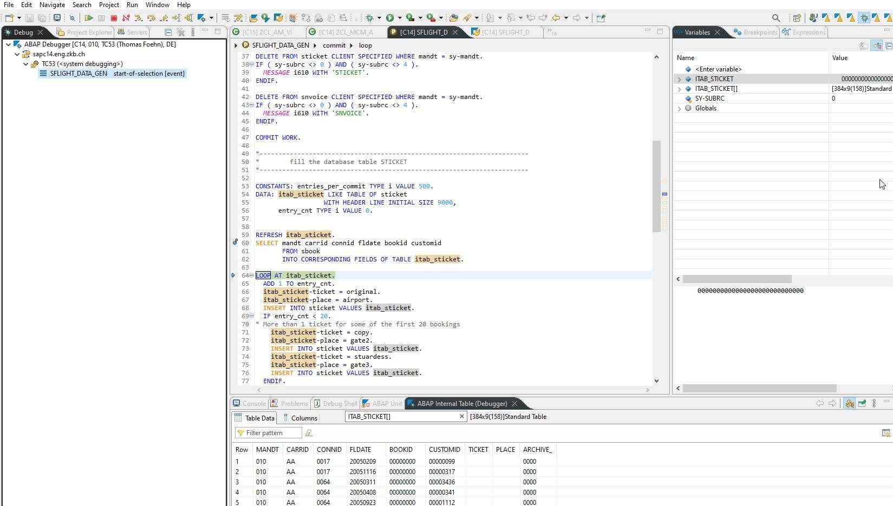

*Abbildung: Debugging Perspektive in Eclipse*

Die Debugging-Perspektive in Eclipse bietet einen schnellen Überblick über den Programm-Code, Call-Stack, Variableninhalte und Inhalte von internen Tabellen. Die Variablen und interne Tabellen können mit Doppelklick im Programm-Code ausgewählt werden. Sie werden auf der rechten Seite angezeigt.

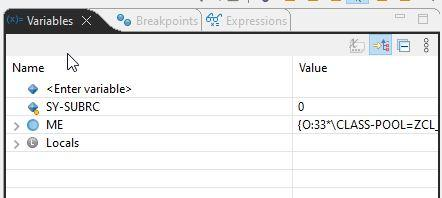

*Abbildung: Werte der Variablen in der Debugging Perspektive*

## Besonderes Verhalten im Debugger

Im Debugger der ABAP Development Tools ist es möglich, den Code direkt zu modifizieren und zu aktivieren. Im aktuellen Debugging-Kontext ist das Coding jedoch noch nicht aktiv. Der Programmlauf muss neu gestartet werden.

## Weitere Informationen

Weitere Besonderheiten über Debugging mit den ABAP Development Tools in Eclipse finden sich in den SAP-Blogs. Hervorzuheben sind dabei die folgenden beiden. Sie beschreiben Fälle und Lösungen, die beim Arbeiten mit dem Debugger auftreten können.

[https://blogs.sap.com/2020/04/21/adt-abap-debugger-what-to-do-if-your-program-does-not-stop-at-breakpoints/]

[https://blogs.sap.com/2015/11/02/breakpoint-validity-scope-and-activation-conflicts-in-abap-development-tools-adt/]

# Checkpoint IDs und dynamische Logpoints 

Ein sehr hilfreiches Tool im Bereich der Fehleranalyse und Debugging sind die sogenannten Checkpoint IDs. Diese können über die Transaktion SAAB oder in ADT unter "others" angelegt werden. Diese IDs werden mittels der Befehle:

-   BREAK POINT ID \[GRUPPENNAME\]

-   LOG POINT ID \[GRUPPENNAME\]

-   ASSERT ID \[GRUPPENNAME\]

im Code verankert. Für den detaillierte Syntax und die Optionen der Befehle verweisen wir auf die [SAP-Hilfe](https://help.sap.com/docs/ABAP_PLATFORM_NEW/ba879a6e2ea04d9bb94c7ccd7cdac446/491c002326bc14cde10000000a42189b.html?locale=en-US&version=202009.000&q=Checkpoint%20ID).

Wie bereits im Debugger des SAP GUI können diese dynamischen Breakpoints für das Debuggen aktiviert bzw. zur Protokollierung genutzt werden. Der Hauptvorteil liegt hier darin, dass der Entwickler im Voraus wichtige Stellen im Code mit Breakpoints versehen kann. Falls der Code analysiert werden soll, muss die Checkpoint ID nur einmalig entsprechend aktiviert werden. Beim Aufruf der Einheit wird dann bei einem aktiven Breakpoint der Debugger an der betreffenden Stelle aufgerufen.

Um die Checkpoints effektiv einzusetzen, empfiehlt es sich, entsprechende Templates anzulegen, die dann einfach mittels Quick Fixes aufgerufen werden können (siehe Kapitel 3 - Arbeiten mit ADT im Abschnitt zu Templates).

Während Checkpoint IDs auch im GUI-basierten Debugger genutzt werden können, bietet ADT für On-Premise-Systeme zusätzlich die Möglichkeit, dynamische Log Points im Debugger zu setzen, die zum Auslesen programm-interner Werte verwendet werden können. Diese Option ist dann hilfreich, wenn es nicht möglich ist, den Produktivcode zu ändern oder auch eine Analyse sehr zeitnah auf dem Produktivsystem durchgeführt werden muss.

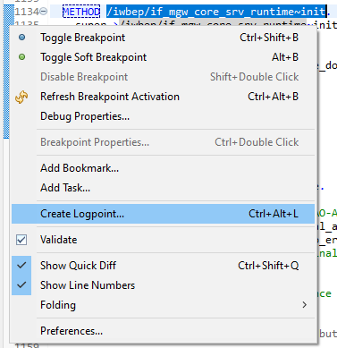

*Abbildung: Erstellung eines Log Points über das Kontextmenü*

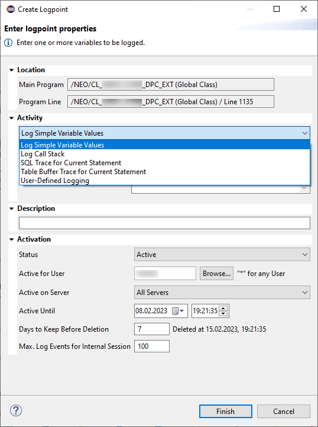

*Abbildung: Attribute beim Erstellen eines Log Points*

Sie können in dem Dialog entscheiden, was im Log aufgezeichnet werden soll, Sie können dem dynamischen Logpoint eine Beschreibung mitgeben, die dann in der Log-Ausgabe verwendet wird, und Sie können verschiedene Kriterien mitgeben, ob (anhand einer Bedingung -- in der Bildschirmkopie verdeckt -- und/oder Benutzer/Server) und wie lange die Log-Ausgabe erfolgen soll. Erstellte Logpoints werden im Editor am linken Rand und am rechten Rand neben der vertikalen Scroll-Leiste angezeigt sowie im View "Logpoints" aufgelistet:

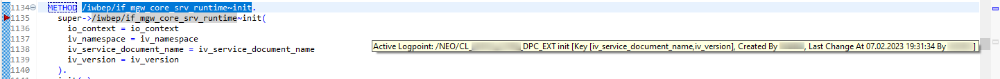

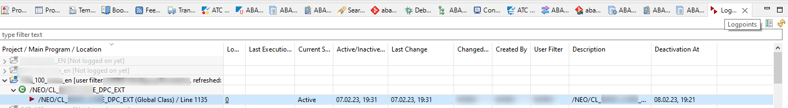

*Abbildung: Log Points View in der Debugging Perspektive*

Wir empfehlen, hierzu die SAP-Dokumentation ([On-Premise](https://help.sap.com/docs/ABAP_PLATFORM_NEW/c238d694b825421f940829321ffa326a/02f4fac1e87244f2968bfbe6d3c37095.html)) zu studieren, um Details über die Anwendung zu erfahren. Einen guter Einstieg bietet hierzu auch dieser Blogeintrag: [Dynamic Logpoints in ABAP \| SAP-Blogs](https://blogs.sap.com/2015/10/22/dynamic-logpoints-in-abap/)

# Performance-Analyse 

Für eine integrierte und graphische Performance-Analyse bieten Ihnen die ADT einen komfortablen Zugang zum ABAP Profiler ([[On-Premise](https://help.sap.com/docs/ABAP_PLATFORM_NEW/c238d694b825421f940829321ffa326a/4ec41bbe6e391014adc9fffe4e204223.html)/[Cloud](https://help.sap.com/docs/BTP/5371047f1273405bb46725a417f95433/4ec41bbe6e391014adc9fffe4e204223.html)]) als Nachfolger u.a. der Transaktion SAT. Zum Starten des Profiler gibt es verschiedene Möglichkeiten:

Wenn Sie ein ausführbares Programm (nur On-Premise), eine Konsolenanwendung (nur ABAP Cloud) oder ein Artefakt mit zugeordneten Unit-Tests geöffnet haben, können Sie den Profiler direkt über das Kontextmenü "Profile as" starten. Alternativ dazu kann auch der Wizard verwendet werden, der über das Run-Menü erreichbar ist.

Für den Fall, dass man einen anderen Startpunkt benötigt, kann man mit Trace-Requests Anforderungen für den Start des Profiler erstellen. Dazu zuerst die View "ABAP Trace Requests" (diese finden Sie in der View-Liste unterhalb von ABAP, vgl. Views und Perspektiven in Kapitel 3 - Arbeiten mit ADT) einblenden. In dieser View bekommen Sie nach Auswahl eines Systems mit dem Create-Trace-Request-Icon einen Wizard. Mit diesem können Sie verschiedene Trigger für den Start des Profiler auswählen. Wird mit HTTP(S)-Zugriffen direkt auf das System zugegriffen (Achtung: Das ist in einer Hub/FES-Konfiguration im Backend normalerweise nicht der Fall), kann ein Muster für die URL verwendet werden, z. B. der Name des OData-Services mit vor- und nachgestelltem Stern. Des Weiteren können ein RFC-Aufruf eines Funktionsbausteins oder der Start eines Hintergrund-Jobs und diverse weitere Trigger für den Start des Trace verwendet werden. In der SAP-Fiori-Entwicklung kann in einer Hub/FES-Konfiguration für OData-Zugriffe im Backend-System der Funktionsbaustein /IWBEP/FM_MGW_HANDLE_REQUEST als Trigger verwendet werden. Die Anzahl der Trigger-Aktivierungen kann begrenzt werden, ebenso gibt es eine Möglichkeit zur zeitlichen Limitierung. Über verschiedene Einstellungen können Sie den Umfang der Datenermittlung steuern. Über das Kontextmenü in der Liste können Trace-Requests gelöscht werden.

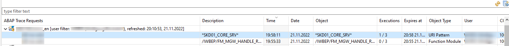

*Abbildung: ABAP Trace Requests in der Debugging Perspektive*

Darüber hinaus gibt es noch die Möglichkeit, aus dem ADT-Debugger heraus den Trace zu starten ([[On-Premise](https://help.sap.com/docs/ABAP_PLATFORM_NEW/c238d694b825421f940829321ffa326a/d491c9ce396c47f2b6b8affb46ca3291.html)/[Cloud](https://help.sap.com/docs/BTP/5371047f1273405bb46725a417f95433/d491c9ce396c47f2b6b8affb46ca3291.html)]).

Im Falle der Trace-Requests kann über das Aktualisierungs-Icon im Trace-Request-View die Anzahl der pro Anforderung bereits erzeugten Traces aktualisiert werden. Über das Kontextmenü bzw. per Doppelklick kann in die View mit der Liste der Traces gesprungen werden. Von dort kann die Anzeige eines Trace geöffnet werden. Entweder kann über das Kontextmenü gezielt in die verschiedenen Tabs der Analyse oder per Doppelklick in die Übersichtsseite gesprungen werden.

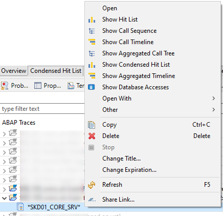

*Abbildung: Kontextmenü eines Traces*

Die Übersichtsseite bietet neben einem knappen Überblick über die Laufzeit ebenfalls direkte Absprungpunkte in die verschiedenen Tabs.

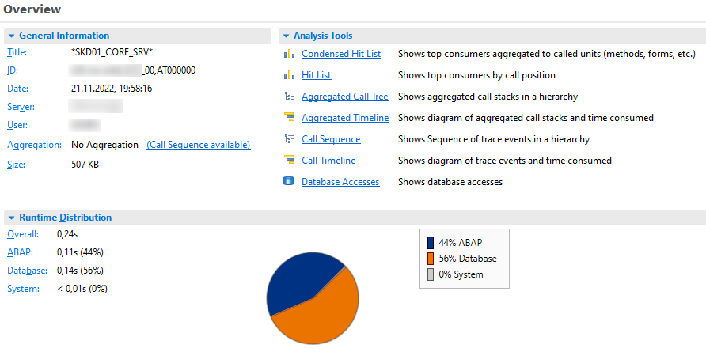

*Abbildung: Übersicht über die Eigenschaften eines Traces*

Insbesondere die graphische Analyse der Timeline ist nur in den ADT verfügbar und erleichtert eine Analyse. Bewegt man den Mauszeiger über die Blöcke, bekommt man direkt Details angezeigt und kann über das Kontextmenü auch direkt in den Quellcode navigieren.

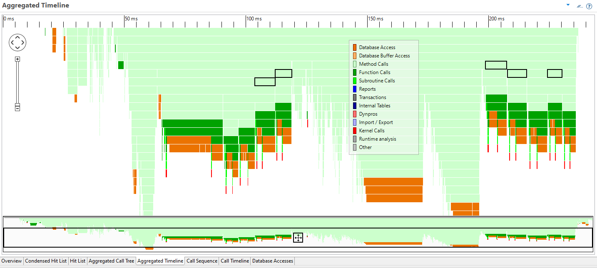

*Abbildung: Aggregierte Übersicht eines Trace-Verlaufs*

Der SQL-Trace, der insbesondere bei HANA als Datenbank die PLV-Dateien für eine visuelle Analyse der Query-Pläne liefert, kann im Kontextmenü eines Systems im Project Explorer gestartet werden (funktioniert auch im ABAP Environment). Die Ergebnisdarstellung erfolgt dann aber in einer Webanwendung außerhalb der ADT (oder in der Transaktion ST05).

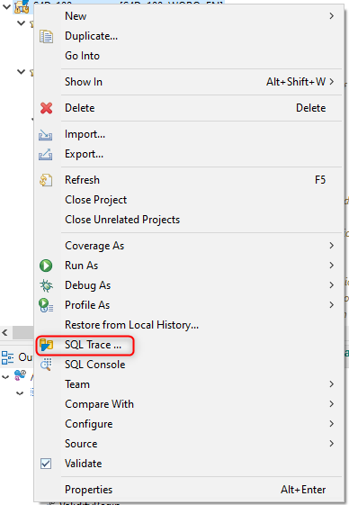

*Abbildung: Absprung in den SQL Trace*

Sie können für die visuelle Analyse aktuell noch die SAP HANA Administration Tools aus dem HANA Studio zusätzlich in der ADT-Eclipse (oder das komplette SAP HANA Studio parallel) installieren und somit den automatischen Start der visuellen Analyse aus der Transaktion heraus konfigurieren. Dazu setzen Sie den Benutzerparameter HDB_OPEN_STUDIO auf X

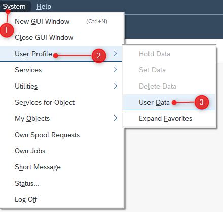

*Abbildung: Einstieg in die Verwaltung der Benutzerparameter*

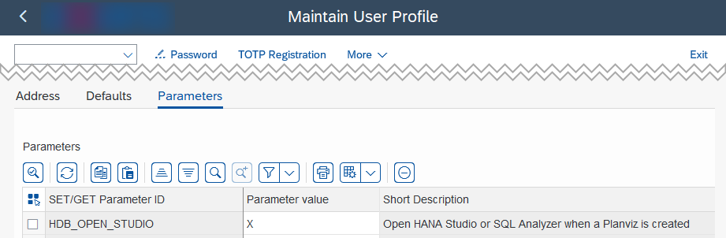

*Abbildung: Setzen des Benutzerparameters HDB_OPEN_STUDIO*

und verknüpfen im Betriebssystem das Öffnen von \*.plv-Dateien mit der richtigen eclipse.exe. Beispielsweise gibt es unter Windows dafür im Datei-Explorer im Kontextmenü der Datei die Option "Öffnen mit..." und dort findet sich dann ganz unten die Option "Andere App auf diesem PC suchen", nach Klick müssen Sie die "eclipse.exe" ihrer Eclipse/ADT-Installation suchen und auswählen sowie die Option "Immer diese App ... verwenden" auswählen.

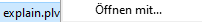

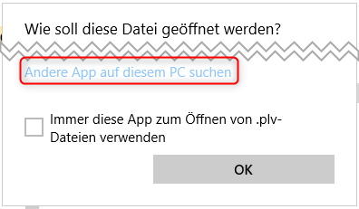

*Abbildung: Auswahl der eclipse.exe als neue Möglichkeit zur Anzeige von \*.plv Dateien*

Nach Auswählen einer Zeile in den SQL-Trace-Liste der ST05 oder in Auswahl eines Trace-Record und eines SQL-Statement in der SQL-Trace-Analysis des Technical-Monitoring-Cockpit kann man die HANA-PlanViz-Query-Plan-Visualisierung anfordern:

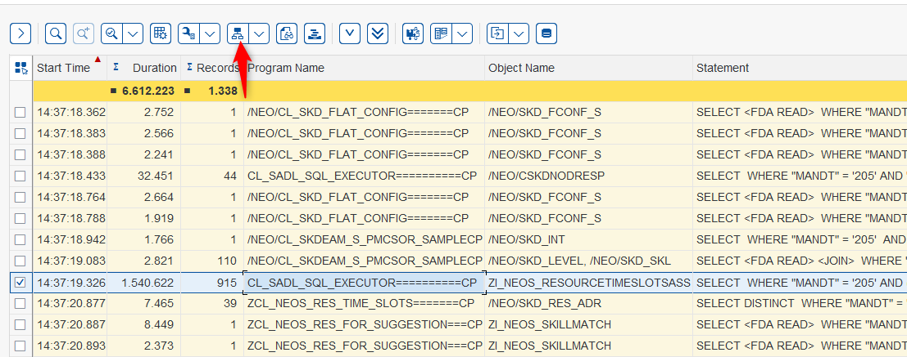

*Abbildung: Auswahl einer konkreten Selektion*

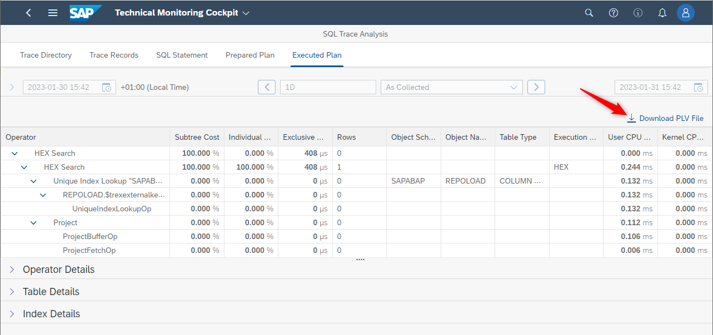

*Abbildung: Download der \*.plv Datei*

Eclipse startet dann automatisch die richtige View, und im Tab-Executed-Plan ist die visuelle Analyse des Query-Plans zu sehen.

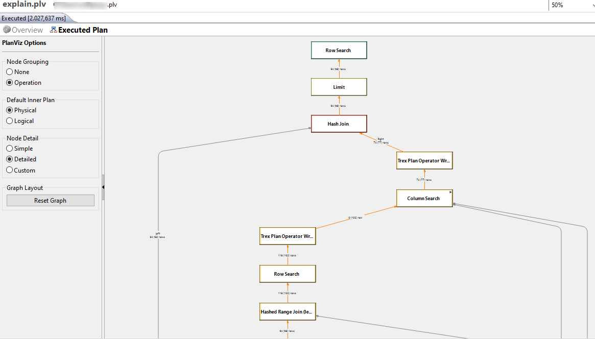

*Abbildung: Anzeige des Abfrage-Ausführungsplans*

Für die Entwicklung mit dem RAP (ABAP RESTful Application Programming Model) gibt es ein spezielles Trace-Werkzeug namens Cross Trace (Doku [On-Premise](https://help.sap.com/docs/ABAP_PLATFORM_NEW/c238d694b825421f940829321ffa326a/290647b75cea46f491907889251ad067.html)/[Cloud](https://help.sap.com/docs/btp/sap-abap-development-user-guide/working-with-abap-cross-trace)), mit dem Sie Anfragen von Fiori-Apps über den RAP Softwarestack (SAP Gateway, BO Behavior, SADL, ABAP Core) hinweg analysieren können. Zur Benutzung ist eine entsprechende gesonderte Berechtigung nötig.

Zum Starten lassen Sie sich die View "ABAP Cross Trace" anzeigen. Diese View hat zwei Tabs. Im ersten Tab können Sie im Kontextmenü eines Systems eine neue Cross-Trace-Konfiguration erstellen. Eine Cross-Trace-Konfiguration kann mit einer Beschreibung zur Unterscheidung versehen werden, kann aktiv oder inaktiv sein, eine automatische Deaktivierung nach einer bestimmten Anzahl von Trace-Requests ist möglich, ebenso eine automatisierte Löschung zu einem bestimmten Zeitpunkt. Sie können entscheiden, ob nicht-sensitive oder sensitive Daten aufgezeichnet werden sollen. Sie können optional nach Benutzer, Zugriffsart und -ziel filtern (z. B. nur ein bestimmter OData-Service; hier ist auch \* für eine Wildcard-Filterung möglich), ebenso können Sie angeben, ob und mit welchem Trace-Level zu den jeweiligen Cross-Trace-Komponenten eine Aufzeichnung stattfinden soll.

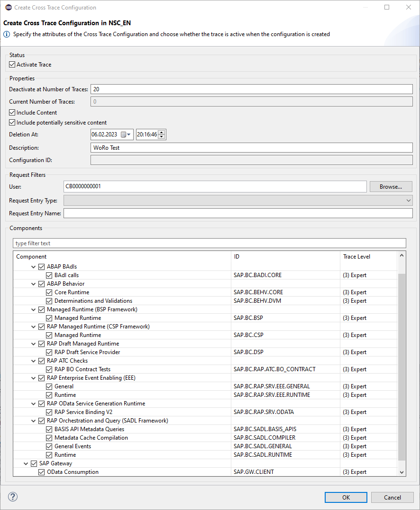

*Abbildung: Erstellung von ABAP Cross Traces*

Nach Bestätigung mit OK wird die Konfiguration im View angezeigt, hier kann auch der aktuelle Zustand (aktiv/inaktiv), die Beschreibung und die Anzahl der verbliebenen aufzuzeichnenden Zugriffe eingesehen werden. Im Kontextmenü kann eine Konfiguration editiert sowie aktiviert/deaktiviert/gelöscht/aktualisiert werden. Eine globale Aktualisierung ist rechts oben im View möglich. Zur Ergebnisanzeige wechseln Sie auf den zweiten Tab der View. Hier sehen Sie je einzelnem Zugriff einen Trace. Im Kontextmenü können Sie einen Trace öffnen (und löschen usw.). Der Trace öffnet sich dann in einer weiteren View. Dort sehen Sie den Weg des Zugriffs durch die einzelnen Komponenten hindurch und können die angezeigten Zeilen filtern bzw. eine Textsuche starten. Anhand der Offset-Spalte können Sie den zeitlichen Verlauf des Zugriffs nachvollziehen. Zu jeder Zeile werden in der Properties View Details angezeigt.

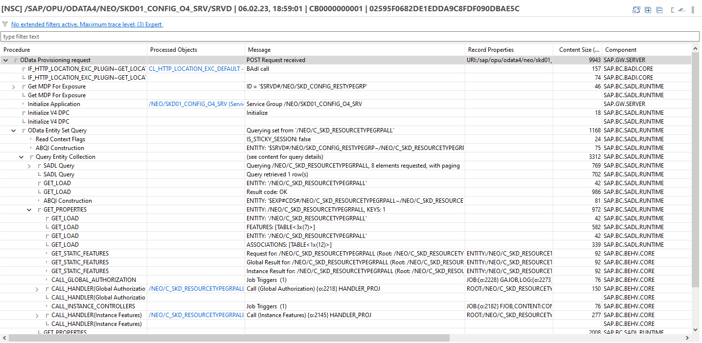

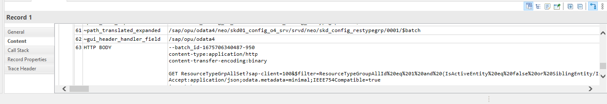

*Abbildung: Detaillierte Ansicht der Operationen*

Sie können direkt zur auslösenden Quellcodezeile springen, sich die Aufrufhierarchie anzeigen lassen usw.

## Hinweis zu HANA Studio und SAP HANA Tools

HANA Studio wird von SAP nur begrenzt weiterentwickelt. Eine zukünftige Lösung für die visuelle Analyse der Query-Pläne innerhalb der ADT oder für die ABAP Cloud steht noch aus. Als eine Lösung außerhalb von Eclipse gibt es ein Visual Studio Code Plug-in, das ebenfalls \*.plv-Dateien öffnen und grafisch anzeigen kann, vgl. [SQL Analyzer Extension](https://help.sap.com/docs/HANA_SERVICE_CF/6a504812672d48ba865f4f4b268a881e/50bc09af2fa549c3ace4178b61056da8.html).

Die SAP HANA Tools folgen einem anderen Release-Zyklus als die ADT und sind daher häufig nicht in der aktuellen bzw. der "latest" Update-Site enthalten. Beispielsweise waren die SAP HANA Tools im Januar 2023 in der aktuellsten Version nur auf der https://tools.hana.ondemand.com/2022-09 Site verfügbar.

# Feed Reader 

Feeds ermöglichen ereignisbezogene Benachrichtigungen in den ADT inklusive Zugriff auf eine Liste der bisherigen Ereignisse. Die Feeds werden in einer eigenen View (vgl. Views und Perspektiven in Kapitel 3 - Arbeiten mit ADT) dargestellt. Diese finden Sie in der Liste der Views unterhalb von ABAP mit dem Titel "Feed Reader". Die einzelnen Quellen werden als Feeds bezeichnet und für jeden Feed kann eingestellt werden, wie oft dieser von der Quelle aktualisiert werden soll und ob Benachrichtigungsmeldungen in Eclipse angezeigt werden sollen.

Neben den in der Doku unter "Getting Feeds" ([On-Premise](https://help.sap.com/docs/ABAP_PLATFORM_NEW/c238d694b825421f940829321ffa326a/4ec3b0cd6e391014adc9fffe4e204223.html)/[Cloud](https://help.sap.com/docs/BTP/5371047f1273405bb46725a417f95433/4ec3b0cd6e391014adc9fffe4e204223.html)) beschriebenen ABAP-Runtime-Errors/-Dumps und Systemnachrichten können insbesondere auch (abhängig vom Release-Stand des Quellsystems) folgende Informationen im Feed Reader angezeigt werden:

-   Gateway/OData-Fehler (vielfältig filterbar, einschl. Benutzer)

-   ATC-Ergebnisse (vielfältig filterbar, einschl. Benutzer)

-   Enterprise-Event-Fehler (filterbar nach Kanal und Benutzer)

-   BW Job Repository (vielfältig filterbar, einschl. Benutzer)

-   URI Creation Error (nur für die ADT-Entwickler relevant)

Dazu werden die Ereignisse im Pull-Verfahren im Hintergrund abgefragt. Damit die Hintergrundabfrage aus SAP-Systemen funktioniert, müssen Sie allerdings nach einem Eclipse-Start mindestens einmal in irgendeiner Form (das können Sie auch durch Klick auf einen Feed auslösen) auf die gewünschten Systeme zugegriffen und dabei die Anmeldeprozedur durchlaufen haben.

Daneben können auch beliebige Atom-/RSS-Feeds abonniert werden, das kann beispielsweise der RSS-Feed für die letzten Blog-Posts zu einem Tag auf blogs.sap.com sein:

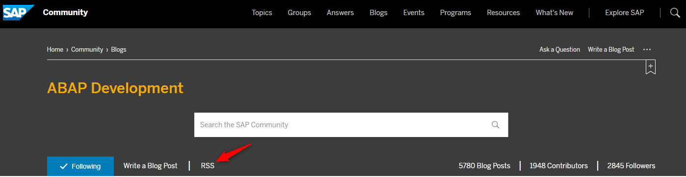

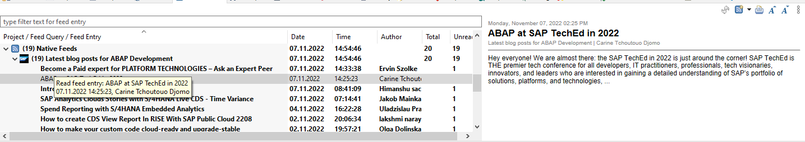

*Abbildung: Abonnieren populärer RSS Feeds*

Mit einem Links-Klick auf den Titel in der Detailanzeige bzw. Rechts-Klick in der Liste und den Kontextmenüpunkt Open können Sie den Blog-Artikel öffnen (dafür ist es sinnvoll, in Eclipse einen externen Browser einzustellen, weil der Eclipse-interne Browser sich als IE11 für die Webseite ausgibt).

Der Feed zu den Systemnachrichten zeigt die aktuell vorliegenden Nachrichten der Systemadministratoren an.

Sie können Feeds zu Laufzeitfehlern (ST22-Dumps) mit verschiedenen Filtermöglichkeiten ergänzen, u.a. kann gemäß auslösendem Benutzer, verantwortlichem Benutzer, Objekt- und Paket-Benutzer oder Paket gefiltert werden. Die Filter können auch mit und/oder-

(all/any-) Verknüpfungen zu einem hierarchischen Filter-Baum angeordnet werden. Sie können einen Laufzeitfehler in einer eigenen Editor-Ansicht öffnen (Kontextmenü in der Liste, Link in den Details; dort ist auch das bekannte Langtext Format bzw. eine unformatierte Anzeige verfügbar). Sie können direkt in den ADT-Quelltexteditor zu den Quellcodezeilen der auslösenden Stelle und der Aufrufhierarchie navigieren.

Ein Beispiel mit mehreren Laufzeitfehlern in einem Feed:

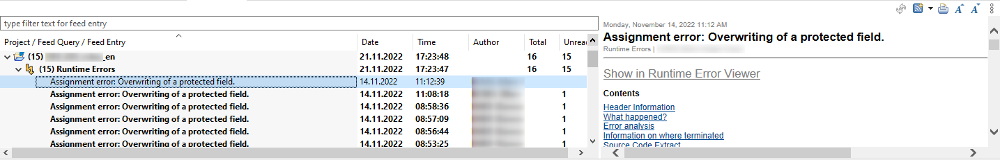

*Abbildung: Mehrere Laufzeitfehler innerhalb eines Feeds*

Dokumentation zu den SAP Gateway Error Log Feeds findet sich im PDF-Dokument aus dem Hinweis [1797736 - SAP Gateway Troubleshooting Guide](https://me.sap.com/notes/1797736) und im Blog [How to use the SAP Gateway Error Log in ADT](https://blogs.sap.com/2020/07/22/how-to-use-the-sap-gateway-error-log-in-adt/).

Sie können Feeds mit verschiedenen Filtermöglichkeiten ergänzen, u.a. kann auch hier gemäß Benutzer, Service, Namensraum oder Paket gefiltert werden. Um auch mit vielen Einträgen zurechtzukommen, kann ein Blättern (Paging) aktiviert werden. In der Detailanzeige kann direkt in die Transaktion /IWFND/GW_CLIENT zum Replay gesprungen werden. Außerdem kann man direkt in den ADT-Quelltexteditor analog zu den Laufzeitfehlern navigieren, vgl. folgendes Beispiel:

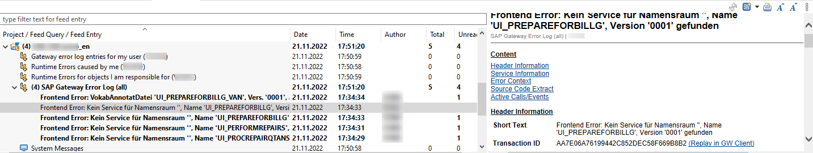

*Abbildung: Ansicht eines SAP Gateway Fehlers aus dem Error Log*

Im Kontext von Enterprise Events können Sie Feeds zu Fehlern aus der Event Verarbeitung hinzufügen, z. B. um Fehler beim Weiterreichen der Events an den Event Mesh zu sehen. Dazu können Sie Kanal und Benutzer filtern.

Sie können Feeds zu den ATC-Ergebnissen aus Prüfungen in einem zentralen ATC-Check-System anlegen, vgl. Doku ([On-Premise](https://help.sap.com/docs/ABAP_PLATFORM_NEW/c238d694b825421f940829321ffa326a/4ec57b9c6e391014adc9fffe4e204223.html)/[Cloud](https://help.sap.com/docs/BTP/5371047f1273405bb46725a417f95433/4ec57b9c6e391014adc9fffe4e204223.html)). Auch hier sind diverse Filtermöglichkeiten verfügbar. In der Feed-Liste können Sie zu den Details und zur Quellcodezeile eines Ergebnisses navigieren.

Sofern Sie BW/S4HANA-Systeme haben, können Sie sich mit dem BW Job Repository Feed über den Status verschiedener Job-Typen (z. B. DATAFLOWCOPY oder DTP_LOAD) informieren lassen, vgl. [Doku](https://help.sap.com/docs/SAP_BW4HANA/107a6e8a38b74ede94c833ca3b7b6f51/976f6a8b97714ffaad08df0679ab0849.html). Von den Feed-Einträgen können Sie dann zur Anzeige der Job-Details verzweigen.

Da der Feed Reader das ideale Tool für ein proaktives Monitoring von Anwendungen ist (z. B. bei und nach einem Go-live einer neuen Anwendung), ist es sinnvoll, die Berechtigung für die ADT nicht nur für die Entwicklungssysteme zu betrachten, sondern den Entwicklern mittels Berechtigungen zu ermöglichen, die Feeds auch von Test- und Produktivsystemen einzusammeln.

# 

# Doku-Links

ABAP-Debugger-Konzept: [https://help.sap.com/docs/BTP/5371047f1273405bb46725a417f95433/4ec365a66e391014adc9fffe4e204223.html](https://help.sap.com/docs/BTP/5371047f1273405bb46725a417f95433/4ec365a66e391014adc9fffe4e204223.html)

Troubleshooting-Tools: [https://help.sap.com/docs/BTP/5371047f1273405bb46725a417f95433/4ecc7d3a6e391014adc9fffe4e204223.html]

Syntax für Breakpoint-Bedingungen: [https://help.sap.com/docs/BTP/5371047f1273405bb46725a417f95433/d878e676fe904eba9f4bb79193154092.html]
