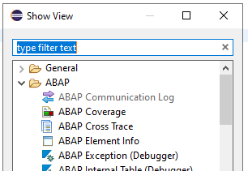

{: .no_toc}
# Best Practices Eclipse-Konfiguration

1. TOC
{:toc}

## Einstellungen in Eclipse

In Eclipse gibt es zahlreiche Einstellungsmöglichkeiten, die das Leben als Entwickler leichter, aber manchmal auch schwerer machen können. In diesem Abschnitt erfahren Sie mehr über die verschiedenen Möglichkeiten und die wichtigsten Einstellungen. Wichtig zu wissen: Es gibt zwei Ebenen, auf denen Sie Einstellungen vornehmen können. Die *globale Ebene* für Eclipse und die *projektspezifische Ebene* für ein SAP-System.

### Globale Einstellungen

Nach dem Öffnen der Einstellungen über das Menü (Window → Preferences) sehen Sie alle Einstellungen für Eclipse. Im Fenster auf der linken Seite befindet sich die Struktur mit Unterknoten für die Navigation, darüber ein Suchfeld, um nach Knoten oder Einstellungen zu suchen. Auf der rechten Seite befinden sich die Einstellungen zum gewählten Punkt.

Einstieg in die globalen Einstellungen
{: .img-caption}

In den folgenden Abschnitten zeigen wir unseren Vorschlag für diese Einstellungen, den Pfad innerhalb der Einstellungen, um diese zu finden und eine kurze Erklärung der Auswirkungen.

#### Dark Theme

(General → Appearance)

Viele Entwicklungsumgebungen bieten mittlerweile die Möglichkeit, mit einem hellen oder dunklen Theme zu arbeiten, um die Augen zu schonen oder einfach nur dem persönlichen Geschmack zu entsprechen.

Einstellung für das Dark-Theme
{: .img-caption}

#### Einrückung

(General → Editors → Text Editors)

Beim Schreiben von ABAP Quellcode wird oft mit einer Tabulatorweite von 2 Leerzeichen gearbeitet, standardmäßig ist sie in Eclipse aber auf 4 eingestellt ("Displayed tab width"). Außerdem können Sie einstellen, ob statt einem Tabulator Leerzeichen eingefügt werden ("Insert spaces for tabs") und ob beim Löschen gleich ein ganzer Tabulator entfernt werden soll ("Remove multiple spaces on backspace/delete").

Einstellung zur Einrückung des Quellcodes
{: .img-caption}

#### Fehlermeldung im Code

(General → Editors → Text Editors)

Fehlermeldungen tauchen als Ikonen links neben dem Quellcode auf. Um die Information zum Fehler zu erhalten, müssen Sie mit der Maus über die Ikone gehen. Über die Option „Show code minings for problem annotations" können Sie sich die gesamte Fehlermeldung auch direkt im Code anzeigen lassen. Wählen Sie dazu die Art der Meldung aus.

Beispiel für die Einstellung
{: .img-caption}

Ergebnisbild im Quellcode
{: .img-caption}

#### Rechtschreibprüfung: Kommentare

(General → Editors → Text Editors → Spelling)

Wenn Sie Kommentare in Eclipse nicht auf Englisch schreiben, erhalten Sie von der Rechtschreibprüfung viele rote Kommentare. Diese Prüfung können Sie über die Einstellungen ("Enable spell checking") deaktivieren oder Sie laden das Wörterbuch für Deutsch nach.

#### Tastenkombinationen

(General → Keys)

Konfiguration der Tastenkombinationen in Eclipse, mit denen Sie Ihre Wunscheinstellungen definieren können. Außerdem können Sie sich Shortcuts einblenden lassen, wenn diese ausgelöst wurden ("Through keyboard") oder es zur ausgeführten Aktion eine Tastenkombination gibt ("Through mouse click"). Diese Option ist immer dann sinnvoll, wenn Sie Schulungen halten, Kollegen bei der Einarbeitung in Eclipse unterstützen oder sich selbst in die Tastenkombinationen einarbeiten möchten.

Siehe auch:

- Blog Post [Useful Keyboard Shortcuts for ABAP in Eclipse](https://blogs.sap.com/2013/11/21/useful-keyboard-shortcuts-for-abap-in-eclipse/)
- SAP Help [Keyboard Shortcuts for ABAP Development](https://help.sap.com/docs/ABAP_PLATFORM_NEW/c238d694b825421f940829321ffa326a/4ec299d16e391014adc9fffe4e204223.html)

#### Debugging

(ABAP Development → Debug)

Möglichkeit zur Festlegung der allgemeinen Debugger-Einstellungen, aber auch Aktivierung ("Enable debugging of system programs") des System-Debuggings.

#### Farbformatierung von Schlüsselwörtern

(ABAP Development → Editors → Source Code Editors → ABAP Keyword Colors)

Um wichtige Schlüsselwörter in Eclipse hervorzuheben, können Sie diese mit zusätzlichen Farbkombinationen hervorheben. Dazu können Sie einzelne Schlüsselwörter hervorheben oder alle ("Select all"). Damit lassen sich im Quellcode wichtige Passagen leichter identifizieren.

Farbeinstellungen zur Hervorhebung der Schlüsselworte im Quellcode
{: .img-caption}

#### Farbformatierung von Methodenhintergründen

(General → Appearance → Colors and Fonts)

Methodenhintergründe können farblich hervorgehoben werden. Einzelne Methoden werden somit visuell stärker mehr voneinander unterscheidbar gemacht.
Dafür reicht es schon, nur eine geringfügige farbliche Abweichung zu wählen.

Farbeinstellungen zur Hervorhebung von Methoden im Quellcode
{: .img-caption}

Quellcode mit hervorgehobenem Methodenhintergrund
{: .img-caption}

#### Code-Vorlagen

(ABAP Development → Editors → Source Code Editors → ABAP Templates)

Für häufig verwendete Code-Fragmente liefert SAP Vorlagen aus, die man nach Belieben an eigene Bedürfnisse anpassen kann. Auch neue Vorlagen sind möglich. Die Vorlagen werden im Coding durch Eingabe des Vorlagennamens und Autocomplete (<kbd>Strg</kbd>+<kbd>Space</kbd>) eingefügt.

Verwaltung der ABAP Templates in den Einstellungen
{: .img-caption}

Einfügen des Templates in den Quellcode
{: .img-caption}

#### Alias für CDS-Felder

(ABAP Development → Editors → Source Code Editors → CDS → Code Completion)

Bei der Erstellung eines Core Data Service (CDS) werden bei der Einbindung einer Tabelle die Feldnamen ohne Unterstrich und in Camel Case mit einem Alias zur Verfügung gestellt. Mit der Option ("Add aliases for table fields ...") wird dies standardmäßig beim Einfügen über "Insert all elements" durchgeführt (Default-Einstellung).

#### Auto-Vervollständigung

(ABAP Development → Editors → Source Code Editors → Code Completion)

Standardmäßig ergänzt Eclipse Klammern und Anführungsstriche am Ende eines Ausdrucks ("Automatically close brackets and literals") und fügt Leerzeichen innerhalb von Klammern ein ("Add additional whitespace inside ..."). Wenn Sie diese Optionen stören, können sie hier deaktiviert werden. Weiterhin können Sie sich auch Nicht-Schlüsselwörter von Eclipse vorschlagen lassen ("Also suggest non-keywords"), wodurch Ihnen dann z. B. auch Variablennamen vorgeschlagen werden.

#### Suche

(ABAP Development → Search)

Hier können Sie Einstellungen am Suchdialog (<kbd>Strg</kbd>+<kbd>Shift</kbd>+<kbd>A</kbd>) vornehmen, z. B. ob das alte Such-Pattern weiterverwendet wird ("Use pattern from previous search") oder auch die Anzahl der angezeigten Treffer ("Maximum number of results"). Wichtig ist aber auch der Typ des Objektes ("Display object types") und in welchem Paket ("Display packages") es sich befindet.

#### Icon Größe

Bei hochauflösenden Monitoren kann es sein, dass Ihnen die Icons und Tabreiter zu klein erscheinen. Dies kann mittels Parametern in der eclipse.ini-Datei, die sich im Eclipse-Stammverzeichnis befindet, nach eigenen Wünschen angepasst werden.

Beispiel - vergrößert die Icons und Tabreiter auf 130%:
~~~
-Dswt.enable.autoScale=true
-Dswt.autoScale=130
-Dswt.autoScale.method=nearest
~~~

Diese Zeilen können an beliebiger Stelle in der Datei eingefügt werden.

### Projektspezifische Einstellungen

Sie finden die systemspezifischen Einstellungen mit einem Rechts-Klick auf das ABAP-Projekt unter "Properties". Der Aufbau des Fensters ist dem der globalen Einstellungen ähnlich und lässt sich gleich bedienen.

Einstieg in die projektspezifischen Einstellungen
{: .img-caption}

#### Externes Debugging

(ABAP Development → Debug)

Mit dieser Option können Sie einstellen, für welchen User das Debugging aktiv ist. Das kann der aktuelle Anwender ("Logon User") oder ein anderer Anwender ("User") sein, wenn Sie ein externes Debugging durchführen möchten.

Breakpoints in Eclipse sind automatisch für alle Zugriffsarten (SAP GUI, ABAP Unit, HTTP, RFC) aktiv. Es gibt kein explizites "externes Debugging" mehr.

#### Pretty Printer

(ABAP Development → Editors → Source Code Editors → ABAP Formatter)

Wie bei Pretty Printer nehmen Sie hier die Einstellungen der Formatierung vor, wenn der Code Formatter (<kbd>Shift</kbd>+<kbd>F1</kbd>) ausgeführt wird. Ein Standard hierfür wäre zum Beispiel:

Mögliche Einstellungen für den Pretty Printer / ABAP Formatter
{: .img-caption}

(Einstellungen abhängig von der Backend-System-Version, z. B. ist "Keep Camel Case Identifiers" erst in S/4HANA vorhanden)

## Views und Perspektiven

Begriffsdefinitionen: siehe Kapitel [Einführung in Eclipse](/ADT-Leitfaden/introduction-eclipse)

Arbeiten mit den unterschiedlichen Views: siehe Kapitel [Arbeiten mit ADT](/ADT-Leitfaden/working-with-adt)

### Views

Alle Informationen, die Sie sehen und mit denen Sie arbeiten, werden in Views ("Unterbilder" des Bildschirms) dargestellt, z. B. der Project Explorer oder der Editor. Views können dabei beliebig auf den Bildschirm verschoben werden, indem Sie den Tabellenreiter der View anfassen (Maustaste halten, "Drag") und ziehen.

Verschieben des Views über die Bezeichnung/Reiter
{: .img-caption}

Während des Verschiebens wird eine Vorschau des neuen Layouts angezeigt.

Die Markierungen deuten die Platzierbarkeit des Fensters an
{: .img-caption}

Nach dem Loslassen ("Drop") wird die View an diese Stelle verschoben.

Views können auch außerhalb des Eclipse-Bildschirms platziert werden und dort existieren. Das ist gerade beim Arbeiten mit mehreren Monitoren sinnvoll.

Wenn Sie die View neben einen anderen Tabellenreiter ziehen, werden die Views gestapelt, das heißt in einer View-Gruppe zusammengefasst.

Darstellung von gestapelten Views
{: .img-caption}

View-Gruppen können gemeinsam minimiert und wiederhergestellt werden.

Minimieren von View-Gruppen
{: .img-caption}

Ergebnis ist, dass die View-Gruppe minimiert am Rand des Bildschirms angezeigt wird. Über den Druckknopf "Restore" können Sie die View-Gruppe wiederherstellen.

Wiederherstellung der View-Gruppen
{: .img-caption}

Nach einem Doppelklick auf einen Tabellenreiter wird die View im Vollbild angezeigt. Dies ist vor allem bei Editor-Views oder großen Dynpros, die im SAP GUI View angezeigt werden, sehr nützlich. Ein erneuter Doppelklick auf den Tabellenreiter verkleinert den View wieder.

Nicht mehr benötigte Views können über das Schließen-Symbol geschlossen werden -- so zum Beispiel auch der Feature-Explorer, nachdem Sie das Tutorial durchgearbeitet haben.

Schließen eines Views
{: .img-caption}

Neue oder versehentlich geschlossene Views können Sie nachträglich zu einer Perspektive hinzufügen.

Einblenden einer View
{: .img-caption}

So können auch Nicht-ABAP-Views (s. "Empfohlene zusätzliche Views") der ABAP-Perspektive zugeordnet werden.

### Perspektiven

Die Anordnung aller Views auf dem Bildschirm wird in einer Perspektive gespeichert. Für unterschiedliche Aktivitäten werden eigene Perspektiven ausgeliefert, die beliebig angepasst werden können.

In den ABAP Development Tools werden hauptsächlich die Perspektiven ABAP und Debugging verwendet, zwischen den man beliebig wechseln kann.

Wechseln zwischen verschiedenen Perspektiven
{: .img-caption}

*Tipp: Gerade in den ersten Wochen der ADT-Nutzung wird nach einer Debugging-Session gerne vergessen, zur ABAP-Perspektive zurückzukehren.*

Wenn Sie Ihre Perspektive "zu sehr" angepasst haben, können Sie über das Menü den Auslieferungszustand der Perspektive wiederherstellen.

Zurücksetzen einer Perspektive
{: .img-caption}

#### Eigene Perspektiven

Sie können auch eigene Perspektiven definieren. Dies ist vor allem dann sinnvoll, wenn Sie mit verschiedenen Monitor-Konfigurationen arbeiten (z. B. zwei Monitoren). Dadurch kann die Größe und Anordnung der Views angepasst werden. Eine eigene Perspektive kann über "Save Perspektive As..." gespeichert werden.

Speichern einer Perspektive
{: .img-caption}

Benennung der neuen Perspektive
{: .img-caption}

Neu Perspektive mit Name
{: .img-caption}

## Empfohlene zusätzliche Views

Über Eclipse bzw. ABAP Development Tools bereits installierte Views:

- ABAP Element Info
- Minimap

Über Eclipse Marketplace installierbare Views

- [Open Editors](https://marketplace.eclipse.org/content/open-editors)

## Vorschläge zur Verteilung

Die Einrichtung eines virtuellen Arbeitsplatzes ist so individuell wie die eines realen. Neben den persönlichen Vorlieben kommt es z. B. auch auf die Größe des Monitors an, wie viele Views gleichzeitig sinnvoll angezeigt werden können. Es können deshalb hier nur sehr subjektive Vorschläge gemacht werden.

Mögliche Einstellung der ABAP Perspektive
{: .img-caption}

Mögliche Einstellung der Debugger Perspektive
{: .img-caption}
