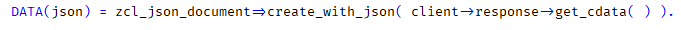
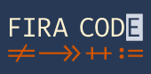

WIP
{: .label .label-red }

# In Kapiteln verwendete Querverweise

<table>
<colgroup>
<col style="width: 28%" />
<col style="width: 71%" />
</colgroup>
<thead>
<tr class="header">
<th>Kapitel</th>
<th>Link</th>
</tr>
<tr class="odd">
<td>Kapitel 3 - Best Practices Eclipse Konfiguration</td>
<td>
Blog Post <a href="https://blogs.sap.com/2013/11/21/useful-keyboard-shortcuts-for-abap-in-eclipse/">Useful Keyboard Shortcuts for ABAP in Eclipse</a>

SAP Help <a href="https://help.sap.com/docs/ABAP_PLATFORM_NEW/c238d694b825421f940829321ffa326a/4ec299d16e391014adc9fffe4e204223.html">Keyboard Shortcuts for ABAP Development</a>

View <a href="https://marketplace.eclipse.org/content/open-editors">Open Editors</a>
</td>
</tr>
<tr class="header">
<td>Sonstige</td>
<td>
Blog Post <a href="https://blogs.sap.com/2013/06/05/adt-feature-availability-matrix-for-as-abap-releases/">ADT Feature Availability Matrix for AS ABAP Releases</a>

Blog Posts <a href="https://people.sap.com/thomasfiedler#content:blogposts">ADT Product Owner</a>
</td>
</tr>
</thead>
<tbody>
</tbody>
</table>

# Zusätzliche Ressourcen

### Fonts

**(General → Appearance → Colors and Fonts → Text Font)**

Schriftarten sind Geschmackssache, und die Installation benötigt einmalig Administratorrechte. Ein sehr schöner Font, der sogenannte "Ligatures" verwendet, bei dem mehrere Zeichen zu einem vereint werden, ist "Fira Code" (siehe [GitHub - tonsky/FiraCode: Free monospaced font with programming ligatures](https://github.com/tonsky/FiraCode)).

Beispiel

