{: .no_toc}
# Installations- und Verteilungsstrategien

1. TOC
{:toc}

## Übersicht und Vergleich

Da die ADT erst vergleichsweise spät dem Eclipse-Ökosystem hinzugefügt wurden, haben sich außerhalb des SAP-Umfelds bereits diverse Installations-Strategien für Eclipse-basierte Entwicklungsumgebungen etabliert. Die verbreitetsten sind:

1. Komplett manuelle Einrichtung
2. Vorkonfigurierte Erstinstallation
3. Eclipse Installer (Oomph)

In den folgenden Kapiteln wird auf diese Mechanismen im Detail eingegangen. Neben diesen existieren noch viele weitere Möglichkeiten, die entweder für eher ungewöhnliche Situationen (z. B. fehlender Internetzugriff) konzipiert wurden oder mittlerweile durch komfortable Varianten verdrängt wurden.

Zunächst sollen die näher betrachteten Varianten jedoch einmal in einer Übersicht verglichen werden. Die dabei verwendeten Symbole *+ (gut)*, ∘ *(mittel)* und *- (schlecht)* sind als Rangfolge zu verstehen und nicht als absolute Werte am Anfang, Mitte und Ende des jeweiligen Spektrums. Grund hierfür ist, dass beispielsweise ein Aufwand sehr individuell wahrgenommen wird. So kann ein mit *-* *(schlecht)* gekennzeichneter hoher Aufwand für eine Person trotzdem akzeptabel sein. Wohl jedoch stellen diese Symbole eine Reihenfolge dar, da messbare Unterschiede existieren.

<table>
	<thead>
		<tr class="header">
			<th style="text-align: left">Kriterium</th>
			<th style="text-align: left">Manuelle Installation</th>
			<th style="text-align: left">Vorkonfigurierte<br/>Erstinstallation</th>
			<th style="text-align: left">Eclipse Installer</th>
		</tr>
		<tr class="odd">
			<td>
				<strong>Aufwand Anwender</strong>
			</td>
			<td class="centered">
				<em>-</em>
			</td>
			<td class="centered">∘</td>
			<td class="centered">
				<em>+</em>
			</td>
		</tr>
		<tr class="header">
			<td>
				<strong>Notwendiges Wissen Anwender</strong>
			</td>
			<td class="centered">
				<em>-</em>
			</td>
			<td class="centered">∘</td>
			<td class="centered">
				<em>+</em>
			</td>
		</tr>
		<tr class="odd">
			<td>
				<strong>Aufwand zentrale Verwaltung</strong>
			</td>
			<td class="centered">
				<em>+<br/>(keiner)</em>
			</td>
			<td class="centered">∘</td>
			<td class="centered">
				<em>-</em>
			</td>
		</tr>
		<tr class="header">
			<td>
				<strong>Benötigte zentrale Infrastruktur</strong>
			</td>
			<td class="centered">
				<em>+<br/>(keine)</em>
			</td>
			<td class="centered">∘</td>
			<td class="centered">
				<em>-</em>
			</td>
		</tr>
		<tr class="odd">
			<td>
				<strong>Aufwand Anwender bei Update/Upgrade</strong>
			</td>
			<td class="centered">
				<em>∘</em>
			</td>
			<td class="centered">∘</td>
			<td class="centered">∘</td>
		</tr>
		<tr class="header">
			<td>
				<strong>Aufwand zentrale Verwaltung bei Update/Upgrade</strong>
			</td>
			<td class="centered">
				<em>+<br/>(keiner)</em>
			</td>
			<td class="centered">-</td>
			<td class="centered">∘</td>
		</tr>
		<tr class="odd">
			<td>
				<strong>Automatische Verteilung Add-ons, Einstellungen</strong>
			</td>
			<td class="centered">
				<em>-<br/>(unmöglich)</em>
			</td>
			<td class="centered">∘<br/>
				<em>(einmalig)</em>
			</td>
			<td class="centered">
				<em>+<br/>(kontinuierlich)</em>
			</td>
		</tr>
		<tr class="header">
			<td>
				<strong>Empfohlen für Unternehmensgröße</strong>
			</td>
			<td class="centered">
				<em>Einzelpersonen/ kleine Unternehmen</em>
			</td>
			<td class="centered">
				<em>Mittlere und große Unternehmen</em>
			</td>
			<td class="centered">
				<em>Große Unternehmen</em>
			</td>
		</tr>
	</thead>
	<tbody>
</tbody>
</table>

Vergleich unterschiedlicher Installationsmöglichkeiten
{: .table-caption}

## Manuelle Installation

In dieser Variante wird eine Standard-Eclipse-Installation neu heruntergeladen und mittels weniger Klicks installiert. Da es keinen vorgefertigten Installer für ABAP gibt, werden die ADT einzeln nachinstalliert. Ohne Plug-ins, Einstellungen und Perspective-Anpassungen ist hier nach ungefähr 15 Minuten eine benutzbare Installation vorhanden.

SAP hat auf seiner Lernplattform eine bebilderte Anleitung zur Verfügung gestellt: [https://developers.sap.com/tutorials/abap-install-adt.html](https://developers.sap.com/tutorials/abap-install-adt.html).

Ist diese Installation abgeschlossen, müssen die gewünschten Einstellungen vorgenommen und die Systemverbindungen hinzugefügt werden. Sollten weitere Plug-ins zum Einsatz kommen (siehe Kapitel [Plug-ins](/ADT-Leitfaden/plug-ins)), müssen auch diese nachinstalliert werden.

## Vorkonfigurierte Erstinstallation

Eine vorkonfigurierte Erstinstallation ist im Prinzip eine manuelle Installation, deren Zustand direkt nach der Einrichtung gesichert wird (in der Regel gepackt als zip-Datei). Dieser Zustand kann dann über diverse Wege an andere Personen verteilt werden.

Bei macOS als Zielsystem gilt es zudem zu beachten, dass hier eine sogenannte App-Zip-Translocation greifen könnte. Diese erstellt von einer frisch *im selben Verzeichnis* entpackten Software wie Eclipse bei Ausführung eine Art "Schattenkopie". Das Ergebnis verhält sich wie fehlende Schreibrechte im Installationsordner. Sollten Updates eingespielt werden, kommt es zu Fehlern.

Je nach Einsatzzweck können mehr oder weniger der drei Komponenten der Installation (Installationsordner, User-Settings, Workspace) mit hineingepackt werden.

Nimmt man die User-Settings mit, so lassen sich beispielsweise die ADT und deren Update-Site für spätere Updates gleich mit verteilen. In Citrix-Umgebungen wäre dies hingegen hinderlich, da die User-Settings Schreibrechte benötigen. Nimmt man hierfür zwei getrennte Pakete, könnte auch der Installationsordner in einen schreibgeschützten, zentral provisionierten Teil untergebracht werden.

Den Workspace könnte man ebenfalls als getrenntes Template packen und verteilen. Somit können initiale Einstellungen einmalig verteilt werden. Da sich dieser Bereich allerdings sehr häufig ändert und bei einem Update ohnehin nicht ohne Verlust der aktuellen Einstellungen, Layouts und geöffneten Objekte verwendet werden kann, sollte dies nur mit Bedacht geschehen.

## Eclipse Installer

Auf der Eclipse-Webseite kann ein komfortabler Installer mit sehr geringer Download-Größe heruntergeladen werden (auch *Oomph Installer* genannt). Bei dessen Start kann man dann eine Basiskonfiguration und ein paar Detaileinstellungen auswählen und daraufhin genau diese Installation erstellen lassen.

Hier finden sich allerdings keinerlei Konfigurationen inklusive der ADT wieder. Jedoch handelt es sich hierbei nicht um Magie, sondern die verfügbaren Einstellungen sind lediglich in einem bestimmten Format auf einem Server der Eclipse Foundation abgelegt. Der Pfad, wo der Installer nach Konfigurationen suchen soll, ist anpassbar. Somit ist es möglich, unternehmensspezifische Konfigurationen zu erstellen, die jeder nach Belieben installieren kann. Dieses Verfahren könnte in einigen Unternehmen bereits für andere Entwicklungssprachen im Einsatz sein, was den Wartungsaufwand deutlich reduziert.

Lediglich der Eclipse Installer muss dann noch beispielsweise per Software-Verteilungsmechanismus zusammen mit der Einstellung, wo die Konfigurationen zu finden sind, verteilt werden. Zusätzlich bietet diese Variante die Möglichkeit, einzelne Einstellungen im Workspace vorzubelegen und aktuell zu halten.

Der Nachteil dieser Variante ist der vergleichsweise hohe zentrale Aufwand. Sie ist somit nicht für einzelne/wenige Standardinstallationen geeignet.

Das Oomph-Projekt hat eine umfangreiche englischsprachige Dokumentation zur Verfügung gestellt, welche sich gut als Nachschlagewerk eignet: [Link](https://wiki.eclipse.org/Eclipse_Oomph_Authoring).

### Administratorinformationen

In den folgenden Abschnitten wird die Anlage und Anpassung der Oomph-Konfigurationen erklärt. Diese wird in der Regel von wenigen Administratoren durchgeführt.

#### Begriffsdefinitionen

Liest man sich die Dokumentation von Oomph durch, so wird man erst einmal mit vielen neuen Begriffen erschlagen. Daher hier vorab die wichtigsten Begriffe, die in den folgenden Abschnitten verwendet werden. Es werden hier bewusst die englischen Originalbegriffe verwendet, um Wiedererkennungswert zu schaffen.

<table>
<thead>
<tr class="header">
<th style="text-align: left">Begriff</th>
<th style="text-align: left">Beschreibung</th>
</tr>
<tr class="odd">
<td><strong>Setup-Model</strong></td>
<td>Die Oomph-Konfigurationen sind, wie in den meisten Programmiersprachen, dateibasiert. Ein Satz dieser Dateien mit spezifischem Format heißt Setup-Model.</td>
</tr>
<tr class="header">
<td><strong>Product</strong></td>
<td>Eine Konfiguration auf Installationsebene (Plattform mit bestimmter Version + Plug-ins)</td>
</tr>
<tr class="odd">
<td><strong>Project</strong></td>
<td><p>Projektspezifische Einstellungen. In der git-basierten Welt kann dies beispielsweise die Vorgabe von Standard-Repositories sein.</p>
<p>Konfiguration auf Workspace-Ebene.</p></td>
</tr>
<tr class="header">
<td><strong>Index</strong></td>
<td>Die Bibliothek an verfügbaren Konfigurationen, die im Eclipse Installer ausgewählt werden können.</td>
</tr>
</thead>
<tbody>
</tbody>
</table>

Begrifflichkeiten in Oomph
{: .table-caption}

Eine Installation mittels Eclipse/Oomph Installer installiert somit immer eine Plattform, die Plug-ins, Oomph Updater, Oomph Recorder und zuletzt die Projekteinstellungen im Workspace.

#### Benötigte Software für Administratoren

Wer eigene Konfigurationen entwerfen und verwalten will, braucht das Oomph SDK. Das ist nichts anderes als ein Set von Plug-ins auf einer Standard-Eclipse-Plattform. Hiermit werden die benötigten Views und vorgefertigte Perspektiven ausgeliefert, um die Konfigurationsdateien grafisch aufbereitet bearbeiten zu können (Baumansichten, Formulare etc.).

#### Schritt für Schritt zu einer Basiskonfiguration

Bei der Anlage von Konfigurationen geht man in der Regel von allgemein nach spezifisch vor. Für alle im Folgenden genannten benötigten Dateien bietet das Oomph SDK Wizards an (File → New → Other → Oomph → ...). Zu beachten ist, dass Oomph sehr viele Optionen an vielen Stellen zulässt. Somit gibt es nicht "die eine, richtige" Implementierung. Was funktioniert und nachvollziehbar ist, ist richtig.

##### Index

Das bedeutet, man legt zuerst einen *Index* an. Ein Index verweist auf verfügbare *Product-Catalogs* und *Project-Catalogs*. Der Index trägt standardmäßig den Dateinamen *org.eclipse.setup*, kann aber beispielsweise auch *myFirst.setup* heißen.

Folgend der Aufbau eines Index:

```xml
<?xml version="1.0" encoding="UTF-8"?>
<setup:Index
    xmi:version="2.0"
    xmlns:xmi="http://www.omg.org/XMI"
    xmlns:setup="http://www.eclipse.org/oomph/setup/1.0"
    name="myCompany Eclipse Setups"
    label="index">
  <productCatalog href="myCompany.products.setup#/"/>
  <projectCatalog href="myCompany.projects.setup#/"/>
</setup:Index>
```

In der erweiterten Ansicht des Eclipse Installer hat man dann auch die Möglichkeit, zwischen mehreren verfügbaren Indizes zu wechseln.

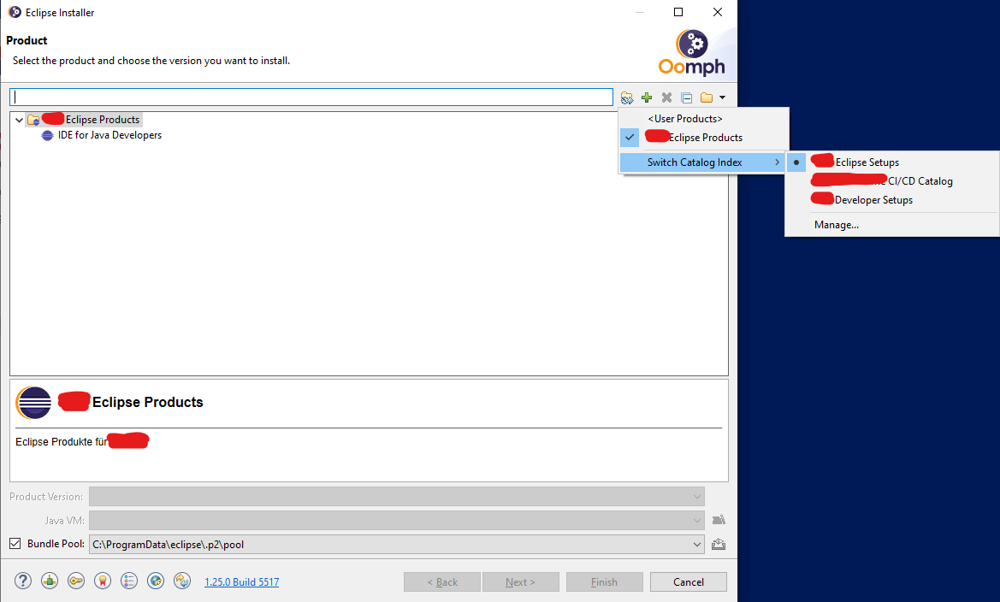

Wechsel zwischen Indizes
{: .img-caption}

##### Product-Catalog und Product

Ein Product-Catalog listet verschiedene Products. Er enthält darüber hinaus auch übergreifende Einstellungen, wie beispielsweise:

- interne Umleitungen von Update-Sites auf lokale Caches
- Definition von Variablen, die später pro Product (Version) oder Project anders gefüllt werden können (beispielsweise für versionsspezifische Update-Sites)
- die Installation des Oomph Client für die spätere Verteilung von Aktualisierungen der in den Products und Projects festgelegten Einstellungen, Oomph Recorder (siehe Abschnitt [Anwenderinformationen](#anwenderinformationen)).

Auf allen Ebenen (Product-Catalog, Product und Product-Version) können folgende Eigenschaften hinterlegt werden:

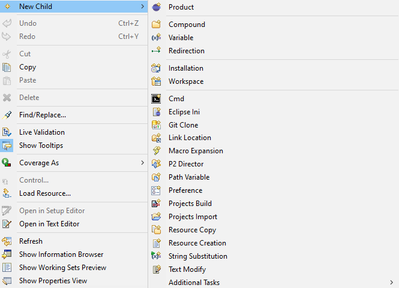

Hinzufügen und Festlegen von Eigenschaften
{: .img-caption}

Die meist benötigten Elemente sind:

| Product             | Fügt ein Product dem Product-Catalog hinzu (z. B. IDE for JAVA Developers). Kann nur auf Ebene Product-Catalog hinzugefügt werden.                             |
| ------------------- | -------------------------------------------------------------------------------------------------------------------------------------------------------------- |
| **Product-Version** | Fügt einem Product eine Version hinzu, in der dann versionsspezifische Einstellungen vorgenommen werden können. Kann nur auf Ebene Product hinzugefügt werden. |
| **Compound**        | Dies ist eine Art Ordner, in dem später Einstellungen gruppiert werden können.                                                                                 |
| **Eclipse ini**     | Fügt der Eclipse.ini eine Option hinzu.                                                                                                                        |
| **Variable**        | Variable mit Wertzuweisung. Später kann darauf referenziert werden.                                                                                            |
| **Redirection**     | URL-Weiterleitung. Somit können die Installationen die Originalquellen einbinden, tatsächlich wird jedoch beispielsweise auf ein Artifactory zugegriffen.      |
| **P2 Director**     | Liste der zu installierenden Feature Groups.                                                                                                                   |
| **Repository**      | Stellt eine Installationsquelle für Feature Groups                                                                                                             |

Wichtigste Elemente
{: .table-caption}

Für eine minimale ADT-Installation wird Folgendes benötigt:

- Ein Product, z. B. "SAP"
- Eine Product-Version, z. B. "2023-03 (4.27)"
- Ein P2 Director Task mit:
  - Eclipse Platform Packages
    - epp.package.java (Value-Range beginnt bei gewünschtem Release → 4.27)
    - org.eclipse.platform (Value-Range beginnt bei gewünschtem Release → 4.27)
    - org.eclipse.rcp (Value-Range beginnt bei gewünschtem Release → 4.27)
    - org.eclipse.buildship
    - org.eclipse.tips.feature
    - org.eclipse.epp.mpc
  - Repository-URLs für die Eclipse Platform Packages
    - [https://download.eclipse.org/releases/2023-03/](https://download.eclipse.org/releases/2023-03/) (Link Release-abhängig!)
    - [https://download.eclipse.org/technology/epp/packages/2023-03/](https://download.eclipse.org/technology/epp/packages/2023-03/) (Link Release-abhängig!)
Die aktuellste Version findet sich jeweils unter: [https://download.eclipse.org/technology/epp/packages/latest/](https://download.eclipse.org/technology/epp/packages/latest/).

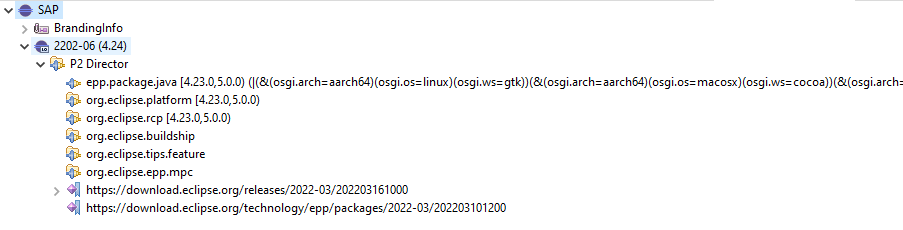

Komponenten einer "minimalen" ADT-Installation
{: .img-caption}

##### Project-Catalog und Project

Der Project-Catalog listet verfügbare Projects. Letztere enthalten Anweisungen für die Veränderung des Workspace. Hier werden beispielsweise auch die zu installierenden Plug-ins hinterlegt.

Die wichtigsten Elemente in einem Project sind:

| P2 Director | Gruppiert Requirements und Repositories                                                                                       |
| --------------- | ----------------------------------------------------------------------------------------------------------------------------- |
| **Requirement** | Zu installierende Feature Group                                                                                               |
| **Repository**  | Update-Site-URL                                                                                                               |
| **Stream**      | Verpflichtendes Objekt. Unterschiedliche Konfigurationen pro Stream möglich. Kann mit Namen, aber ohne Inhalt vorhanden sein. |
| **Variable**    | Variabler String mit Referenzierbarkeit z. B. in Repositories                                                                 |
| **Eclipse ini** | Veränderungen der Eclipse.ini                                                                                                 |
| **Preference**  | Voreingestellte Veränderung der Einstellungen (Window → Preferences).                                                         |

Wichtigste Elemente eines Projects
{: .table-caption}

Für eine minimale ADT-Installation wird benötigt:

- P2-Director-Knoten
  - ADT Feature Groups
    - com.sap.adt.tools.hana.devedition
    - com.sap.core.devedition
  - Repository für ADT
    - <https://tools.hana> .ondemand.com/latest
    - Alternativ: \${Variable} → z. B. \${sap.repository.url}
- Einen leeren Stream, standardmäßig "Master"

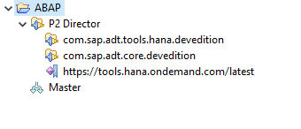

Komponenten einer minimalen ADT-Installation
{: .img-caption}

Zu beachten ist, dass ein Plug-in für Eclipse aus mehreren Feature Groups bestehen kann. Wie man diese herausfinden kann, wird im Abschnitt [Zusätzliches Plug-in installieren](#zusätzliches-plug-in-installieren) erklärt.

#### Verteilung des Installer und Konfiguration

Der Eclipse Installer ist dieselbe exe-Datei, die man von der Eclipse-Startseite herunterladen kann. Diese muss auf die Endgeräte verteilt werden.

Die Verteilung der Konfiguration erfolgt über die Anlage/Anpassung einer Datei mit festgelegtem Namen und Pfad:

```xml
<?xml version=”1.0” encoding=”UTF-8” ?>
<base:Annotation xmi:version=”2.0” 
                 xmlns:xmi=”http://www.omg.org/XMI” 
                 xmlns:base=”http://www.eclipse.org/oomph/base/1.0” 
                 source=”IndexLocations”>
   <detail key=”https://pages.github.com/path/subpath/myFirst.setup”>
     <value>Description of my first Oomph Catalog</value>
   </detail>
</base:Annotation>
```

Hierbei ist der Pfad zu einem oder mehreren Indizes anzugeben. Der Pfad kann auch ein Weblink oder git-Repository-Pfad sein. Die verlinkten Dateien werden dann bei jedem Start des Eclipse Installer heruntergeladen/aktualisiert.

Nun kann jeder Anwender, der im Besitz des Installer ist, diese Konfigurationen auswählen und installieren. Alternativ kann auch der Installer noch per Software-Verteilung im Unternehmen verteilt werden. Somit könnte ein Gleichlauf der Versionen zwischen Oomph-Komponenten in den Installationen und dem verwendeten Eclipse Installer erreicht werden.

#### Anpassungsbeispiele

Bisher wurden minimale Konfigurationen zur Installation von Eclipse und SAP ADT beschrieben. Die Stärken der Verwendung des Oomph Installer ergeben sich jedoch erst in der weiteren Vorkonfiguration bei der Installation. Auf die häufigsten Erweiterungswünsche wird nun eingegangen.

##### Zusätzliches Plug-in installieren

Einer der Vorteile von Eclipse als Entwicklungsplattform ist die Offenheit gegenüber Erweiterungen. Somit können von Drittherstellern oder engagierten Community-Mitgliedern Plug-ins geschrieben werden, die den Funktionsumfang der ADT noch erweitern.

Diese können in einem Oomph Project automatisch bei allen Installationen vorinstalliert werden. Leider ist es jedoch nicht möglich, ein Repository als Update-Site hinzuzufügen, dann aber kein Plug-in darauf zu installieren. Diese Update-Sites werden bei der Installation von Oomph verworfen (Stand: 2022).

Nun besteht ein Plug-in aus mindestens einer Feature Group. Im Oomph Project muss letztere hinterlegt werden. Der Name ist jedoch in der Regel nicht bekannt. Hierfür existiert im Oomph SDK eine View "Repository Explorer" (Window → Show View → Other → Oomph → Repository Explorer). Unter (manueller) Angabe einer Update-Site wird eine Abfrage der bereitgestellten Feature Groups durchgeführt. Diese können dann per Drag-and-drop oder **STRG+C** und **STRG+V** in den P2-Director-Knoten des Oomph Project eingefügt werden. Zusätzlich zu den Feature Groups muss auch ein Repository-Knoten existieren, der diese Update-Site zur Verfügung stellt (kann auch allgemeiner, d. h. im Project-Catalog oder Product (-Catalog) erfolgen).

Stand Oktober 2022 sieht die Abfrage der SAP-Update-Site wie folgt aus:

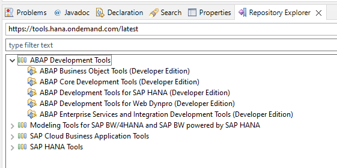

Bestandteile der SAP Update Site
{: .img-caption}

##### Vorgeben von Einstellungen

Neben der Installation von ADT ist die Voreinstellung diverser Einstellungen für alle Installationen einer der größten Vorteile.

Alle zu vergebenden Einstellungen kommen in den Compound/Ordner *User-Preferences* des Oomph Projects. Darunter gibt es dann einzelne Unterordner pro Feature (als Teil einer Feature Group) und darin dann die Einstellungen. Hierbei ist es jedoch jedem Feature selbst überlassen, in welcher Darstellung es seine Einstellungen speichert. Einige Einstellungen sind als direkte Werte abgelegt (klassische Checkboxen), andere beispielsweise als ein großes XML pro Einstellungsseite. Gerade bei letzterem können dann nur alle Einstellungen der Seite oder keine vorgegeben werden. Ein Beispiel für die XML-Darstellung sind die Code Templates der SAP ADT.

Da diese nicht einheitliche Darstellung unpraktisch zu administrieren ist und die Namen der Features in der Regel auch nicht bekannt sind, existieren auch hier Hilfswerkzeuge: In den Einstellungen wird ein Oomph Recorder installiert. Näheres zur Verwendung als Anwender kann dem Abschnitt [Oomph Recorder](#oomph-recorder) entnommen werden. Der Oomph Recorder zeichnet den letzten Stand aller geänderten Einstellungen auf Benutzerebene auf (also übergreifend über Eclipse-Installationen) und fragt nach dem Schließen der Einstellungen, ob diese immer/einmal/nie gespeichert werden sollen. Ebenso wird damit ein Button in der Button-Leiste von Eclipse verfügbar, um sich die bereits gespeicherten Einstellungen anzuschauen.

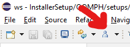

Möglichkeit zur Anzeige der bereits gespeicherten Einstellungen
{: .img-caption}

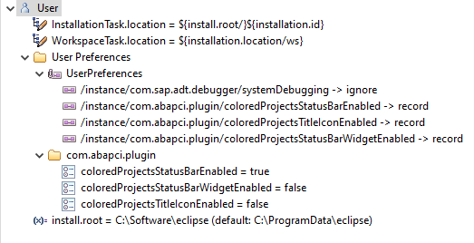

Bereits gespeicherte Einstellungen
{: .img-caption}

Hierbei handelt es sich wieder um setup-Dateien. Somit können auch hier wieder die aufgezeichneten Einstellungen mit Drag-and-drop oder **STRG+C** und **STRG+V** in das Oomph Project übernommen werden.

Folgend ein paar Beispiele für allgemein verteilte Einstellungen. Hier finden sich einige der ADT-exklusiven Features, die SAP leider nicht alle standardmäßig aktiviert.

- Code Templates
- Aktivierung der zusätzlichen Code-Highlights in ABAP (verschiedene Farben)
- Kontinuierliche Syntaxprüfung aktivieren
- Aktivieren des Occurrence Marker
- Einheitliche Darstellung von Einrückungen (Tabs oder Leerzeichen, Breite der Einrückung)

##### Grenzen Arbeitsspeicher anheben

Mit SAP ADT existieren keine Grenzen mehr in der Anzahl der geöffneten Fenster/Objekte. Das hat aber auch zur Folge, dass bei vielen gleichzeitigen Tabs der benötigte Arbeitsspeicher in die Höhe schnellt. Da Eclipse selbst auch eine Java-Anwendung ist, müssen VM-Parameter festgelegt werden. Ist der verfügbare Speicher einer Java-VM überschritten, findet analog der RAM-Verwaltung des Betriebssystems ein Swapping in Festplattendateien statt. Das macht Eclipse langsam und der Spaß an der Benutzung leidet. Es können für den VM-Speicher Mindest- und Maximalgrenzen, initial reservierte Speichermenge und vieles mehr eingestellt werden. Da hiermit aber auch eine Menge kaputt gemacht werden kann und die benötigten Grenzen doch sehr individuell sind, wird bewusst auf konkrete Empfehlungen verzichtet.

Sollten doch solche Parameter für alle Nutzer vorgegeben werden, so müssen diese in der Eclipse.ini angegeben werden. Somit müssen im Oomph Project entsprechende Eclipse Ini Tasks angelegt werden.

##### Erster Start mit ABAP Perspective

Werden die SAP ADT installiert, so sind die Standard-Perspectives zunächst nur vorhanden, aber nicht geöffnet. Eclipse startet beispielsweise mit der Java Perspective, welche die meisten ABAP-Entwickler eher selten benötigen werden. Daher ist es wünschenswert, die Installation direkt mit der ausgelieferten ABAP Perspective zu starten. Die Hinterlegung weiterer Perspectives (z. B. Debug, ABAP Profiling etc.) in den zuletzt verwendeten Perspectives oben rechts ist leider nicht möglich.

Das Erzwingen einer Start-Perspective ist eine Startoption in der Eclipse.ini. Es muss somit ein Eclipse Ini Task mit den folgenden Eigenschaften angelegt werden:

| Option | -perspective                   |
| ------ | ------------------------------ |
| Value  | com.sap.adt.ui.AbapPerspective |
| VM     | false                          |

### Anwenderinformationen

#### Installation mittels Eclipse Installer

Beim ersten Start des Eclipse Installer kann es sein, dass dieser im einfachen Modus startet. Für die Verwendung eigener Konfigurationen ist jedoch der erweiterte Modus nötig. Über das Menü oben rechts kann in diesen gewechselt werden ("Advanced Mode").

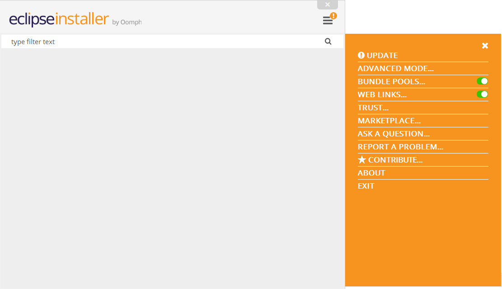

Wechsel in den "Advanced Mode"
{: .img-caption}

Nun sieht man eine Liste an verfügbaren Products. Dies ist der Inhalt des ersten referenzierten Index in der Indices.xmi. Oben rechts kann zwischen allen gelisteten Indizes gewechselt werden.


Wechsel zwischen Indizes
{: .img-caption}

Hier wählt man einen passenden Eintrag aus. Sobald dies geschehen ist, wird unten die verfügbare Produktversion auswählbar.

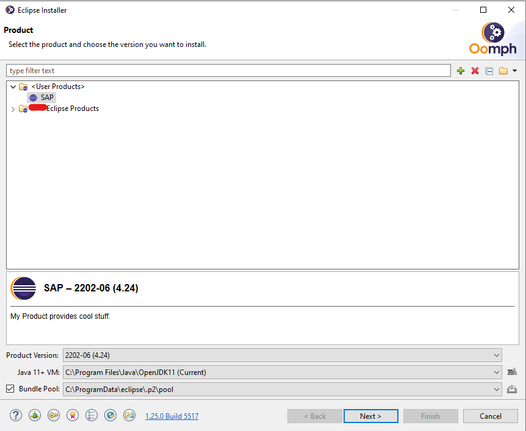

Auswahl der Product-Version
{: .img-caption}

Im nächsten Bild sind die Projects auswählbar. Hier können theoretisch mehrere Projects für eine Installation gewählt werden. Jedoch kann es passieren, dass diese Projects dann konkurrierende Einstellungen vornehmen, und es kommt zu Problemen.

Zu einem Project muss dann auch zwingend ein Stream gewählt werden. Wurde nur einer definiert, ist dieser bereits vorausgewählt.

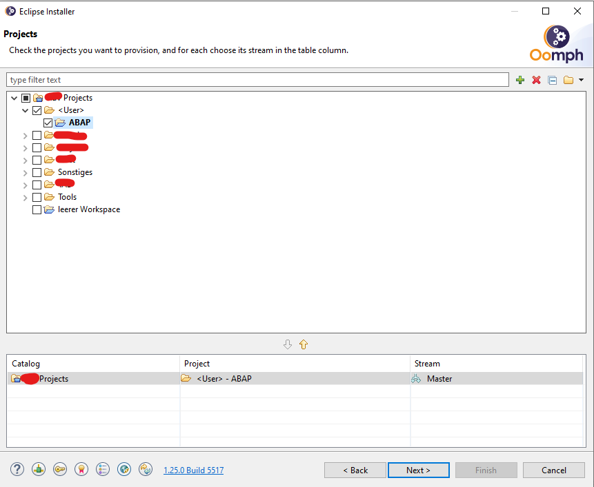

Auswahl des Streams
{: .img-caption}

Nun werden noch definierte und verwendete, aber nicht gefüllte Variablen abgefragt. Dies können beispielsweise die Pfade zu Installation und Workspace sein.

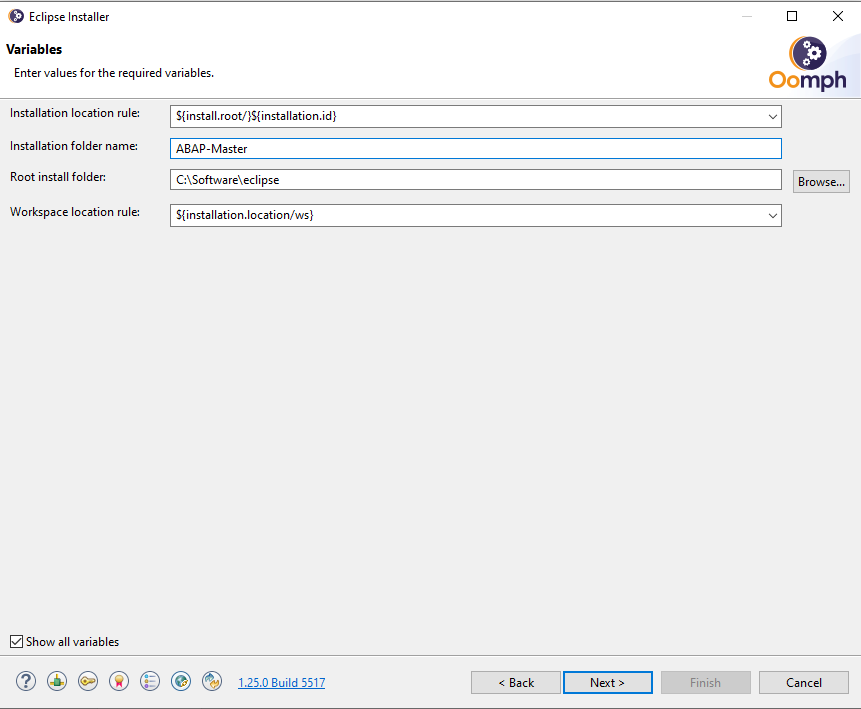

Abfrage weiterer Variablen
{: .img-caption}

Zuletzt wird noch eine Bestätigungsseite angezeigt, die aber in der Regel keine neuen Informationen enthält.

Während der Installation kann es passieren, dass Pop-ups angezeigt werden, in welchen Lizenzbedingungen akzeptiert und/oder Zertifikaten vertraut werden sollen.

Ist der Haken im Installer gesetzt, wird die eben installierte Instanz nach der Installation gestartet. Dabei werden dann noch einmal die Einstellungen des Workspace vorkonfiguriert, da der Workspace erst jetzt existiert. Nun ist die Installation abgeschlossen.

#### Oomph Recorder

Der Oomph Recorder ist ein Hilfswerkzeug, um Einstellungen über Eclipse-Installationen hinweg zu vereinheitlichen und zu sichern. Optional können diese Einstellungen auch an den Eclipse User Account geladen werden, so dass hier auch noch eine geräteübergreifende Synchronisation möglich ist. In den meisten Firmen ist die Verwendung eines Eclipse Accounts aber vermutlich nicht möglich oder nicht gern gesehen.

Der Oomph Recorder wird unter Window → Preferences mit einem neuen Aufnahmesymbol aktiviert. Ab dann wird bei jedem Schließen der Einstellungen abgefragt, ob die gerade veränderten Einstellungen immer/einmal/nie im letzten Zustand gespeichert werden sollen.

Diese Einstellungen auf User-Ebene werden bei einer neuen Eclipse-Installation erst nach dem ersten Start und nach den Einstellungen des verwendeten Oomph Projects angewendet. Somit können hier auch Standardeinstellungen benutzerindividuell übersteuert werden oder eigene Standardeinstellungen definiert werden.
