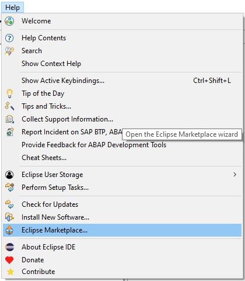
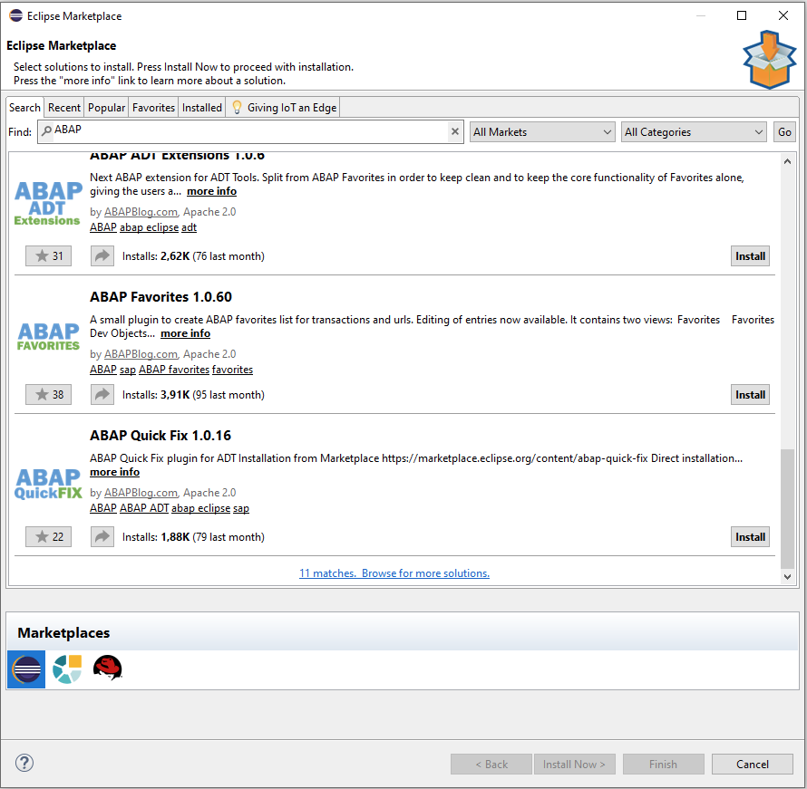
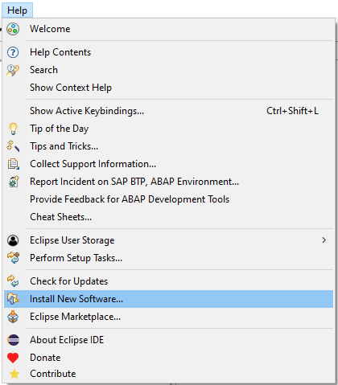
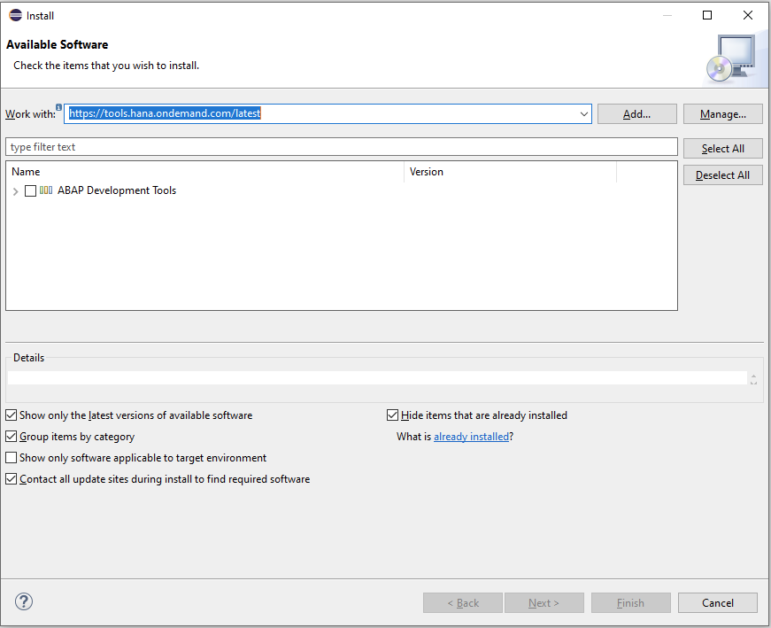

{: .no_toc}
# Plug-ins

1. TOC
{:toc}

Plug-ins wie die ADT können über die Angabe der Update-Site im Dialog Help → Install New Software zu einer bestehenden Eclipse-Plattform hinzugefügt werden. Einfacher ist jedoch die Verwendung des Eclipse Marketplace, sofern das Plug-in dort gelistet ist. Die ADT sind hier Stand 2022 leider nicht gelistet, so dass für die ADT der Weg über die Update-Site notwendig ist.

## Eclipse Marketplace

Der Eclipse Marketplace ist im Help-Menü versteckt.

  

*Abbildung: Einstieg in den Eclipse Marketplace*

Hier kann dann nach Plug-ins gesucht werden. Das Suchwort *ABAP* lieferte Stand 2022 in diesem Beispiel 11 Treffer.

  

*Abbildung: Exemplarische Suche nach Plug-ins im Eclipse Marketplace*

Jedes Plug-in besitzt auf der rechten Seite einen eigenen *Install*-Button. Gegebenenfalls müssen noch eine Lizenz bestätigt und Zertifikaten vertraut werden. Abschließend ist ein Neustart von Eclipse notwendig.

## Update-Site

Kennt man die Update-Site eines Plug-ins oder ist es nicht auf dem Eclipse Marketplace gelistet, kann auch der klassische Installationsweg verwendet werden.

  

*Abbildung: Installation neuer Software über das Kontextmenü*

Im Feld *Work with* wird die Update-Site eingetragen. Ist diese gültig, werden unten die dort verfügbaren Plug-ins angezeigt. Neben Webseiten kann auch eine heruntergeladene Version des Plug-ins in einer zip-Datei eine Update-Site sein. In letzterem Fall müssen Updates jedoch händisch mit einem weiteren Download durchgeführt werden.

  

*Abbildung: Eintragen der Update-Site*

Auch hier müssen gegebenenfalls Lizenzen akzeptiert und Zertifikaten vertraut werden. Nach einem Neustart steht das Plug-in zur Verfügung.