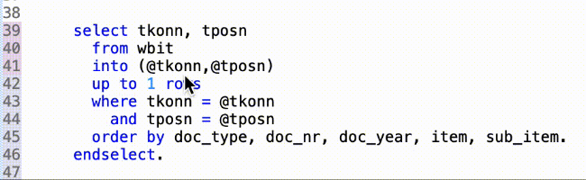

{: .no_toc}
# Nützliche Open Source ADT Plugins 

1. TOC
{:toc}

## ABAP Cleaner

Der ABAP Cleaner ist seit Sommer 2023 verfügbar und unterstützt Entwickler bei der Erstellung von ABAP Code, der den Richtlinien des Clean-ABAP Styleguides entspricht. Das Plugin lässt sich genau wie andere Eclipse Plugins und damit auch wie ADT in Eclipse mittels "Install new Software" einfach installieren. Die Update Site findet sich in GitHub unter:
[https://sap.github.io/abap-cleaner/updatesite](https://sap.github.io/abap-cleaner/updatesite).

Da der ABAP Cleaner rein Client-basiert ist, gibt es keine direkten Abhängigkeiten zu der ABAP Version des Backends. Da manche ABAP Cleaner Regeln nicht auf allen ABAP Releases anwendbar sind, z.B. Inline Deklarationen oder Einsatz neuer ABAP Statements, kann in der ABAP Cleaner Konfiguration das ABAP Release eingestellt werden. Dementsprechend werden auch nur anwendbare Regeln verwendet.

Mittels der [Stand-alone App](https://github.com/SAP/abap-cleaner?tab=readme-ov-file#using-the-stand-alone-app-with-sap-gui) des ABAP Cleaners kann auch ABAP Code aus dem SAP-GUI (bei Enhancements) oder aus anderen Systemen per Copy-and-Paste oder als Textdatei eingefügt, bereinigt und anschließend der bereinigte Code exportiert werden.
Die tatsächlich angewendeten Regeln werden in einem extra Fenster angezeigt.

Für Entwicklerteams besteht die Möglichkeit eigene Profile zu konfigurieren. In den Profilen werden die Regeln ausgewählt, die mit dem Profil angewendet werden sollen. In dieser Konfigurationsansicht wird die Auswirkung des Code Cleanings anhand von Beispielen dargestellt und man erhält so auch einen guten Überblick welche Änderungen die Regeln bewirken.
Für den Einstieg und für detaillierte Informationen empfehlen sich die Blogeinträge in blogs.sap.com:

- [ABAP cleaner project – open, configurable, and automated](https://blogs.sap.com/2023/10/30/abap-cleaner-project-open-configurable-and-automated/)
- [ABAP Tools for Clean ABAP](https://blogs.sap.com/2023/10/09/abap-tools-for-clean-abap/)

Eine ausführliche Session, die alle Aspekte von ABAP Cleaner erklärt, finden sie im YouTube Channel von [SAP Developers](https://www.youtube.com/watch?v=0mp0FuJV5_k).

Der ABAP Cleaner sollte genauso selbstverständlich zu den Werkzeugen des modernen ABAP Entwicklers gehören wie der Code Formatter oder der Syntax Check und sollte daher bei keiner ADT Installation fehlen. Dass die Funktionen des ABAP Cleaners nicht direkt in den ADT implementiert wurden, sondern als eigenes Plug-in durch SAP bereitgestellt werden, ermöglicht eine flexible und schnelle Auslieferung neuer Funktionen im ABAP Cleaner Kontext.

## ABAP Favorites

Das ABAP Favorites Plug-in wurde entwickelt, um die Funktionalität des SAP GUI User Menu abzubilden. In diesem Menü kann jeder Benutzer Transaktionen, Reports oder URLs seinen Favoriten hinzufügen und diese nach seinen persönlichen Vorlieben strukturieren.

Die Plug-in-Installation bringt mit Favorites und Favorite DevObjects zwei neue Views, verfügbar über Windows → Show View → Others. Beide Views bieten eine gefilterte Baumansicht, in der die favorisierten Objekte verwaltet werden können.

Der Unterschied der beiden Views liegt in den Möglichkeiten zur Erstellung der Ordner (Container). Die Favorites View ermöglicht zwei Arten dieser Ordner: "Standard" für Transaktionen, Reports und URL und "DevObject" zur Verwaltung von Entwicklungsobjekten wie Klassen, Funktionsbausteinen, CDS Views usw. Im Falle der Favorite DevObjects können ausschließlich "DevObject"-Ordner erstellt werden. Die Aufteilung dieser Views ermöglicht dem Verwender zu wählen, ob er alle Ordner vermischt oder gemäß der beschriebenen Trennung verwalten möchte.

Vergleicht man den "Standard"- mit dem "DevObject"-Ordner liegt neben den auswählbaren Objekttypen der größte Unterschied darin, dass bei "Standard" durch einen Doppelklick die Objekte ausgeführt werden. Ein Doppelklick in einem "DevObject"-Ordner bewirkt das Öffnen des ausgewählten Objekts.

ABAP Favorites View
{: .img-caption}

Um neue Objekte den Favoriten hinzuzufügen, können die Kontextmenüs der Favorites View, des ABAP Editors oder des Project Explorers genutzt werden.

Kontextmenü eines Ordners im ABAP Favorites View
{: .img-caption}

Voraussetzungen:

- Eclipse IDE for Java Developers
- ADT

Links:

- Source-Code auf [GitHub](https://github.com/fidley/ABAPFavorites)

- [Eclipse Marketplace](https://marketplace.eclipse.org/content/abap-favorites)

## ABAP Continuous Integration

AbapCI ist ein Open Source Eclipse Plug-in, das verschiedene Continuous Integration (CI) Tools für die ABAP-Entwicklung mit Eclipse bereitstellt. Das Plug-in basiert auf den CI-Funktionen von ADT.

Das Plug-in stellt folgende Funktionen bereit:

- Automatische Unit-Testläufe
- Automatische ATC-Läufe
- Visualisierung des Quellcode-Status auf der Benutzeroberfläche
- Unterschiedliche Farbgebung für jedes ABAP-Projekt
- Automatische Quellcode-Formatierung
- Shortcut für abapGit
- Auslösen von Jenkins aus Eclipse (experimentell)

Farbige Hervorhebung der Statusleiste pro Projekt + Teststatus
{: .img-caption}

Verwaltung von Paketen, für die Unittests und/oder ATC-Prüfläufe eingeplant sind
{: .img-caption}

Weitere Informationen können im GitHub Repository nachgelesen werden.

Voraussetzungen:

- Eclipse IDE for Java Developers ( \<= 2022-06, Installation mit neueren Versionen aktuell nur mit Workaround möglich; siehe [Issue](https://github.com/andau/abapCI/issues/34) auf GitHub)
- ADT

Links:

- Source-Code auf [GitHub](https://github.com/andau/abapCI)
- [Eclipse Marketplace](https://marketplace.eclipse.org/content/abap-continuous-integration)

## ABAP ADT Extensions

Dieses Plug-in erweitert die ADT um mehrere zusätzliche Funktionalitäten.

### Automatisches Einloggen in SAP-Systeme

Die Funktionalität "Automatisches Einloggen" ermöglicht dem Entwickler, seine Benutzer/Passwort-Kombinationen innerhalb des Secure Storage von Java zu verwalten. Sicherheitstechnisch sollten diese verschlüsselt werden.

View zur Verwaltung der hinterlegten Zugangsdaten von ABAP Systemen
{: .img-caption}

Abhängig von den Einstellungen des Plug-in kann man sich in jedes der ausgewählten On-Premise-SAP-Systeme, die mittels ABAP/BW-Projekten abgebildet sind, automatisch einloggen lassen. Die Passwörter können bei der Erstellung des Projekts oder erst später über die Passwort-View gepflegt werden.

### Verändern von ABAP-Projekt-Attributen

Durch das Kontextmenü des Project Explorers können für ABAP/BW-Projekte die Projektattribute (Client, User, Sprache) geändert werden. Zudem können die Breakpoint-User gesetzt werden.

Kontextmenü auf Projekt im Project Explorer
{: .img-caption}

### Eingabefeld zur Ausführung von Transaktions-Codes

Nach der Installation erscheint in Eclipse im unteren rechten Bereich eine Toolbar mit einem Eingabefeld für Transaktions-Codes. Das Feld kann per Maus oder über den Shortcut **Shift+F8** bedient werden. Nach der Eingabe des Codes und dem Bestätigen per Enter wird die Transaktion im momentan aktiven Projekt ausgeführt.

Statusleiste im Eclipse-Fenster
{: .img-caption}

Voraussetzungen:

- Eclipse IDE for Java Developers
- ADT

Links:

- Source-Code auf [GitHub](https://github.com/fidley/ABAP-Project-Extensions)
- [Eclipse Marketplace](https://marketplace.eclipse.org/content/abap-adt-extensions)

## ADT Classic Outline

Dieses Plug-in fügt Ihrer Oberfläche eine neue View namens "Classic Outline" hinzu, die gewissermaßen die SE80-Objektliste abbildet. In den meisten Fällen kann diese Ansicht die eingebaute ADT Outline ersetzen. Die angezeigte Objektliste kann gefiltert werden und erlaubt die Ansicht der Objektattribute, ähnlich der eingebauten ADT Outline. Durch einen Doppelklick (bzw. einfachen Klick abhängig von den Einstellungen) kann in das selektierte Objekt navigiert werden.

Classic Outline View
{: .img-caption}

Voraussetzungen:

- Eclipse IDE for Java Developers
- ADT

Voraussetzungen ABAP:

- SAP NetWeaver 7.40 SP08 oder neuer
- abapGit repository [ADT Classic Outline Backend](https://github.com/fidley/ADT-Classic-Outline-Backend.git) muss installiert sein

Links:

- Source-Code auf GitHub: [Frontend](https://github.com/fidley/ADT-Classic-Outline-Frontend) und [Backend](https://github.com/fidley/ADT-Classic-Outline-Backend)

- [Eclipse Marketplace](https://marketplace.eclipse.org/content/adt-classic-outline)

## ABAP Quick Fix

Quick Fixes sind Teil der Eclipse IDE. Im ADT-Standard werden sie im Backend-System verarbeitet und können vom Nutzer bei Bedarf mittels Shortcut **CTRL+1** verwendet werden. Das ABAP Quick Fix Plug-in bietet zusätzliche Quick Fixes, die direkt von der Eclipse-Umgebung prozessiert werden.

ABAP Code vor Quick-Fix-Ausführung
{: .img-caption}

ABAP Code nach Quick-Fix-Ausführung
{: .img-caption}

Einen Auszug der verfügbaren Features finden Sie in der folgenden Liste:

- Ersetze READ TABLE durch ASSIGN, REF#, Table Expression oder line_exists.
- Ersetze CALL METHOD durch den direkten Aufruf.
- Ersetze MOVE durch die direkte Zuweisung.
- Ändere APPEND TO in APPEND VALUE#( ) TO.
- Ersetze CREATE OBJECT durch NEW.
- Entferne "full line comments" vom Statement.
- Unterlasse die Selbstreferenz ME-\>.
- Ersetze die Operatoren EQ, NE, GT, GE, LT, LE mit =, \<\>, \>, \>=, \<, \<=
- Rücke Operatoren im markierten Bereich entsprechend ein.
- Rücke TYPE und LIKE im Deklarationsblock der Variablen entsprechen ein.

Voraussetzungen:

- Eclipse IDE for Java Developers
- ADT

Links:

- Source-Code auf [GitHub](https://github.com/fidley/ABAPQuickFix)
- [Eclipse Marketplace](https://marketplace.eclipse.org/content/abap-quick-fix)

## ABAPQuickFixS4Conversion

Dieses Plug-in ist ein sehr schönes Beispiel für die Zusammenarbeit von Entwicklern innerhalb der Community. ABAPQuickFixS4Conversion ist eine Erweiterung des ABAP Quick Fix Plug-in von SAP und ergänzt dieses um folgende Funktionalitäten:

- Konvertiere SELECT SINGLE nach SELECT ... UP TO 1 ROWS ... ORDER BY
- Passe für jede beliebige Tabelle die custom ORDER BY-Liste an
- Ändere SELECT SINGLE auf den modernen SQL-Stil
- Konvertiere SELECT/ENDSELECT in den modernen SQL-Stil
- Transformiere MOVE_CORRESPONDING nach CORRESPONDING #( )

Beispiel für Quick-Fix-Verfügbarkeit bei einer SELECT-Anweisung
{: .img-caption}

SELECT-Anweisung nach Anwendung des Quick Fix
{: .img-caption}

Voraussetzungen:

- Eclipse IDE for Java Developers
- ADT
- ABAP Quick Fixes plugin

Links:

- Source-Code auf [GitHub](https://github.com/lc-leuc/ABAPQuickFixS4Conversion)
- [Eclipse Marketplace](https://marketplace.eclipse.org/content/abap-quickfix-s4-conversion)

## ABAP Tags

Das ABAP Tags Plug-in ermöglicht es, Tags zu erstellen, welche dann zu beliebigen Entwicklungsobjekten hinzugefügt werden können. Die Tags und deren zugeordneten Objekte werden dabei auf dem jeweiligen ABAP-System persistiert. Dies erleichtert den Zugriff auf getaggte Objekte durch andere Benutzer. Generell erlaubt das Plug-in, Tags entweder im globalen oder im benutzerspezifischen Geltungsbereich anzulegen. Benutzerspezifische Tags können dabei auch mit anderen geteilt werden und dadurch die Zusammenarbeit erleichtern.

View "Tag Manager"
{: .img-caption}

Das Taggen von Objekten ist intuitiv über das Kontextmenü aus dem Editor oder dem Project Explorer heraus möglich. Die getaggten Objekte können dann entweder aus dem View "Tag Manager" mittels Kontextmenü-Aktion, oder über die in den "Search"-Dialog integrierten "ABAP Tagged Object Search" gesucht und angezeigt werden.

Search-Dialog mit Seite "ABAP Object Search"
{: .img-caption}

Voraussetzungen Eclipse:

- Eclipse Platform Runtime oder Eclipse IDE for Java Developers
- ADT

Voraussetzungen ABAP:

- SAP NetWeaver 7.40 SP08 oder neuer
- abapGit repository [abap-tags-backend](https://github.com/stockbal/abap-tags-backend) muss installiert sein

Links:

- Source-Code auf [GitHub](https://github.com/stockbal/abap-tags-ui)
- [Eclipse Marketplace](https://marketplace.eclipse.org/content/abap-tags) (Marketplace Client muss installiert sein)

## ABAP Search and Analysis Tools

Dieses Plug-in erweitert die ADT um weitere Such- und Analysefunktionen für die folgenden Objekttypen:

- Klasse/Interface
- Datenbanktabelle/-view
- CDS View

Die Suchfunktionen sind in den Eclipse-Search-Dialog integriert (<kbd>Strg</kbd>+<kbd>H</kbd>). Die Bedienung ist dabei ähnlich wie beim Dialog "Open ABAP Development Object" (<kbd>Strg</kbd>+<kbd>Shift</kbd>+<kbd>A</kbd>). Den Objekttyp kann man mittels Dropdown ändern. Dieser steuert unter anderem die verfügbaren Filter im Feld "Search Filters".

Search-Dialog auf Seite "ABAP Object Search"
{: .img-caption}

Zusätzlich zu den Suchfunktionen stellt das Plug-in noch den View "CDS Analyzer" zur Verfügung, der die folgenden Analysen auf CDS Views erlaubt:

- Top-Down
- Auswertung auf alle verwendeten Entitäten eines CDS View
- Verwendungsnachweis von Datenbankentitäten als Datenquelle ("*select from"* oder "*association"*)
- Analyse auf Feldebene
  - Top-Down (Herkunftsermittlung)
  - Bottom-up (Verwendung eines Feldes in Feldern anderer CDS Views)

View "CDS Analyzer" - Top-Down-Analyse
{: .img-caption}

Voraussetzungen Eclipse:

- Eclipse Platform Runtime oder Eclipse IDE for Java Developers
- ADT

Voraussetzungen ABAP:

- SAP NetWeaver 7.40 SP08 oder neuer
- abapGit repository [abap-search-tools](https://github.com/stockbal/abap-search-tools) muss installiert sein

Links:

- Source-Code auf [GitHub](https://github.com/stockbal/abap-search-tools-ui)
- [Eclipse Marketplace](https://marketplace.eclipse.org/content/abap-search-and-analysis-tools) (Marketplace Client muss installiert sein)

## ABAP Code Search

Dieses Plug-in bringt die bekannte SAP-GUI-Transaktion CODE_SCANNER nach Eclipse. Wie der Name schon vermuten lässt, ist die "ABAP Code Search" auch im Eclipse-Search-Dialog integriert. Neben der Verwendung von regulären Ausdrücken gibt es auch spezielle Suchmodi wie z. B. *Single Pattern mode* oder *Sequential Matching*. Weitere Merkmale der Suche sind:

- Parallele Ausführung (optional pro Benutzer steuerbar)
- Suche kann jederzeit gestoppt werden
- Komplette Systemsuche möglich, da auf dem Anwendungs-Server immer nur kleine Pakete verarbeitet werden
- Tags können zur Objektauswahl verwendet werden → erfordert Installation des ABAP Tags Plug-in

Search-Dialog mit "ABAP Code Search"-Seite
{: .img-caption}

Voraussetzungen Eclipse:

- Eclipse Platform Runtime oder Eclipse IDE for Java Developers
- ADT

Voraussetzungen ABAP:

- SAP NetWeaver 7.40 SP08 oder neuer
- abapGit repository [abap-code-search-tools](https://github.com/stockbal/abap-code-search-tools) muss installiert sein

Links:

- Source-Code auf [GitHub](https://github.com/stockbal/abap-code-search-tools)
- [Eclipse Marketplace](https://marketplace.eclipse.org/content/abap-code-search) (Marketplace Client muss installiert sein)

## abapGit Eclipse Plug-in

Stellt die Funktionen der abapGit-SAP-GUI-Transaktion als Eclipse Plug-in bereit. Der volle Funktionsumfang ist aktuell (2022) jedoch nur über die SAP-GUI-Transaktion gewährleistet.

Voraussetzungen Eclipse:

- Eclipse IDE for Java Developers
- ADT

Voraussetzungen ABAP:

- SAP NetWeaver 7.50 oder neuer
- Vollständige [abapGit](https://github.com/abapGit/abapGit) Installation
- abapGit repository [ADT_Backend](https://github.com/abapGit/ADT_Backend) muss installiert sein

Links:

- Source-Code auf [GitHub](https://github.com/abapGit/ADT_Frontend)
- Installation über Update-Site [https://eclipse.abapgit.org/updatesite/](https://eclipse.abapgit.org/updatesite/)
