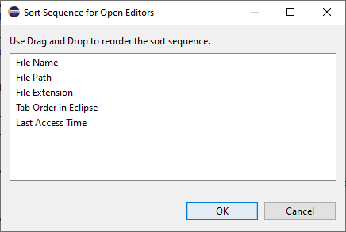
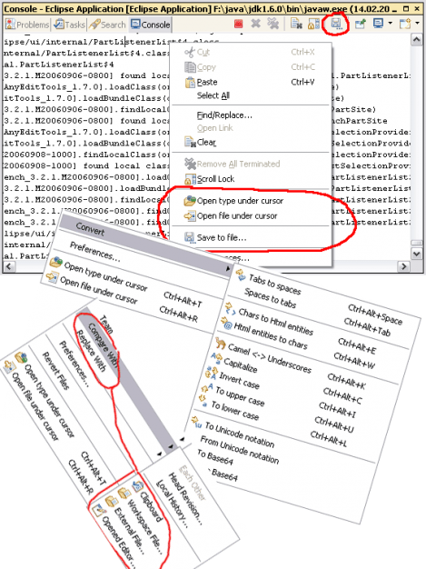
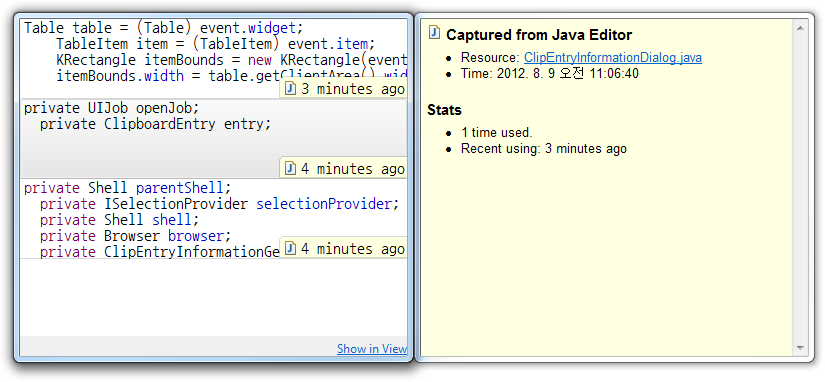

{: .no_toc}
# Nützliche Open-Source-Plug-ins

1. TOC
{:toc}

## Open Editors

Bietet eine neue View, die alle geöffneten Editoren in Eclipse anzeigt. Diese View bietet auch die Möglichkeit, die Sortierreihenfolge der Editoren anzupassen.

Dialog zur Anpassung der Sortierreihenfolge von geöffneten Editoren
{: .img-caption}

Voraussetzungen Eclipse:

- Eclipse IDE for Java Developers

Links:

- Source-Code auf [GitHub](https://github.com/dbickley/OpenEditors)
- [Eclipse Marketplace](https://marketplace.eclipse.org/content/open-editors)

## AnyEdit Tools

Bietet viele Möglichkeiten zum Editieren von Text/Quellcode:

- Umwandlung von Text in Klein-/Großbuchstaben
- Umwandlung von Text von Pascal- zu Camel-Schreibweise
- Sortierung der selektierten Zeilen (alphabetisch, numerisch, nach Zeilenlänge)
- ...

Zusätzlich bietet das Plug-in auch viele Möglichkeiten zum Vergleichen von Text.

- Vergleich eines Editors mit Text in der Zwischenablage
- Vergleich eines Editors mit einem beliebigen anderen Editor
- Vergleich eines Editors mit einer externen Datei

Alle möglichen Operationen stehen über das Kontextmenü eines Editors zur Verfügung.

Beispiele für verfügbare Operationen im Kontextmenü
{: .img-caption}

Voraussetzungen Eclipse:

- Eclipse IDE for Java Developers

Links

- Source-Code auf [GitHub](https://github.com/iloveeclipse/anyedittools)
- [Eclipse Marketplace](https://marketplace.eclipse.org/content/anyedit-tools)

## PDE Tools

Dieses Plug-in erweitert Eclipse um nützliche Tools für Plug-in-Entwickler:

- Vorschau von Icon-Dateien direkt im Project Explorer
- Generierung von Java-Konstanten für Icon-Ordner
- Screenshot-Tool für UI-Elemente im Eclipse Workbench

Es gibt jedoch Features, die auch außerhalb der Plug-in-Entwicklung hilfreich sind:

- Erweiterte Historie der Zwischenablage
- Direkter Start eines neuen Eclipse-Fensters mit einem bestimmten Workspace

Historie für Zwischenablage (Tastenkürzel Strg+Shift+V)
{: .img-caption}

Links:

- Source-Code auf [GitHub](https://github.com/jeeeyul/pde-tools)
- [Eclipse Marketplace](https://marketplace.eclipse.org/content/pde-tools)