{: .no_toc}
# Eigene ADT Plug-ins entwickeln

1. TOC
{:toc}

## Voraussetzungen

Da Plug-ins für Eclipse in Java zu entwickeln sind, empfiehlt es sich, dort schon einige Kenntnisse zu haben. Der notwendige Kenntnisgrad richtet sich dabei nach dem Plug-in, das man entwickeln will.

## Einrichtung der Entwicklungsumgebung

### Installation Eclipse for RCP/RAP Development

Um Plug-ins für Eclipse zu entwickeln, benötigt man eine bestimmte Variante der Eclipse-Plattform: *Eclipse IDE for RCP and RAP Developers* (RAP = Remote Application Platform). Diese Variante bietet ein vollständiges Toolset, um sowohl Plug-ins für Eclipse als auch Rich-Client-Anwendungen (RCP) auf Basis von Eclipse zu entwickeln. Sie kann direkt von [eclipse.org](https://www.eclipse.org/downloads/packages/) bezogen werden.

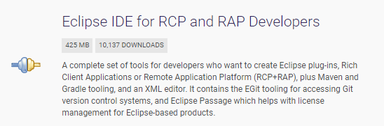  
<span class="img-caption" markdown=1>
*Abbildung: Eclipse Bundle "Eclipse IDE for RCP and RAP Developers"*
</span>

Des Weiteren wird eine Installation des Java Development Kits (JDK) benötigt. Dieses kann z. B. von den folgenden Quellen bezogen werden:

- [https://adoptium.net/de/](https://adoptium.net/de/)
- [https://openjdk.org/](https://openjdk.org/)
- [https://sap.github.io/SapMachine/](https://sap.github.io/SapMachine/)

**Hinweis**: In den aktuelleren Eclipse-Versionen wird dieses bereits mitgeliefert.

#### Welche Java-Version?

Seit Eclipse v2020-09 bzw. ADT v3.16 ist Java 11 die Mindestvoraussetzung, und somit sollte auch das JDK in mindestens dieser Version installiert werden.

### Installation von ADT

Als nächsten Schritt muss ADT in Eclipse installiert werden, da sonst nicht gegen das ADT SDK entwickelt werden kann.

Um die bestmögliche Kompatibilität zu haben, empfiehlt es sich, ADT immer in der gleichen Version wie Eclipse zu installieren. Die neueste ADT-Version kann hierbei über [https://tools.hana.ondemand.com/latest](https://tools.hana.ondemand.com/latest) bezogen werden. Für ältere Versionen von ADT muss einfach das *latest* im Pfad gegen die gewünschte Eclipse-Version ausgetauscht werden (für Eclipse 2020-09 wäre es z. B.: [https://tools.hana.ondemand.com/2020-09](https://tools.hana.ondemand.com/2020-09)).

### Installation nützlicher Plug-ins (optional)

Neben der Eclipse-Installation empfiehlt es sich, noch folgende Plug-ins zu installieren:

#### Enhanced Class Decompiler 

Marketplace Link: [https://marketplace.eclipse.org/content/enhanced-class-decompiler](https://marketplace.eclipse.org/content/enhanced-class-decompiler).

Dieses Plug-in erlaubt es, kompilierten Source-Code lesbar anzuzeigen. Es ist sogar möglich, in solchen de-kompilierten Klassen Haltepunkte zu setzen und den Code zur Laufzeit zu analysieren.

#### Web Developer Tools

Marketplace Link: [https://marketplace.eclipse.org/content/eclipse-web-developer-tools-0/promo](https://marketplace.eclipse.org/content/eclipse-web-developer-tools-0/promo).

Wenn man für sein Plug-in auch eine Hilfe anbieten möchte, erweitert dieses Plug-in Eclipse um Editoren mit Syntax-Highlighting für die typischen Web-Dateiendungen (css, html etc.).

#### WindowBuilder

Marketplace Link: [https://www.eclipse.org/windowbuilder/](https://www.eclipse.org/windowbuilder/)

Das Erstellen von GUI-Elementen, wie z. B. Dialoge oder eigene Sichten, kann zeitweise sehr aufwendig sein. Der WindowBuilder kann dabei Abhilfe schaffen und erlaubt es, GUI-Elemente mit Hilfe eines grafischen Editors zu erstellen.

## Wichtige Konzepte/Artefakte

### Plug-in

Ein Plug-in wird verwendet, um Code zu einer modularen, erweiterbaren und gemeinsam nutzbaren Einheit zusammenzufassen. Die gesamte Eclipse-Anwendung besteht aus vielen solcher Plug-ins.

### Feature

Ein Feature dient zur Gruppierung von einem oder mehreren Plug-ins zu einer einzigen installierbaren und aktualisierbaren Einheit.

### Update-Site

Update-Sites werden verwendet, um Features zu organisieren und zu exportieren, damit sie in Eclipse-Anwendungen installiert werden können.

## Erstellung eines Plug-in-Projektes

Ein neues Plug-in-Projekt kann über File → New → Plug-in Project erstellt werden. Daraufhin öffnet sich der Plug-in Project Wizard:

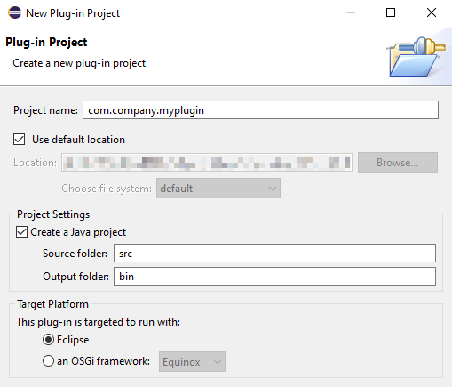  
<span class="img-caption" markdown=1>
*Abbildung: Plug-in Project Wizard - Einstieg*
</span>

Hier muss zunächst ein Name für das Projekt vergeben werden. Beim Namen wird die sog. *Reverse-Naming-Domain-Notation* empfohlen (z. B. com.company.myplugin), jedoch kann hier auch jede beliebige andere Namenskonvention gewählt werden.

Standardmäßig wird ein Plug-in Projekt immer als Java-Projekt angelegt weil die meisten Plug-ins Code beisteuern. Diese Option kann jedoch auch abgewählt werden, z. B. für Plug-ins, welche nur Dokumentation bereitstellen.

Da in diesem Guide explizit auf die Plug-in-Entwicklung für Eclipse eingegangen wird, ist die *Zielplattform* immer Eclipse.

Durch den Klick auf *Next* geht es auf die nächste Seite des Wizards.

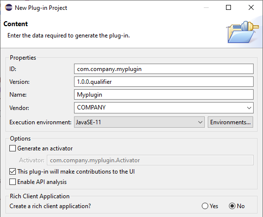  
<span class="img-caption" markdown=1>
*Abbildung: Plug-in Project Wizard - Inhalt*
</span>

Hier werden die Plug-in-spezifischen Eigenschaften erfasst. Für die ID wird empfohlen, den Projektnamen zu verwenden, verpflichtend ist dies jedoch nicht. Die Version muss dem Muster *major.minor.micro.qualifier* folgen. Der *.qualifier*-Teil ist dabei optional. Er wird beim Build durch einen Zeitstempel ersetzt (z. B. 1.3.0.202205011550).

Die Felder *Name* und *Vendor* sind übersetzbar und repräsentieren den Plug-in-Namen und dessen Anbieter.

Beim *Execution Environment* ist die minimal erforderliche Java-Version einzutragen. Für die ADT Plug-ins ist aktuell Java 11 die Mindestvoraussetzung und sollte demnach auch für eigene Plug-ins gesetzt werden.

Wenn die Option *Generate an activator* gesetzt ist, wird eine *Activator*-Klasse generiert. Solch eine Klasse kann pro Plug-in genau einmal existieren und ist nur notwendig, wenn Aktivitäten beim Starten bzw. beim Stoppen des Plug-in notwendig sind. Die Option *This plug-in will make contributions to the UI* regelt die verfügbaren Templates, die auf der nächsten Seite des Wizard ausgewählt werden können.

Als letzten optionalen Schritt kann auf der nächsten Seite noch ein Template ausgewählt werden. Templates existieren zum Beispiel für das Erstellen von eigenen Views oder Editoren.

Nach Abschluss des Wizard mittels *Finish* wird das Plug-in-Projekt an der ausgewählten Stelle im Dateisystem generiert und anschließend im Eclipse Workspace angezeigt.

### Struktur eines Plug-In-Projektes

Ein Plug-in-Projekt hat immer den folgenden Aufbau. Die Datei *plugin.xml* und der Ordner *OSGI-INF* sind dabei optional und existieren nur, wenn die Notwendigkeit besteht.

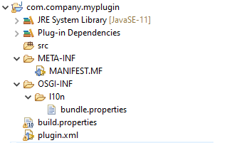  
<span class="img-caption" markdown=1>
*Abbildung: Plug-in-Projekt im Project Explorer View*
</span>

Die wichtigsten Dateien sind *manifest.mf*, *build.properties* und *plugin.xml*. Öffnet man eine dieser drei Dateien, wird standardmäßig der Plug-in-Manifest-Editor geöffnet. Dieser Editor ermöglicht die Pflege aller Metadaten eines Plug-in, welcher der Editor in folgende Bereiche untergliedert:

- **Overview**  
  Diese Sicht dient als genereller Einstiegspunkt. Sie erlaubt die Pflege der grundlegenden Plug-in-Daten wie Name, Version etc. und den Absprung zu den anderen Sichten.

- **Dependencies**  
  Hier müssen alle Plug-ins aufgelistet werden, die in diesem Plug-in benötigt werden.

- **Runtime**  
  Dient zur Spezifikation der Java-Pakete, die für andere Plug-ins sichtbar sein sollen.  
  Für jedes Paket kann außerdem noch ein API-Status gesetzt werden.

- **Extensions**  
  Hier erfolgt die eigentliche Erweiterung von Eclipse um z. B. neue Menüs, Commands, Views etc.

- **Extension Points**  
  Definition der Erweiterungspunkte, die dieses Plug-in für andere bereitstellt.

- **Build**  
  Konfiguration, welche Dateien im Build-Ergebnis enthalten sein sollen.

## Erstellung eines Feature-Projektes

Ein neues Feature-Projekt kann über File → New → Feature Project erstellt werden. Daraufhin öffnet sich der Feature Project Wizard:

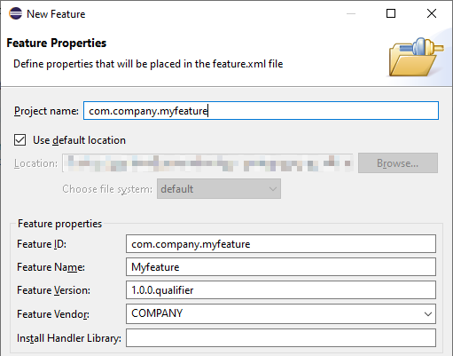  
<span class="img-caption" markdown=1>
*Abbildung: Feature Project Wizard - Einstieg*
</span>

Die Eigenschaften bei einem Feature-Projekt sind ähnlich wie beim Plug-in-Projekt, und somit gelten auch die gleichen Regeln für z. B. *ID*, *Name* oder *Version*.

Nun kann der Wizard beendet werden oder man navigiert zur nächsten Seite, auf der man gleich die Plug-ins selektieren kann, die in diesem Feature enthalten sein sollen:

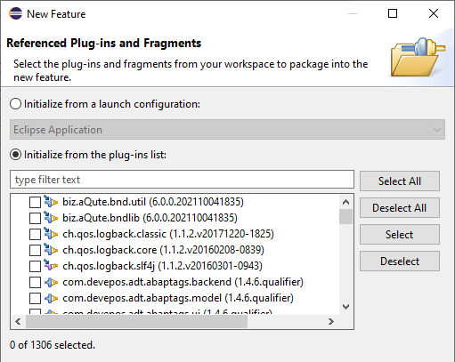  
<span class="img-caption" markdown=1>
*Abbildung: Feature Project Wizard - Plug-in-Auswahl*
</span>

Nach Abschluss wird das Feature-Projekt generiert und im Workbench angezeigt.

### Struktur eines Feature-Projekts

Ein Feature-Projekt hat eine sehr einfache Struktur. Es enthält nur die zwei Dateien *feature.xml* und *build.properties*. Wie beim Plug-in-Projekt gibt es zur Pflege der Feature-Metadaten einen eigenen Manifest-Editor, welcher sich automatisch beim Öffnen einer der beiden Dateien öffnet.

Dieser ist in die folgenden Sektionen unterteilt:

- **Overview**  
  Diese Sicht dient als genereller Einstiegspunkt. Sie erlaubt die Pflege der grundlegenden Plug-in-Daten wie Name, Version etc. und den Absprung zu den anderen Sichten.

- **Information**  
  Hier können Beschreibung, Copyright-Notice und Lizenzvereinbarung gepflegt werden.

- **Included Plug-ins**  
  Auswahl der Plug-ins, die in diesem Feature enthalten sind.

- **Included Features**  
  Features können zur Gruppierung anderer Features verwendet werden und somit können hier die enthaltenen Features gelistet werden.

- **Dependencies**  
  Normalerweise werden alle Abhängigkeiten beim Build berechnet. Dies passiert durch Analyse der Abhängigkeiten aller enthaltenen Plug-ins. Es besteht jedoch auch die Möglichkeit, die Abhängigkeiten hier manuell zu pflegen.

- **Build**  
  siehe Plug-in-Manifest

## Erstellung einer Update-Site

Ein neues Update-Site-Projekt kann über File → New → Project... → Plug-in Development →\> Update Site Project erstellt werden. Daraufhin öffnet sich der Update Site Project Wizard:

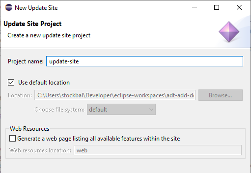  
<span class="img-caption" markdown=1>
*Abbildung: Update Site Wizard*
</span>

Der Wizard enthält nur eine Seite, auf der man dem Projekt einen Namen gibt und den Ablageort auswählen kann. Nach Abschluss des Wizard sollte sich im Workspace ein Ordner mit dem gewählten Projektnamen befinden. In diesem Ordner befindet sich die Manifestdatei der Update-Site, genannt *site.xml*.

Bei Doppelklick auf diese Datei öffnet sich der Manifest-Editor für die Update-Site. In diesem Editor können nun die Features hinzugefügt werden, die auf der Site veröffentlicht werden sollen. Zur besseren Übersicht sollten die Features in Kategorien unterteilt werden.

Nachdem der Inhalt der Update-Site fertig konfiguriert ist, kann diese über den Button *Build all* im Editor erstellt werden. Es ist auch möglich, nur einzelne bzw. ausgewählte Features zu erstellen.

**WICHTIG**: Bevor man nun die Update-Site erstellt, sollte man nochmal die Java-Compiler-Einstellungen über Window → Preferences → Java → Compiler prüfen. Diese sollten auf die gleiche Java-Version eingestellt sein, die bei den Plug-ins als minimale Voraussetzung definiert wurde:

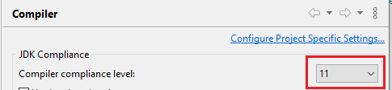  
<span class="img-caption" markdown=1>
*Abbildung: Compiler-Einstellungen im Eclipse-Einstellungsdialog*
</span>

Wenn die Erstellung erfolgreich war, befinden sich die folgenden Dateien/Ordner im Anschluss im Projektordner der Update-Site:

- features (enthält jar-Dateien der Features)
- plugins (enthält jar-Dateien der Plug-ins)
- artifacts.jar
- content.jar

Zusätzlich kann auch noch ein Archiv mit dem Namen *logs.zip* erstellt worden sein. Dort befinden sich alle Meldungen, die während der Kompilierung aufgetreten sind.

### Testen der Update-Site

Bevor die erstellte Site nun auf einem Webserver hochgeladen wird, möchte man diese vorher eventuell noch testen. Dazu sollte man sich eine neue Eclipse-Installation besorgen. Hierfür ist die Variante *Eclipse IDE for Java Developers* völlig ausreichend. In dieser Installation werden nun erst die ADT installiert, nach einem Neustart fügt man jetzt die neue -- bis jetzt noch lokale -- Update-Site über Help → Install New Software... → Add*...* hinzu:

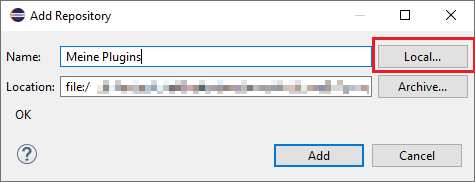  
<span class="img-caption" markdown=1>
*Abbildung: Dialog zum Hinzufügen einer Update-Site*
</span>

Über den Button "Local...*"* wählt man dann das Verzeichnis des Update-Site-Projekts aus. Nach Klick auf den Button "Add" sollten die Kategorien und die zugewiesenen Features der Update-Site aufgelistet und installierbar sein.

### Deployment

Wenn der Test der Update-Site erfolgreich war, kann diese nun auf einem Webserver hochgeladen werden, um die Artefakte für andere bereitzustellen. Sollte man die Kosten für einen eigenen Webserver scheuen, gibt es zum Beispiel über GitHub Pages eine kostenlose Möglichkeit, seine Update-Site bereitzustellen. Dazu initialisiert man im Projektverzeichnis der Update-Site ein neues Git Repository und veröffentlicht dieses in einem öffentlichen Repository auf GitHub. Im Anschluss kann in den Repository-Einstellungen auf GitHub die Option "GitHub Pages" aktiviert werden:

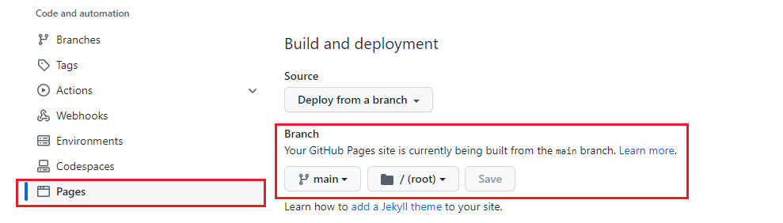  
<span class="img-caption" markdown=1>
*Abbildung: GitHub-Repository-Einstellungen für GitHub Pages*
</span>

Nachdem das Erstellen der GitHub-Pages-Seite durch GitHub abgeschlossen ist, kann diese mit der URL *https://\<username\>.github.io/\<repository-name\>* in Eclipse als Update-Site eingetragen werden.

## Erweiterung des ADT Backends mit ABAP Code

Für die Kommunikation von Eclipse zum ABAP Server verwenden die ADT RESTful APIs. Wie man solche APIs selbst entwickelt, kann in dem SAP Guide [How To\... Create RESTful APIs and consume them in ADT](https://assets.cdn.sap.com/sapcom/docs/2013/04/12289ce1-527c-0010-82c7-eda71af511fa.pdf) nachgelesen werden.

Obwohl hier die Rede von RESTful APIs ist, findet von ADT aus keine Kommunikation mittels HTTP statt. Sie erfolgt mit dem RFC-Protokoll. In der untersten Ebene der Kommunikationsschicht von ADT findet somit ein RFC-Aufruf statt, der einen bestimmten RFC-Funktionsbaustein auf dem ABAP Server aufruft.

Somit steht es jedem offen, entweder, wie im Guide beschrieben, eigene RESTful APIs mit dem BAdI-Erweiterungskonzept zu entwickeln oder alternativ einen RFC-fähigen Funktionsbaustein zu entwickeln und diesen mit dem RFC Java Connector aufzurufen. Die Java Connector API kann über das Plug-in "com.sap.conn.jco" eingebunden und verwendet werden.

Vor allem bei kleineren Plug-ins mag die BAdI-Methode als ziemlicher Overhead wirken, sowohl auf ABAP- als auch auf Java-Seite. Jedoch hat der BAdI-Ansatz auch seine Vorteile. Vor allem durch den Einsatz von EMF (Eclipse Modelling Framework) besteht die Möglichkeit, einen von ABAP nach XML serialisierten String ganz einfach in Objekte in Java umzuwandeln. Einfach beschrieben benötigt man dafür auf der ABAP-Seite eine "Simple Transformation" (Objekttyp XSLT), um ABAP-Daten nach XML zu transformieren.

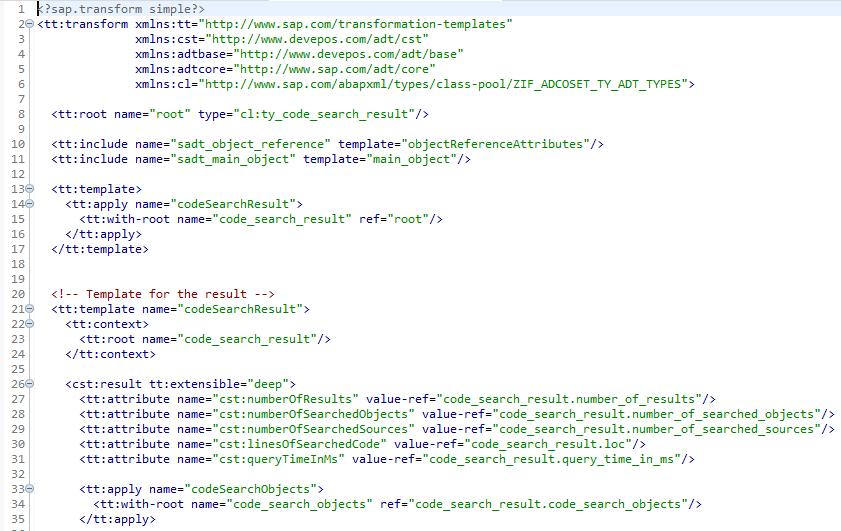  
<span class="img-caption" markdown=1>
*Abbildung: Beispiel für eine Simple Transformation zur Transformation von ABAP \<-\> XML*
</span>

Und seitens Java ist ein EMF-Modell notwendig.

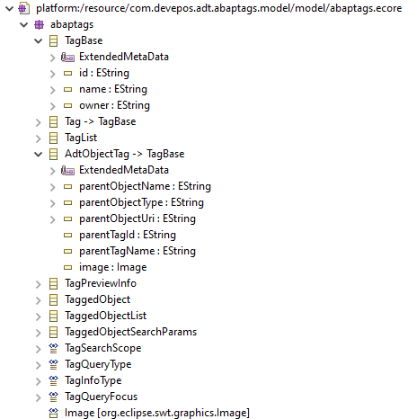  
<span class="img-caption" markdown=1>
*Abbildung: Beispiel für EMF-Modell zur Serialisierung von XML- \<-\> Java-Objekt*
</span>

Durch diesen Ansatz lässt sich die Datentransformation sehr generisch bauen, und man spart auch wieder Entwicklungszeit ein.

## Java Code Snippets für wiederkehrende Aufgaben in ADT

### Aufruf eines RFC-Funktionsbausteins mit dem Java Connector

```java
// 1) Lesen der Destination Id für eine ABAP Project Instanz
String destinationId = AdtCoreProjectServiceFactory.createCoreProjectService().getDestinationId(project);

// 2) Lesen der JCo destination zur Destination Id
JCoDestination destination = JCoDestinationManager.getDestination(destinationId);

// 3) Lesen des RFC Bausteins
JCoFunction function = destination.getRepository().getFunction("name_of_rfc_function");

// 4) Setzen eines Importing-Parameters
function.getImportParameterList().getField("I_PARAM1").setValue("PARAM_VALUE");

// 5) Ausführen der Funktion
function.execute(destination);

// 6) Lesen eines Exporting Tabellenparameters
JCoTable objectTree = function.getExportParameterList().getTable("E_PARAM1");
```

### Lesen des ABAP-Projekts abhängig von der aktuellen Selektion im Workbench

```java
// 1) Ermittlung der aktiven Page im Workbench
IWorkbenchPage page = PlatformUI.getWorkbench().getActiveWorkbenchWindow().getActivePage();

// 2) Lesen der Workbench Window Instanz
IWorkbenchWindow window = page.getWorkbenchWindow();

// 3) Ermittlung der aktuellen Selektion im Window
ISelection adtSelection = window.getSelectionService().getSelection();

// 4) Ermittlung des aktiven ABAP Projekts
IProject project = ProjectUtil.getActiveAdtCoreProject(adtSelection, null, null, IAbapProject.ABAP_PROJECT_NATURE);
```

### Ermittle den Quellcode des aktiven Editors

```java
// 1) Ermittle den aktiven Editor
IAdtFormEditor editor = (IAdtFormEditor)PlatformUI.getWorkbench().getActiveWorkbenchWindow()
  .getActivePage().getActiveEditor();

// 2) Ermittle das Document des Editors
IDocument document = editor.getAdapter(AbapSourcePage.class).getDocument();

// 3) Ermittle den Quellcode
String code = document.get();
```

### Führe den Transaction-Code aus

```java
// 1) Ermittle die Benutzereinstellung der Navigation zum Eclipse Editor für unterstützte Entwicklungsobjekte
boolean navigateToEclipse = com.sap.adt.sapgui.ui.internal.Activator.getDefault().getPreferenceStore()
  .getBoolean(com.sap.adt.sapgui.ui.internal.PreferenceInitializer.PREF_KEY_USE_ECLIPSE_NAVIGATION);

// 2) Ausführung des Transaction Code
AdtSapGuiEditorUtilityFactory.createSapGuiEditorUtility().openEditorAndStartTransaction(project, "<TRANSACTION_NAME>", navigateToEclipse);
```

### ABAP Scan Services -- Prüfe, ob der Token ein Keyword ist

```java
// 1) Ermittle die Instanz von AbapSourceUI
IAbapSourceUi sourceUi = AbapSourceUi.getInstance();

// 2) Ermittle die Instanz von SourceScannerServices
IAbapSourceScannerServices = sourceUi.getSourceScannerServices();

// 3) Ermittle den aktiven ADT Editor
editor = (IAdtFormEditor)PlatformUI.getWorkbench().getActiveWorkbenchWindow().getActivePage().getActiveEditor();

// 4) Ermittle das Dokument vom Editor
IDocument document = editor.getAdapter(AbapSourcePage.class).getDocument();

// 5) Prüfe ob der Token an der Offset-Position ein Keyword ist (oder nicht)
Boolean isKeyword = scannerServices.isKeyword(document, OFFSET);

// 6) Ermittle den nächsten Token basierend auf der Offset-Position
Token nextToken = scannerServices.getNextToken(document, OFFSET);

// 7) Prüfe ob der nächste Token ein Keyword ist (oder nicht)
isKeyword = scannerServices.isKeyword(document, nextToken.offset);
```

### Ermittle das Projekt und zeige den Selektionsdialog

```java
// 1) Ermittle die Shell
Shell shell = PlatformUI.getWorkbench().getActiveWorkbenchWindow().getShell();

// 2) Zeige den Selektions-Dialog und ermittle das gewählte Projekt
IProject chosenProject = AbapProjectSelectionDialog.open(shell, null);
```

### Ermittle die User und rufe den Selektionsdialog

```java
// 1) Ermittle den User Service
IAdtUserServiceUI adtUserService = AdtUserServiceUIFactory.createAdtUserServiceUI();

// 2) Rufe den User Selektions-Dialog und ermittle die selektierten User
String[] users = adtUserService.openUserNameSelectionDialog(null, false, project, "");
```

### Anmelden auf dem ABAP-System

```java
// 1) Adaptieren eines IProject Objekts zu einem IAbapProject Objekt
final IAbapProject abapProject = project.getAdapter(IAbapProject.class);

// 2) Prüfen des Anmeldestatus mit automatischem Anmeldedialog falls noch keine
//    Anmeldung vorliegt
IStatus logonStatus = AdtLogonServiceUIFactory.createLogonServiceUI()
  .ensureLoggedOn(abapProject.getDestinationData(), PlatformUI.getWorkbench().getProgressService().isOK());
```

## Projekt-Set-up mit Maven

Neben den Standardmöglichkeiten zur Entwicklung von Plug-ins, Features und Update-Sites, welche mit der *Eclipse IDE for RCP and RAP Developers* geliefert werden, gibt es auch noch die Option, Eclipse Tycho zu verwenden. Eclipse Tycho ist eine Sammlung von Plug-ins für Apache Maven. Weitere Informationen können der [Projektseite](https://github.com/eclipse-tycho/tycho) von Tycho entnommen werden. Ein Tutorial zur Plug-in-Entwicklung mit Tycho gibt es [hier](https://github.com/eclipse-tycho/tycho).