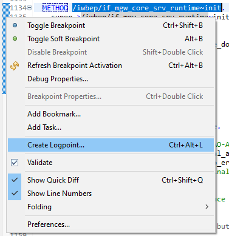
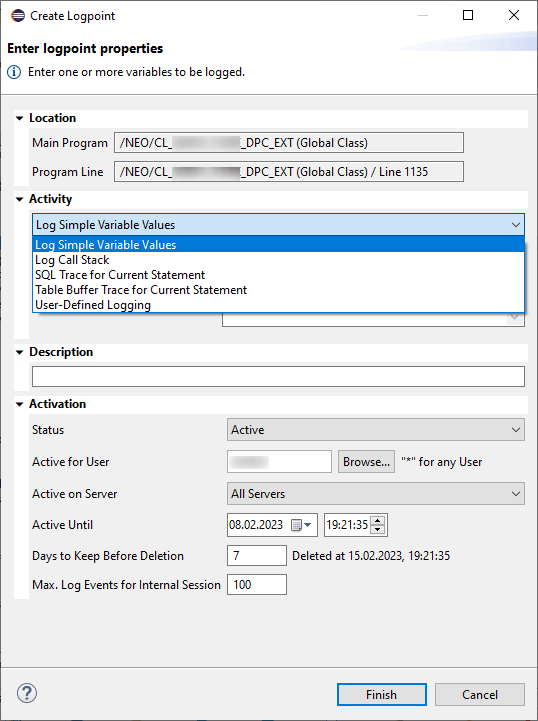

# Checkpoint IDs und dynamische Logpoints

Ein sehr hilfreiches Tool im Bereich der Fehleranalyse und Debugging sind die sogenannten Checkpoint IDs. Diese können über die Transaktion SAAB oder in ADT unter "others" angelegt werden. Diese IDs werden mittels der Befehle:

- `BREAK POINT ID [GRUPPENNAME]`
- `LOG POINT ID [GRUPPENNAME]`
- `ASSERT ID [GRUPPENNAME]`

im Code verankert. Für den detaillierte Syntax und die Optionen der Befehle verweisen wir auf die [SAP-Hilfe](https://help.sap.com/docs/ABAP_PLATFORM_NEW/ba879a6e2ea04d9bb94c7ccd7cdac446/491c002326bc14cde10000000a42189b.html) (On-Premise, Checkpoint IDs gibt es in der Cloud nicht).

Wie bereits im Debugger des SAP GUI können diese dynamischen Breakpoints für das Debuggen aktiviert bzw. zur Protokollierung genutzt werden. Der Hauptvorteil liegt hier darin, dass der Entwickler im Voraus wichtige Stellen im Code mit Breakpoints versehen kann. Falls der Code analysiert werden soll, muss die Checkpoint ID nur einmalig entsprechend aktiviert werden. Beim Aufruf der Einheit wird dann bei einem aktiven Breakpoint der Debugger an der betreffenden Stelle aufgerufen bzw. der Logeintrag geschrieben.

Um die Checkpoints effektiv einzusetzen, empfiehlt es sich, entsprechende Templates anzulegen, die dann einfach mittels Quick Fixes aufgerufen werden können (siehe Kapitel [Arbeiten mit ADT](/ADT-Leitfaden/working-with-adt) im Abschnitt zu [Templates](/ADT-Leitfaden/working-with-adt/#templates)).

Während Checkpoint IDs auch im GUI-basierten Debugger genutzt werden können, bietet ADT für On-Premise-Systeme zusätzlich die Möglichkeit, dynamische Log Points im Debugger zu setzen, die zum Auslesen programm-interner Werte verwendet werden können. Diese Option ist dann hilfreich, wenn es nicht möglich ist, den Produktivcode zu ändern oder auch eine Analyse sehr zeitnah auf dem Produktivsystem durchgeführt werden muss.

  

*Abbildung: Erstellung eines Log Points über das Kontextmenü*

  

*Abbildung: Attribute beim Erstellen eines Log Points*

Sie können in dem Dialog entscheiden, was im Log aufgezeichnet werden soll, Sie können dem dynamischen Logpoint eine Beschreibung mitgeben, die dann in der Log-Ausgabe verwendet wird, und Sie können verschiedene Kriterien mitgeben, ob (anhand einer Bedingung -- in der Bildschirmkopie verdeckt -- und/oder Benutzer/Server) und wie lange die Log-Ausgabe erfolgen soll. Erstellte Logpoints werden im Editor am linken Rand und am rechten Rand neben der vertikalen Scroll-Leiste angezeigt sowie im View "Logpoints" aufgelistet:

  

*Abbildung: Log Points View in der Debugging Perspektive*

Wir empfehlen, hierzu die SAP-Dokumentation ([On-Premise](https://help.sap.com/docs/ABAP_PLATFORM_NEW/c238d694b825421f940829321ffa326a/02f4fac1e87244f2968bfbe6d3c37095.html)) zu studieren, um Details über die Anwendung zu erfahren. Einen guter Einstieg bietet hierzu auch dieser Blog [Dynamic Logpoints in ABAP](https://blogs.sap.com/2015/10/22/dynamic-logpoints-in-abap/).
