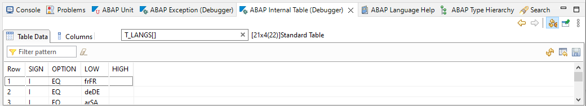

{: .no_toc}
# Der Debugger in den ABAP Development Tools

1. TOC
{:toc}

Im Eclipse steht für Analysezwecke ein Debugger (Konzepte: [On-Premise](https://help.sap.com/docs/ABAP_PLATFORM_NEW/c238d694b825421f940829321ffa326a/4ec365a66e391014adc9fffe4e204223.html)/[Cloud](https://help.sap.com/docs/btp/sap-abap-development-user-guide/abap-debugger); Doku: [On-Premise](https://help.sap.com/docs/ABAP_PLATFORM_NEW/c238d694b825421f940829321ffa326a/4ec33a996e391014adc9fffe4e204223.html)/[Cloud](https://help.sap.com/docs/btp/sap-abap-development-user-guide/debugging-abap-code)) zur Verfügung. Diesern erreichen Sie, ebenso wie für andere Programmiersprachen, über den Wechsel in die Debugging-Perspektive . Des Weiteren wird Ihnen diese Perspektive beim Treffen auf einen Breakpoint (vgl. im folgenden) automatisch angeboten.

## Breakpoints und Soft-Breakpoints

Breakpoints in Eclipse sind ausschließlich externe Breakpoints. Die Breakpoints werden bei jedem Durchlauf der Software gezogen (soweit sie nicht deaktiviert sind oder eine nicht zutreffende Bedingung haben). Der Ablauf wird an der entsprechenden Stelle unterbrochen.

Breakpoints können in allen Perspektiven im Editor links neben der Zeilennummer gesetzt werden. Alternativ können Breakpoints über das Kontextmenü gesetzt werden. Gesetzte Breakpoints werden durch einen blauen Punkt neben der Codezeile gekennzeichnet.

Die ABAP Development Tools bieten neben den normalen Breakpoints die Möglichkeit von Soft Breakpoints. Diese werden über das Kontextmenü gesetzt und mit einem grünen Punkt gekennzeichnet. Im Gegensatz zu den Standard-Breakpoints wird der Programmablauf an der Stelle nur gestoppt, wenn die Software im Debugging-Kontext läuft. Ansonsten werden Soft-Breakpoints übersprungen.

## Debugging-Perspektive

  

*Abbildung: Debugging Perspektive in Eclipse*

Die Debugging-Perspektive in Eclipse bietet einen schnellen Überblick über den Programm-Code, Call-Stack, Variableninhalte und Inhalte von internen Tabellen. Die Variablen und interne Tabellen können mit Doppelklick im Programm-Code ausgewählt werden. Sie werden auf der rechten Seite angezeigt und die Werte können dort direkt oder über das Kontextmenü auch geändert werden. Alternativ können Sie dort auch den Variablennamen eintippen. Array- und Strukturzugriffe sind als Teil des Variablennamen auch möglich, können aber auch aufgeklappt werden. Komplette Strukturen oder Tabellen können in der Cloud im Kontextmenü als VALUE Ausdrücke kopiert werden, was insbesondere für die Erstellung von Unit Tests sehr hilfreich ist.

  

*Abbildung: Werte der Variablen in der Debugging Perspektive*

Interne Tabellen können zusätzlich in einem eigenen View angezeigt werden, hier können die anzuzeigenden Spalten konfiguriert werden und es kann die Tabelle gefiltert werden. Die Tabelle kann editiert werden. Auch hier können in der Cloud Tabellenzeilen im Kontextmenü als VALUE Ausdrücke kopiert werden

*Abbildung: Inhalt einer internen Tabelle in der Debugging Perspektive*

## Besonderes Verhalten im Debugger

Im Debugger der ABAP Development Tools ist es möglich, den Code direkt zu modifizieren und zu aktivieren. Im aktuellen Debugging-Kontext ist das Coding jedoch noch nicht aktiv. Der Programmlauf muss neu gestartet werden.

## Weitere Informationen

Weitere Besonderheiten über Debugging mit den ABAP Development Tools in Eclipse finden sich in den SAP-Blogs. Hervorzuheben sind dabei die folgenden beiden. Sie beschreiben Fälle und Lösungen, die beim Arbeiten mit dem Debugger auftreten können:

- [ADT ABAP Debugger – What to do if your program does not stop at breakpoints](https://blogs.sap.com/2020/04/21/adt-abap-debugger-what-to-do-if-your-program-does-not-stop-at-breakpoints/)
- [Breakpoint validity scope, breakpoint activation conflicts and group user debugging in ADT](https://blogs.sap.com/2015/11/02/breakpoint-validity-scope-and-activation-conflicts-in-abap-development-tools-adt/)
