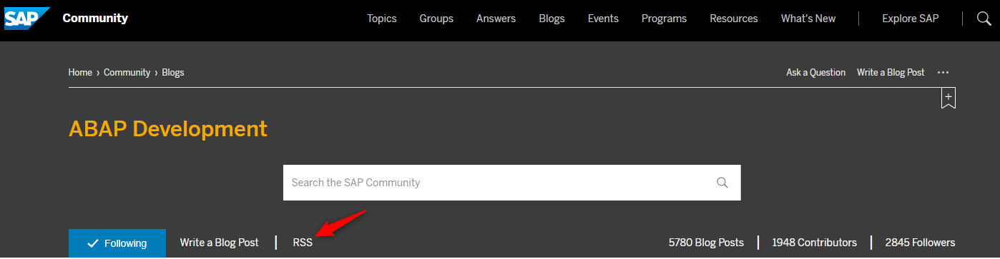
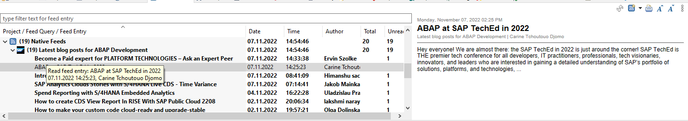
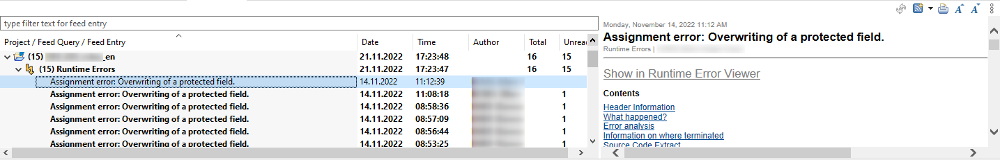
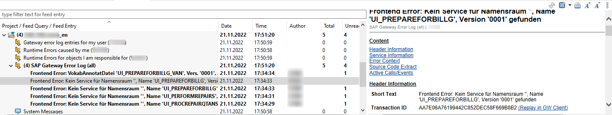

# Feed Reader

Feeds ermöglichen ereignisbezogene Benachrichtigungen in den ADT inklusive Zugriff auf eine Liste der bisherigen Ereignisse. Die Feeds werden in einer eigenen View (vgl. Views und Perspektiven in Kapitel [Arbeiten mit ADT](/ADT-Leitfaden/working-with-adt)) dargestellt. Diese finden Sie in der Liste der Views unterhalb von ABAP mit dem Titel "Feed Reader". Die einzelnen Quellen werden als Feeds bezeichnet und für jeden Feed kann eingestellt werden, wie oft dieser von der Quelle aktualisiert werden soll und ob Benachrichtigungsmeldungen in Eclipse angezeigt werden sollen.

Neben den in der Doku unter "Getting Feeds" ([On-Premise](https://help.sap.com/docs/ABAP_PLATFORM_NEW/c238d694b825421f940829321ffa326a/4ec3b0cd6e391014adc9fffe4e204223.html)/[Cloud](https://help.sap.com/docs/BTP/5371047f1273405bb46725a417f95433/4ec3b0cd6e391014adc9fffe4e204223.html)) beschriebenen ABAP-Runtime-Errors/-Dumps und Systemnachrichten können insbesondere auch (abhängig vom Release-Stand des Quellsystems) folgende Informationen im Feed Reader angezeigt werden:

- Gateway/OData-Fehler (vielfältig filterbar, einschl. Benutzer)
- ATC-Ergebnisse (vielfältig filterbar, einschl. Benutzer)
- Enterprise-Event-Fehler (filterbar nach Kanal und Benutzer)
- BW Job Repository (vielfältig filterbar, einschl. Benutzer)
- URI Creation Error (nur für die ADT-Entwickler relevant)

Dazu werden die Ereignisse im Pull-Verfahren im Hintergrund abgefragt. Damit die Hintergrundabfrage aus SAP-Systemen funktioniert, müssen Sie allerdings nach einem Eclipse-Start mindestens einmal in irgendeiner Form (das können Sie auch durch Klick auf einen Feed auslösen) auf die gewünschten Systeme zugegriffen und dabei die Anmeldeprozedur durchlaufen haben.

Daneben können auch beliebige Atom-/RSS-Feeds abonniert werden, das kann beispielsweise der RSS-Feed für die letzten Blog-Posts zu einem Tag auf blogs.sap.com sein:

  

*Abbildung: Abonnieren populärer RSS Feeds*

Mit einem Links-Klick auf den Titel in der Detailanzeige bzw. Rechts-Klick in der Liste und den Kontextmenüpunkt Open können Sie den Blog-Artikel öffnen (dafür ist es sinnvoll, in Eclipse einen externen Browser einzustellen, weil der Eclipse-interne Browser sich als IE11 für die Webseite ausgibt).

Der Feed zu den Systemnachrichten zeigt die aktuell vorliegenden Nachrichten der Systemadministratoren an.

Sie können Feeds zu Laufzeitfehlern (ST22-Dumps) mit verschiedenen Filtermöglichkeiten ergänzen, u.a. kann gemäß auslösendem Benutzer, verantwortlichem Benutzer, Objekt- und Paket-Benutzer oder Paket gefiltert werden. Die Filter können auch mit und/oder-

(all/any-) Verknüpfungen zu einem hierarchischen Filter-Baum angeordnet werden. Sie können einen Laufzeitfehler in einer eigenen Editor-Ansicht öffnen (Kontextmenü in der Liste, Link in den Details; dort ist auch das bekannte Langtext Format bzw. eine unformatierte Anzeige verfügbar). Sie können direkt in den ADT-Quelltexteditor zu den Quellcodezeilen der auslösenden Stelle und der Aufrufhierarchie navigieren.

Ein Beispiel mit mehreren Laufzeitfehlern in einem Feed:

  

*Abbildung: Mehrere Laufzeitfehler innerhalb eines Feeds*

Dokumentation zu den SAP Gateway Error Log Feeds findet sich im PDF-Dokument aus dem Hinweis [1797736 - SAP Gateway Troubleshooting Guide](https://me.sap.com/notes/1797736) und im Blog [How to use the SAP Gateway Error Log in ADT](https://blogs.sap.com/2020/07/22/how-to-use-the-sap-gateway-error-log-in-adt/).

Sie können Feeds mit verschiedenen Filtermöglichkeiten ergänzen, u.a. kann auch hier gemäß Benutzer, Service, Namensraum oder Paket gefiltert werden. Um auch mit vielen Einträgen zurechtzukommen, kann ein Blättern (Paging) aktiviert werden. In der Detailanzeige kann direkt in die Transaktion /IWFND/GW_CLIENT zum Replay gesprungen werden. Außerdem kann man direkt in den ADT-Quelltexteditor analog zu den Laufzeitfehlern navigieren, vgl. folgendes Beispiel:

  

*Abbildung: Ansicht eines SAP Gateway Fehlers aus dem Error Log*

Im Kontext von Enterprise Events können Sie Feeds zu Fehlern aus der Event Verarbeitung hinzufügen, z. B. um Fehler beim Weiterreichen der Events an den Event Mesh zu sehen. Dazu können Sie Kanal und Benutzer filtern.

Sie können Feeds zu den ATC-Ergebnissen aus Prüfungen in einem zentralen ATC-Check-System anlegen, vgl. Doku ([On-Premise](https://help.sap.com/docs/ABAP_PLATFORM_NEW/c238d694b825421f940829321ffa326a/4ec57b9c6e391014adc9fffe4e204223.html)/[Cloud](https://help.sap.com/docs/BTP/5371047f1273405bb46725a417f95433/4ec57b9c6e391014adc9fffe4e204223.html)). Auch hier sind diverse Filtermöglichkeiten verfügbar. In der Feed-Liste können Sie zu den Details und zur Quellcodezeile eines Ergebnisses navigieren.

Sofern Sie BW/S4HANA-Systeme haben, können Sie sich mit dem BW Job Repository Feed über den Status verschiedener Job-Typen (z. B. DATAFLOWCOPY oder DTP_LOAD) informieren lassen, vgl. [Doku](https://help.sap.com/docs/SAP_BW4HANA/107a6e8a38b74ede94c833ca3b7b6f51/976f6a8b97714ffaad08df0679ab0849.html). Von den Feed-Einträgen können Sie dann zur Anzeige der Job-Details verzweigen.

Da der Feed Reader das ideale Tool für ein proaktives Monitoring von Anwendungen ist (z. B. bei und nach einem Go-live einer neuen Anwendung), ist es sinnvoll, die Berechtigung für die ADT nicht nur für die Entwicklungssysteme zu betrachten, sondern den Entwicklern mittels Berechtigungen zu ermöglichen, die Feeds auch von Test- und Produktivsystemen einzusammeln.
