{: .no_toc}
# Performance-Analyse

1. TOC
{:toc}

Für eine integrierte und graphische Performance-Analyse bieten Ihnen die ADT einen komfortablen Zugang zum ABAP Profiler ([On-Premise](https://help.sap.com/docs/ABAP_PLATFORM_NEW/c238d694b825421f940829321ffa326a/4ec41bbe6e391014adc9fffe4e204223.html)/[Cloud](https://help.sap.com/docs/BTP/5371047f1273405bb46725a417f95433/4ec41bbe6e391014adc9fffe4e204223.html)) als Nachfolger u.a. der Transaktion SAT. Zum Starten des Profiler gibt es verschiedene Möglichkeiten:

Wenn Sie ein ausführbares Programm (nur On-Premise), eine Konsolenanwendung (nur ABAP Cloud) oder ein Artefakt mit zugeordneten Unit-Tests geöffnet haben, können Sie den Profiler direkt über das Kontextmenü "Profile as" starten. Alternativ dazu kann auch der Wizard verwendet werden, der über das Run-Menü erreichbar ist.

Für den Fall, dass man einen anderen Startpunkt benötigt, kann man mit Trace-Requests Anforderungen für den Start des Profiler erstellen. Dazu zuerst die View "ABAP Trace Requests" (diese finden Sie in der View-Liste unterhalb von ABAP, vgl. Views und Perspektiven in Kapitel [Arbeiten mit ADT](/ADT-Leitfaden/working-with-adt)) einblenden. In dieser View bekommen Sie nach Auswahl eines Systems mit dem Create-Trace-Request-Icon einen Wizard. Mit diesem können Sie verschiedene Trigger für den Start des Profiler auswählen. Wird mit HTTP(S)-Zugriffen direkt auf das System zugegriffen (Achtung: Das ist in einer Hub/FES-Konfiguration im Backend normalerweise nicht der Fall), kann ein Muster für die URL verwendet werden, z. B. der Name des OData-Services mit vor- und nachgestelltem Stern. Des Weiteren können ein RFC-Aufruf eines Funktionsbausteins oder der Start eines Hintergrund-Jobs und diverse weitere Trigger für den Start des Trace verwendet werden. In der SAP-Fiori-Entwicklung kann in einer Hub/FES-Konfiguration für OData-Zugriffe im Backend-System der Funktionsbaustein /IWBEP/FM_MGW_HANDLE_REQUEST als Trigger verwendet werden. Die Anzahl der Trigger-Aktivierungen kann begrenzt werden, ebenso gibt es eine Möglichkeit zur zeitlichen Limitierung. Über verschiedene Einstellungen können Sie den Umfang der Datenermittlung steuern. Über das Kontextmenü in der Liste können Trace-Requests gelöscht werden.

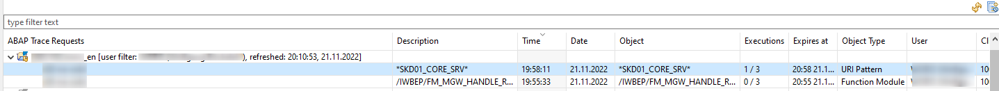  

*Abbildung: ABAP Trace Requests in der Debugging Perspektive*

Darüber hinaus gibt es noch die Möglichkeit, aus dem ADT-Debugger heraus den Trace zu starten ([[On-Premise](https://help.sap.com/docs/ABAP_PLATFORM_NEW/c238d694b825421f940829321ffa326a/d491c9ce396c47f2b6b8affb46ca3291.html)/[Cloud](https://help.sap.com/docs/BTP/5371047f1273405bb46725a417f95433/d491c9ce396c47f2b6b8affb46ca3291.html)]).

Im Falle der Trace-Requests kann über das Aktualisierungs-Icon im Trace-Request-View die Anzahl der pro Anforderung bereits erzeugten Traces aktualisiert werden. Über das Kontextmenü bzw. per Doppelklick kann in die View mit der Liste der Traces gesprungen werden. Von dort kann die Anzeige eines Trace geöffnet werden. Entweder kann über das Kontextmenü gezielt in die verschiedenen Tabs der Analyse oder per Doppelklick in die Übersichtsseite gesprungen werden.

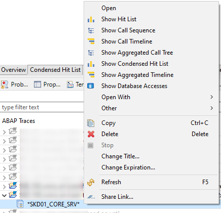  

*Abbildung: Kontextmenü eines Traces*

Die Übersichtsseite bietet neben einem knappen Überblick über die Laufzeit ebenfalls direkte Absprungpunkte in die verschiedenen Tabs.

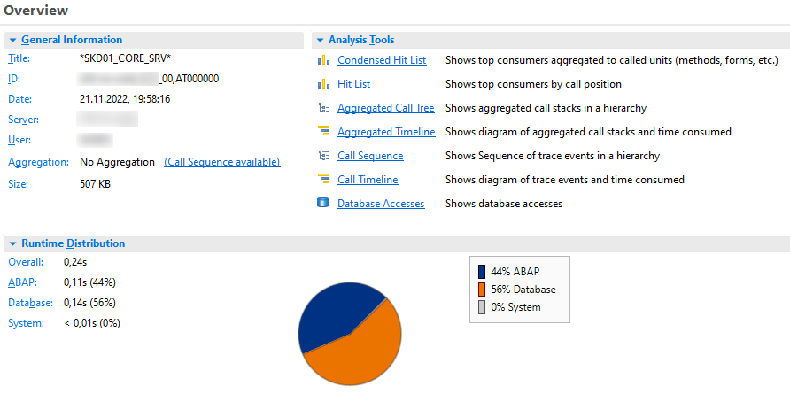  

*Abbildung: Übersicht über die Eigenschaften eines Traces*

Insbesondere die graphische Analyse der Timeline ist nur in den ADT verfügbar und erleichtert eine Analyse. Bewegt man den Mauszeiger über die Blöcke, bekommt man direkt Details angezeigt und kann über das Kontextmenü auch direkt in den Quellcode navigieren.

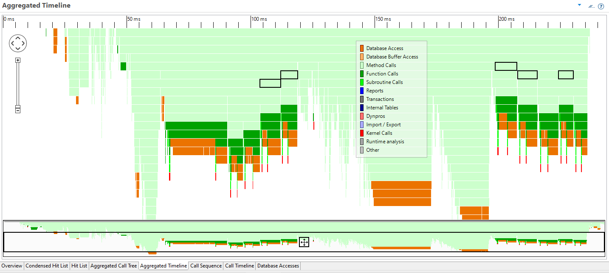  

*Abbildung: Aggregierte Übersicht eines Trace-Verlaufs*

Der SQL-Trace, der insbesondere bei HANA als Datenbank die PLV-Dateien für eine visuelle Analyse der Query-Pläne liefert, kann im Kontextmenü eines Systems im Project Explorer gestartet werden (funktioniert auch im ABAP Environment). Die Ergebnisdarstellung erfolgt dann aber in einer Webanwendung außerhalb der ADT (oder in der Transaktion ST05).

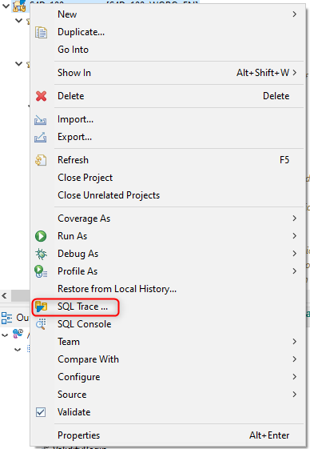  

*Abbildung: Absprung in den SQL Trace*

Sie können für die visuelle Analyse aktuell noch die SAP HANA Administration Tools aus dem HANA Studio zusätzlich in der ADT-Eclipse (oder das komplette SAP HANA Studio parallel) installieren und somit den automatischen Start der visuellen Analyse aus der Transaktion heraus konfigurieren. Dazu setzen Sie den Benutzerparameter HDB_OPEN_STUDIO auf X

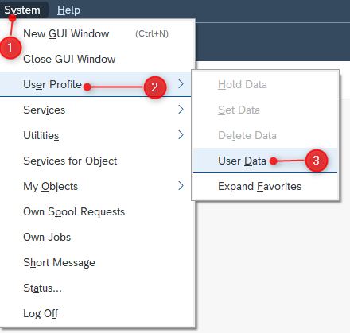  

*Abbildung: Einstieg in die Verwaltung der Benutzerparameter*

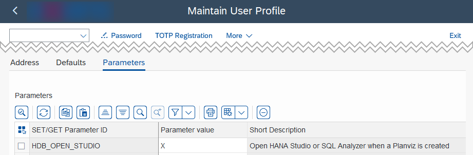  

*Abbildung: Setzen des Benutzerparameters HDB_OPEN_STUDIO*

und verknüpfen im Betriebssystem das Öffnen von \*.plv-Dateien mit der richtigen eclipse.exe. Beispielsweise gibt es unter Windows dafür im Datei-Explorer im Kontextmenü der Datei die Option "Öffnen mit..." und dort findet sich dann ganz unten die Option "Andere App auf diesem PC suchen", nach Klick müssen Sie die "eclipse.exe" ihrer Eclipse/ADT-Installation suchen und auswählen sowie die Option "Immer diese App ... verwenden" auswählen.

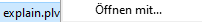

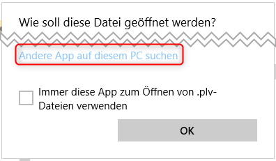  

*Abbildung: Auswahl der eclipse.exe als neue Möglichkeit zur Anzeige von \*.plv Dateien*

Nach Auswählen einer Zeile in den SQL-Trace-Liste der ST05 oder in Auswahl eines Trace-Record und eines SQL-Statement in der SQL-Trace-Analysis des Technical-Monitoring-Cockpit kann man die HANA-PlanViz-Query-Plan-Visualisierung anfordern:

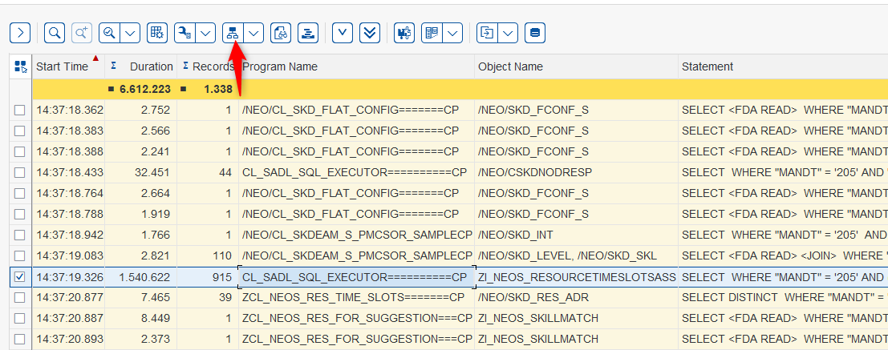  

*Abbildung: Auswahl einer konkreten Selektion*

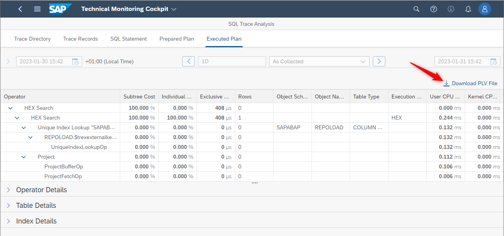  

*Abbildung: Download der \*.plv Datei*

Eclipse startet dann automatisch die richtige View, und im Tab-Executed-Plan ist die visuelle Analyse des Query-Plans zu sehen.

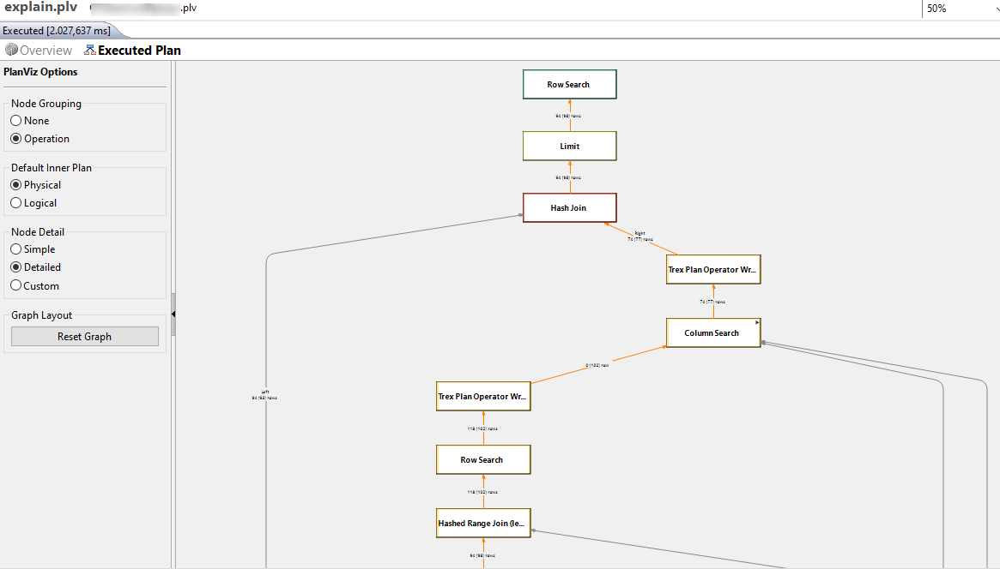  

*Abbildung: Anzeige des Abfrage-Ausführungsplans*

Für die Entwicklung mit dem RAP (ABAP RESTful Application Programming Model) gibt es ein spezielles Trace-Werkzeug namens Cross Trace (Doku [On-Premise](https://help.sap.com/docs/ABAP_PLATFORM_NEW/c238d694b825421f940829321ffa326a/290647b75cea46f491907889251ad067.html)/[Cloud](https://help.sap.com/docs/btp/sap-abap-development-user-guide/working-with-abap-cross-trace)), mit dem Sie Anfragen von Fiori-Apps über den RAP Softwarestack (SAP Gateway, BO Behavior, SADL, ABAP Core) hinweg analysieren können. Zur Benutzung ist eine entsprechende gesonderte Berechtigung nötig.

Zum Starten lassen Sie sich die View "ABAP Cross Trace" anzeigen. Diese View hat zwei Tabs. Im ersten Tab können Sie im Kontextmenü eines Systems eine neue Cross-Trace-Konfiguration erstellen. Eine Cross-Trace-Konfiguration kann mit einer Beschreibung zur Unterscheidung versehen werden, kann aktiv oder inaktiv sein, eine automatische Deaktivierung nach einer bestimmten Anzahl von Trace-Requests ist möglich, ebenso eine automatisierte Löschung zu einem bestimmten Zeitpunkt. Sie können entscheiden, ob nicht-sensitive oder sensitive Daten aufgezeichnet werden sollen. Sie können optional nach Benutzer, Zugriffsart und -ziel filtern (z. B. nur ein bestimmter OData-Service; hier ist auch \* für eine Wildcard-Filterung möglich), ebenso können Sie angeben, ob und mit welchem Trace-Level zu den jeweiligen Cross-Trace-Komponenten eine Aufzeichnung stattfinden soll.

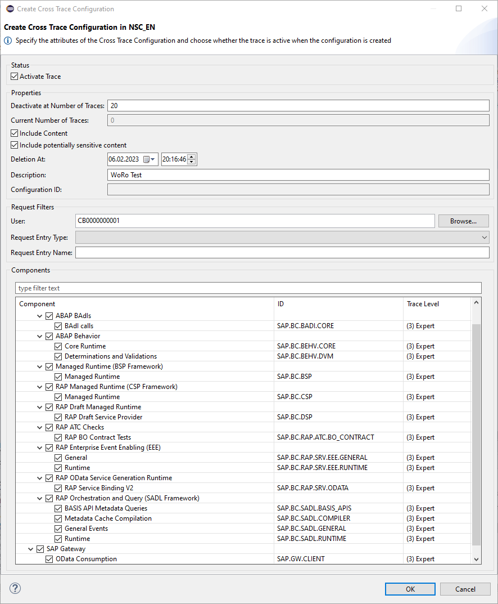  

*Abbildung: Erstellung von ABAP Cross Traces*

Nach Bestätigung mit OK wird die Konfiguration im View angezeigt, hier kann auch der aktuelle Zustand (aktiv/inaktiv), die Beschreibung und die Anzahl der verbliebenen aufzuzeichnenden Zugriffe eingesehen werden. Im Kontextmenü kann eine Konfiguration editiert sowie aktiviert/deaktiviert/gelöscht/aktualisiert werden. Eine globale Aktualisierung ist rechts oben im View möglich. Zur Ergebnisanzeige wechseln Sie auf den zweiten Tab der View. Hier sehen Sie je einzelnem Zugriff einen Trace. Im Kontextmenü können Sie einen Trace öffnen (und löschen usw.). Der Trace öffnet sich dann in einer weiteren View. Dort sehen Sie den Weg des Zugriffs durch die einzelnen Komponenten hindurch und können die angezeigten Zeilen filtern bzw. eine Textsuche starten. Anhand der Offset-Spalte können Sie den zeitlichen Verlauf des Zugriffs nachvollziehen. Zu jeder Zeile werden in der Properties View Details angezeigt.

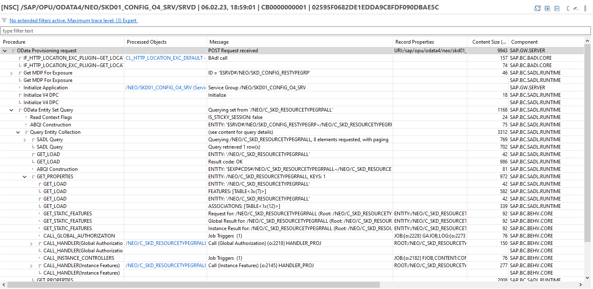

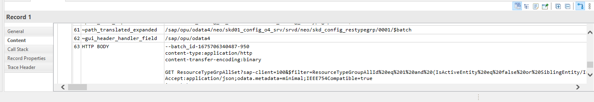  

*Abbildung: Detaillierte Ansicht der Operationen*

Sie können direkt zur auslösenden Quellcodezeile springen, sich die Aufrufhierarchie anzeigen lassen usw.

## Hinweis zu HANA Studio und SAP HANA Tools

HANA Studio wird von SAP nur begrenzt weiterentwickelt. Eine zukünftige Lösung für die visuelle Analyse der Query-Pläne innerhalb der ADT oder für die ABAP Cloud steht noch aus. Als eine Lösung außerhalb von Eclipse gibt es ein Visual Studio Code Plug-in, das ebenfalls \*.plv-Dateien öffnen und grafisch anzeigen kann, vgl. [SQL Analyzer Extension](https://help.sap.com/docs/HANA_SERVICE_CF/6a504812672d48ba865f4f4b268a881e/50bc09af2fa549c3ace4178b61056da8.html).

Die SAP HANA Tools folgen einem anderen Release-Zyklus als die ADT und sind daher häufig nicht in der aktuellen bzw. der "latest" Update-Site enthalten. Beispielsweise waren die SAP HANA Tools im Januar 2023 in der aktuellsten Version nur auf der <https://tools.hana.ondemand.com/2022-09> Site verfügbar.
