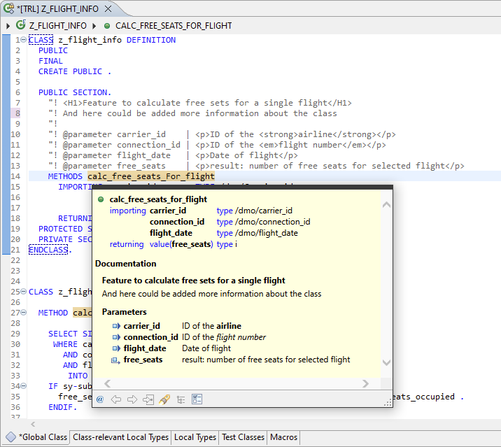

{: .no_toc}
# Dokumentation mit ABAP Doc

1. TOC
{:toc}

## Was sind ABAP Doc?

[ABAP Doc](https://help.sap.com/docs/ABAP_PLATFORM_NEW/c238d694b825421f940829321ffa326a/a7b235922f6944bbaf3b36949e500b12.html) ermöglicht die Code-basierte Dokumentation wie z. B. von Methoden und deren Parametern.

  

*Abbildung: ABAP-Doc Dokumentation der Methode*

ABAP Doc ist ein Feature, das nur in den ADT unterstützt wird. Anstatt des formularbasierten Editors mit der Möglichkeit der Kurzbeschreibung von Methoden, der in den ADT nicht mehr verfügbar ist, wurde mit den ABAP Docs ein deutlich mächtigerer Ersatz etabliert, der in ähnlicher Form auch in anderen Programmiersprachen verfügbar ist (z. B. JavaDoc).

Im Folgenden wird für die bessere Lesbarkeit des Texts detailliert auf den Einsatz der ABAP Docs im Kontext von Klassen/Methoden eingegangen. Die ABAP Docs sind aber auch auf andere Entwicklungartefakte wie z. B. Funktionsbausteine anwendbar (s. SAP-Hilfe).

Mit Hilfe der ABAP-Doc-Funktion können für Klassen und deren Methoden textuelle Beschreibungen erfasst werden. Des Weiteren können auch für die einzelnen Parameter und Ausnahmen Beschreibungen in ABAP Doc hinterlegt werden.

Die mit ABAP Doc zu erstellenden Hinweise werden im Bereich der Definition angelegt. Der Mehrwert entsteht aber vor allem durch den einfachen Aufruf dieser Dokumentation durch den Verwender. Dies ist sowohl an der Aufrufstelle als auch im Bereich der Implementierung von Entwicklungsartefakten mittels der Taste F2 möglich. Zusätzlich können die in ABAP Docs erstellten Texte sogar mittels HTML-Tags formatiert werden. So können die Dokumentationen mit Überschriften oder Textformatierungen angereichert und somit noch ansprechender und strukturierter dargestellt werden.

Um in ABAP Doc erstellte Beschreibungen in die SAP-GUI-angezeigten Kurztexte zu übernehmen, wird das "[Syncronized](https://help.sap.com/docs/ABAP_PLATFORM_NEW/c238d694b825421f940829321ffa326a/8327c3ff3fcb424584636bbc33211d53.html)" Tag verwendet, so dass auch bei Betrachtung mittels SE24/SE80 die Überschriften sichtbar sind.

Dies kann sinnvoll sein, falls Objekte Enhancements enthalten, die nicht direkt in ADT editiert

werden können und darum die Modifikation noch in den GUI-basierten Tools erfolgen muss.

Eine Mischung von ABAP Doc und GUI-Kurztexten empfehlen wir nicht. Die Nutzung von ABAP Doc ist das Mittel der Wahl, um den funktionalen Code von Kommentaren zu entlasten und dem Verwender hilfreiche Hinweise zu den Entwicklungsartefakten zu geben.

## Nutzung der Quick Fixes zur Erstellung von ABAP Doc

Die Erstellung der ABAP Doc ist über den Aufruf der Quick Fixes einfach. Dazu markiert man die Methodendefinition, ruft die Quick Fixes auf und wählt "Add ABAP Doc" aus. Wurde eine Methodendefinition geändert, z. B. indem ein Parameter ergänzt wurde, und es ist eine Aktualisierung der Dokumentation erforderlich, kann die ABAP Doc aktualisiert werden, indem hier nicht die Methodensignatur, sondern der ABAP-Doc-Bereich direkt markiert wird und damit die Quick Fixes aufgerufen werden.

## Weitergehende Informationen zu ABAP Doc

Weitergehende Informationen zu ABAP Doc finden sich in der offiziellen SAP-Hilfe (z. B.)

unter [ABAP Doc - ABAP-Schlüsselwortdokumentation (sap.com)](https://help.sap.com/doc/abapdocu_750_index_htm/7.50/de-de/abendoccomment.htm) (7.50), in der Beispielklasse CL_DEMO_ABAP_DOC und im [User-Guide](https://help.sap.com/docs/ABAP_PLATFORM_NEW/c238d694b825421f940829321ffa326a/a7b235922f6944bbaf3b36949e500b12.html).