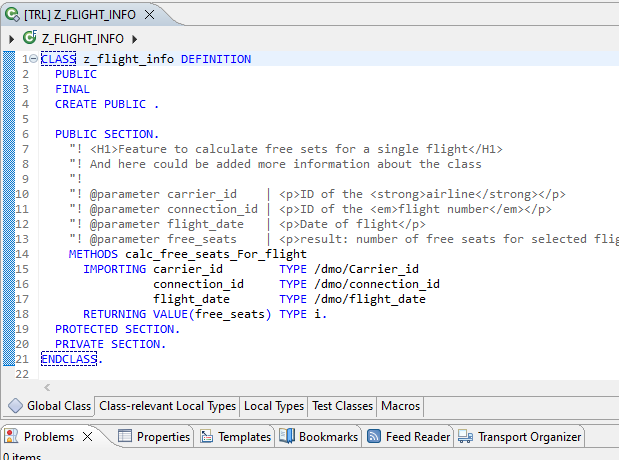
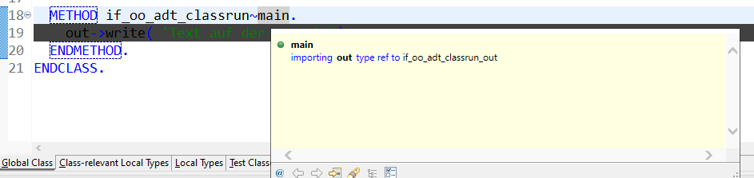
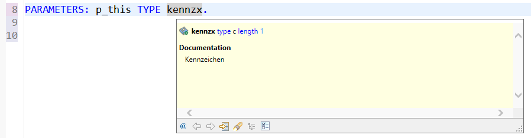
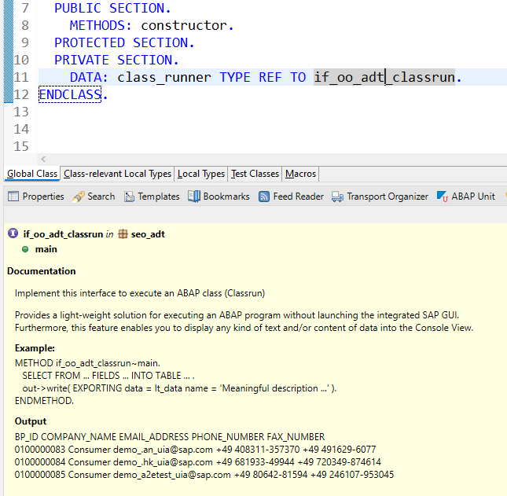
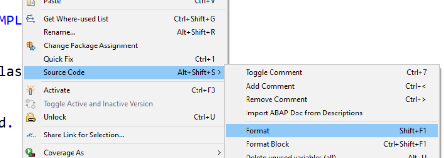
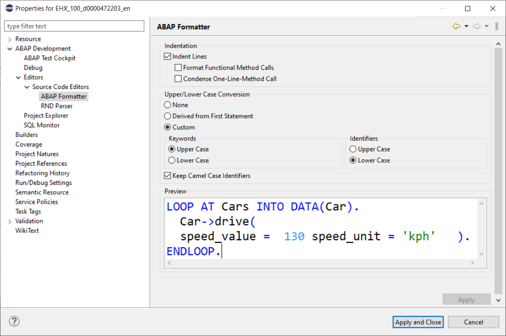
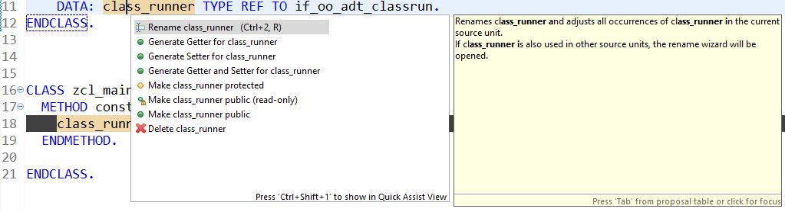

{: .no_toc}
# ABAP Editor

1. TOC
{:toc}

Der [ABAP Editor](https://help.sap.com/docs/ABAP_PLATFORM_NEW/c238d694b825421f940829321ffa326a/79d78f0268484b59a1f6a0e7994316d3.html) ist ein einfacher Texteditor, der die rein textuelle Erstellung von ABAP-Artefakten ermöglicht. Über die Kontext-Funktion können dort die wichtigsten Funktionen wie Quick Fixes, Refactoring-Funktionen und Formatierungsfunktionen aufgerufen werden. Der Einstieg in den ABAP Editor ist im Abschnitt [Das Erstellen einer Klasse im Textmodus](/ADT-Leitfaden/working-with-adt/basics/#das-erstellen-einer-klasse-im-textmodus) näher beschrieben.

ABAP Editor - Hauptfenster
{: .img-caption}

## Element Info

Über die Positionierung des Cursors auf einem Objekt und dem Shortcut <kbd>F2</kbd> erscheint ein Pop-up mit Zusatzinformationen. Hier am Beispiel einer Methode und eines Datenelements:

Element Info für eine Methode
{: .img-caption}

Element Info für ein Datenelement
{: .img-caption}

In der [Element Info](https://help.sap.com/docs/ABAP_PLATFORM_NEW/c238d694b825421f940829321ffa326a/4ec724ce6e391014adc9fffe4e204223.html) sind somit direkt Details ersichtlich, für die man in der alten Welt noch im System navigieren musste. Zusätzlich lässt sich im Element Info weiter navigieren, um Details tieferer Ebenen zu sichten, z. B. die hinterlegte Domäne etc.

Die ABAP Element Info existiert auch als eigenständige View. Diese kann über das Menü Windows → Show View → ABAP Element Info aktiviert werden. Danach wird über "[Link with Selection](https://help.sap.com/docs/ABAP_PLATFORM_NEW/c238d694b825421f940829321ffa326a/4ec5bb496e391014adc9fffe4e204223.html)"  bei jedem Klick auf ein relevantes Entwicklungsobjekt automatisch dessen Element Info sowie die Dokumentation aus ABAP Doc angezeigt:

Anzeige der Element Info nach Auswahl des Objekts
{: .img-caption}

Über "Pin this view"  wird die Information dauerhaft angezeigt, auch wenn auf ein anderes Element geklickt oder die Element Info per <kbd>F2</kbd> für ein anderes Entwicklungsobjekt geöffnet wird.

## Quelltextformatierung mit dem ABAP Formatter

In der SAP GUI heißt das Werkzeug zum Formatieren des Quellcodes Pretty Printer. Das Pendant in ADT ist der [ABAP Formatter](https://help.sap.com/docs/ABAP_PLATFORM_NEW/c238d694b825421f940829321ffa326a/4ec799106e391014adc9fffe4e204223.html). Er wird entweder über die Tastenkombination <kbd>Shift</kbd>+<kbd>F1</kbd> oder über das Kontextmenü im Quelltext aufgerufen.

Kontextmenü für die Formatierung
{: .img-caption}

Damit der ABAP Formatter seinen Dienst leisten kann, muss er vorab konfiguriert werden. Dabei legt man analog zu den Pretty-Printer-Einstellungen in der SAP GUI fest, ob Einrückungen gemacht werden sollen und wie die Groß-/Kleinschreibung formatiert wird. Dies geschieht für jedes ABAP-Projekt separat.

### Einstellung des ABAP Formatters

Falls die Einstellungen noch nicht vorgenommen wurden, erscheint ein Pop-up-Fenster mit der Meldung, dass dies zuvor erledigt werden muss. In diesem Pop-up-Fenster ist auch ein Link zu den Einstellungen enthalten. Alternativ kann man diese auch direkt über den Kontextmenü-Eintrag *Properties* des entsprechenden Projektes aufrufen. In der folgenden Abbildung sehen Sie die Position in den Einstellungen.

Einstellungen für den ABAP Formatter
{: .img-caption}

Die Einstellungen entsprechen denen in der SAP GUI. Wenn man die einzelnen Optionen durchprobiert, sieht man im Vorschaufenster das jeweilige Ergebnis. Neu ist die Möglichkeit, dass Camel-Case-Bezeichner beibehalten werden. Das ist gerade im Zusammenhang mit den CDS Views sehr praktisch, da diese im virtuellen Datenmodell von SAP (VDM) konsequent verwendet werden.

## Quick Fixes

Quick Fixes sind automatisierte Lösungen für gängige Probleme im Rahmen der Software-Entwicklung mit ABAP. Quick Fixes werden dabei nativ durch die ADT angeboten, können aber auch durch verschiedene Plug-ins erweitert werden. Die Verwendung durch die Vielzahl der verfügbaren Quick Fixes macht das Arbeiten mit den ADT wesentlich effizienter als mit der SE80. Zusätzlich wird das Risiko von Fehlern durch manuelle Anpassungen reduziert. Die ADT erledigen die Anpassungen automatisiert und immer identisch.

Quick Fixes liefern Funktionen für zwei Bereiche:

- Automatisches Anlegen von nicht vorhandenen Objekten (z. B. Methodenimplementierungen)
- Automatisches Verändern von bestehenden Objekten ohne Veränderung der Funktionalität (sog. Refactoring, z. B. "Methode extrahieren")

Anzeige der Refactoring Optionen
{: .img-caption}

Aufgrund der Vielzahl an Quick Fixes und der ständigen Änderungen in diesem Bereich werden die einzelnen Quick Fixes hier nicht beschrieben. Ein Überblick ist in der [Dokumentation](https://help.sap.com/docs/ABAP_PLATFORM_NEW/c238d694b825421f940829321ffa326a/ce178e5425364f51994f2c7f634cb56c.html) zu finden.