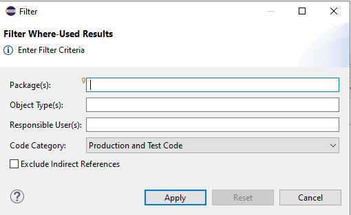

{: .no_toc}
# ABAP Views

1. TOC
{:toc}

## Outline

Die [Outline](https://help.sap.com/docs/ABAP_PLATFORM_NEW/c238d694b825421f940829321ffa326a/706db06c6bf41014b5040bee4e204223.html) View liefert Informationen zum aktuell fokussierten Entwicklungsobjekt und löst Variablen, lokale Klassen, Typen etc. auf. Die View kann mit der SE80 verglichen werden, zeigt Ihnen aber immer nur den aktuellen Kontext des Objekts an. Im Screenshot sehen Sie eine Klasse, darunter die entsprechenden Methoden und zwei private Attribute der Klasse. Mit einem Klick auf einen Eintrag navigieren Sie an die entsprechende Stelle im Quellcode.

  

*Abbildung: Anzeige der Eigenschaften in den Outlines*

In der Button-Leiste gibt es weitere verschiedene Funktionen für den View:

- "Sort" -- Sortierung der Einträge nach Alphabet oder nach Typ und Alphabet
- "Hide Non-Public Members" -- Es werden nur Attribute und Methoden angezeigt, die auch von außen verwendbar sind (Thema Sichtbarkeit)

Hinweis: Im Kapitel [Plug-ins](/ADT-Leitfaden/plug-ins) finden Sie weitere Informationen zum Plug-in "Classic Outlines", welches die Outlines erweitert.

## Problems

Die [Problems View](https://help.sap.com/docs/ABAP_PLATFORM_NEW/c238d694b825421f940829321ffa326a/10bd0d0fdb9c42a8a78933d270f2c41b.html) ist wahrscheinlich eine der wichtigsten Views. Sie zeigt Informationen zu Fehlern innerhalb von Entwicklungsobjekten in Form einer Liste. Die View aktualisiert sich automatisch, wenn neue Fehler hinzukommen oder bestehende korrigiert werden. Ein andauerndes "Prüfen" des Source-Codes ist nicht notwendig.

Dargestellt werden in der Standardkonfiguration dabei systemübergreifend alle Fehler in den eigenen geöffneten Objekten, nicht nur des aktuell in Bearbeitung befindlichen Objekts.

  

*Abbildung: Anzeige der Meldungen im Problems View*

Durch Doppelklick kann an die entsprechende Stelle im Source-Code navigiert werden.

Über den Button  kann der View weiter konfiguriert werden:

  

*Abbildung: Anzeige der Optionen des Views*

- Unter "Show" kann konfiguriert werden, welche Fehler/Warnungen in der Problems View angezeigt werden, z. B. nur die des aktuell in Bearbeitung befindlichen Entwicklungsobjekts oder alle.
- "Group by" ermöglicht eine Gruppierung nach verschiedenen Kriterien, üblicherweise wird hier nach "Severity", d. h. Fehler/Warnung/Info gruppiert.
- Über "Sort By" kann die Reihenfolge der Darstellung verändert werden.
- "New Problems View" dupliziert die View.
- "Filters" ermöglicht, die Ergebnisliste noch einmal im Detail bis hinunter auf den Entwicklungsobjekttyp zu filtern.
- "Configure Columns" ermöglicht es, Spalten ein- und auszublenden sowie die Reihenfolge der Spalten zu ändern.

  

*Abbildung: Konfiguration der angezeigten Punkte*

## Properties

Die [Properties View](https://help.sap.com/docs/ABAP_PLATFORM_NEW/c238d694b825421f940829321ffa326a/4ec739dd6e391014adc9fffe4e204223.html) sammelt Informationen, die in der klassischen SAP GUI unter "Eigenschaften" dargestellt werden. Dazu zählen beispielsweise:

- Zustand Entwicklungsobjekt (aktiv/inaktiv)
- Erstellungs- und Änderungsinformationen
- Paketzuordnung

  

*Abbildung: Properties View*

Im Bereich "Specific" werden objektspezifische Eigenschaften angezeigt und können dort teilweise geändert werden. Für Klassen ist hier beispielsweise die Festpunktarithmetik einstellbar.

Im Bereich Transport ist eine Historie der Transportaufträge gelistet, in denen das Objekt enthalten ist.

  

*Abbildung: Historie der Transporte*

Über das Kontextmenü kann wiederum in den Transportauftrag zur weiteren Analyse verzweigt werden.

  

*Abbildung: Transport View*

Abhängig vom Typ des geöffneten Entwicklungsobjektes existieren weitere Bereiche, die spezifische Informationen zum jeweiligen Objekt enthalten.

Um mehrere Objekte parallel zu sichten, lassen sich über den Button  auch mehrere Properties Views erzeugen.

Der Properties View hat im Vergleich zur klassischen SAP-GUI-Entwicklung mehrere Vorteile:

- Er ist (in der Regel) ständig eingeblendet und verfügbar, so dass nicht aufwendig navigiert werden muss.
- Er aggregiert Informationen, die zuvor nur über mehrere Transaktionen/Tabs/Reiter identifizierbar waren.

## Templates

[Code Templates](https://help.sap.com/docs/ABAP_PLATFORM_NEW/c238d694b825421f940829321ffa326a/4ec116596e391014adc9fffe4e204223.html) sind vorgefertigte Muster an Quellcode, die beliebig in eine Anwendung implementiert werden können. Diese Muster geben statischen Quellcode wieder und besitzen dynamische Elemente in Form von Variablen. In der Standardauslieferung der ADT werden einige Templates ausgeliefert.

### Template View

Templates werden über einen eigenen View zur Verfügung gestellt (Window → Show View → Templates) und können auch über die Einstellungen angepasst werden (General → ABAP Development → Editors → Source Code Editors → ABAP Templates).

  

*Abbildung: Template View Browser*

Der View besteht im oberen Bereich aus einer Button-Leiste, einer Liste der Code Templates und im unteren Teil aus einem Preview des Templates.

### Template verwenden

Das [Template](https://help.sap.com/docs/ABAP_PLATFORM_NEW/c238d694b825421f940829321ffa326a/4ecd257e6e391014adc9fffe4e204223.html) kann direkt im Quellcode verwendet werden. Beginnen Sie, den Namen zu tippen, und wählen Sie mit Hilfe des "Content Assist" das passende Template aus (hier die ersten beiden Einträge).

  

*Abbildung: Auswahl der Templates im Content Assist*

Das gesamte Template wird eingefügt, und Sie können damit beginnen, die Platzhalter (Variablen) zu befüllen. Mit dem Tabulator springen Sie zwischen den einzelnen Platzhaltern hin und her.

Häufig verwendete Templates zur Nutzung sind beispielsweise:

- **lcl** - Anlage einer lokalen Klasse
- **testClass** - Anlage einer Testklasse
- **functionModuleParameter** - Beispielschnittstelle für Funktionsbausteine

Die Anlage von eigenen Templates eignet sich sehr gut zur Einsparung von Entwicklungsaufwand bei wiederholenden Aufgaben oder ähnlichen Code-Abschnitten. Weiterhin können sie in Schulungen hilfreich sein, wenn Sie größere Code-Abschnitte einfügen möchten, ohne per Copy-and-paste zu arbeiten.

### Template anlegen

Ein Template kann grundsätzlich mit allen in ABAP verwendeten Sprachbefehlen definiert werden (Quellcode, Kommentare). Variable Teile des Templates können Sie mit Platzhaltern versehen ("\${placeholder}"). Zur Ableitung von kontextspezifischen Informationen stehen auch Variablen zur Verfügung. Diese gibt es für die folgenden Szenarien:

- Name des Objekts
- Name des Pakets
- ID des Systems
- User, Datum und Uhrzeit
- Aktuelles Jahr
- Cursor-Position nach dem Einfügen

Gleichnamige Platzhalter werden nach dem Einfügen immer einheitlich angepasst (z. B. der Name der Klasse).

### Verfügbarkeit von Templates

Templates stehen innerhalb eines Eclipse-Workspace zur Verfügung, sind im Gegensatz zu eigenen Mustern aber über Systeme hinweg verfügbar. Templates können über die Einstellungen importiert und exportiert werden, um sie unter Kollegen/Mitarbeitern auszutauschen. Eine zentrale An- und Ablage von Templates für alle Entwickler ist nicht möglich.

## Verwendungsnachweis/Where-Used-List

Der [Verwendungsnachweis](https://help.sap.com/docs/ABAP_PLATFORM_NEW/c238d694b825421f940829321ffa326a/4ecc9bf86e391014adc9fffe4e204223.html) findet alle statischen Verwendungen eines Entwicklungsobjektes im Source-Code des aktuellen Projektes. Der Verwendungsnachweis ist über die Tastenkombination

**STRG+SHIFT+G** (Get-Where-Used-List)

erreichbar. Das Ergebnis wird im Reiter "Search" dargestellt:

  

*Abbildung: Ergebnis des Verwendungsnachweises/Where-Used-List*

Durch die Verwendung der Filterfunktion mit Hilfe des Filter-Icons kann hierbei auf Pakete, Objekttypen und Benutzer eingeschränkt werden. Auch hier kann per **STRG+SPACE** die automatische Vervollständigung genutzt werden, um Objekte schneller zu finden.

  

*Abbildung: Filter für Where-Used-Search*

Über **STRG+.** und **STRG+,** lassen sich die Fundstellen komfortabel browsen, d. h. die jeweils nächste oder vorherige Fundstelle anzeigen.

## Bookmarks

[Bookmarks](https://help.sap.com/docs/ABAP_PLATFORM_NEW/c238d694b825421f940829321ffa326a/4ecd34b46e391014adc9fffe4e204223.html) sind "Lesezeichen" zu im System definierten Entwicklungsobjekten. Oft ergeben sich Schlüsselstellen, an denen des Öfteren Anpassungen notwendig sind. Das kann verschiedene Gründe haben, beispielsweise:

- Ein großer historisch gewachsener Include, an dem immer wieder Erweiterungen stattfinden.
- Eine Klasse mit komplexer Logik, die sich als fehleranfällig herausstellt.
- Objekte, an denen regelmäßig gearbeitet wird.

Bookmarks können durch Rechtsklick auf die Liste neben dem Source-Code erstellt werden:

  

*Abbildung: Menü zur Erstellung des Bookmarks*

Als Name wird per Standard das Coding der selektierten Zeile angegeben. Es bietet sich an, einen sprechenden und fachlich sinnvollen Namen zu vergeben, über den das Bookmark dann auch einfach wiedergefunden wird.

  

*Abbildung: Eingabe eines Namens (Bookmark)*

Innerhalb des Source-Code-Editors erscheint nun eine kleine blaue Fahne neben der selektierten Zeilennummer:

  

*Abbildung: Darstellung eines Bookmarks im Quellcode*

Das Bookmark ist dann in der Liste verfügbar und kann durch Doppelklick aufgerufen werden. Über  lassen sich zudem die Ansicht anpassen und Filterungen durchführen. Über das Kontextmenü ist ein Löschen des Bookmarks sowie das Editieren der Beschreibung möglich.

  

*Abbildung: Bookmarks View*

## Teilen von ADT-Links

Im Entwickler-Alltag kommt es oft vor, dass gemeinsam über Code gesprochen werden muss (z. B. bei Reviews) oder ein Problem in einem Stück Coding gefunden wird, welches in der Verantwortung einer anderen entwickelnden Person liegt (kein Shared-Code-Ownership). Oft heißt es dann "Kannst du mal bitte in der Klasse *XYZ Methode ABC Zeile 1203* schauen... Ich glaube, da ist ein Bug?". Der andere Entwickler muss aufwändig durch die IDE navigieren, bis er die erwähnte Stelle findet.

ADT bietet die Möglichkeit, einen Link zu versenden, der den Empfänger direkt an die passende Code-Stelle führt, wenn er auf diesen klickt. Hierzu muss ein Bereich im Source-Code markiert und dann im Kontextmenü "Share Link" ausgewählt werden.

  

*Abbildung: Teilen des Quellcodes als Link (Kontextmenü)*

  

*Abbildung: Dialog zum Teilen des Links*

Der entsprechend generierte Link kann dann an den Kollegen per Mail versendet oder in die Zwischenablage kopiert und beispielsweise über ein Chat-Programm versendet werden. Man hat die Auswahl zwischen HTTP-Link und ADT-Link. HTTP-Links werden direkt im Browser geöffnet, ADT-Links verzweigen in die ADT (Eclipse).

Aufbau eines ADT-Links (URI):

*adt://\<System\>/sap/bc/adt/oo/classes/\<Klasse\>/source/\<Methode\>#start=18,0*

Mehr Details sind im [User-Guide](https://help.sap.com/docs/ABAP_PLATFORM_NEW/c238d694b825421f940829321ffa326a/4ec63adf6e391014adc9fffe4e204223.html) zu finden.

## ABAP Type Hierarchy

Die View [Type Hierarchy](https://help.sap.com/docs/ABAP_PLATFORM_NEW/c238d694b825421f940829321ffa326a/4eccd9066e391014adc9fffe4e204223.html) dient dazu, die Vererbungshierarchie von Klassen und Interfaces darzustellen. Um die View zu nutzen, braucht man nur den Cursor auf die Klasse oder das Interface zu setzen und den Shortcut **F4** zu drücken. Alternativ kann man über das Kontextmenü die ABAP Type Hierarchy öffnen.

  

*Abbildung: Öffnen der ABAP Type Hierarchie*

Die View zeigt die Hierarchie in einer Baumstruktur an.

  

*Abbildung: Anzeige der Type Hierarchy im View*

Per Doppelklick kann man das markierte Objekt im ABAP Editor öffnen. Über **STRG+T** lässt sich auch inline im Code die [Quick Type Hierarchy](https://help.sap.com/docs/ABAP_PLATFORM_NEW/c238d694b825421f940829321ffa326a/aafadb177a1a4cac8117b7b079c2596b.html) öffnen.

## Transport Organizer

Der [Transport Organizer](https://help.sap.com/docs/ABAP_PLATFORM_NEW/c238d694b825421f940829321ffa326a/4ecc6dd96e391014adc9fffe4e204223.html) zeigt eine Übersicht der geöffneten ABAP-Projekte. Unter den Systemen finden Sie die aktuellen Transporte im System. In der Standardeinstellung sehen Sie alle eigenen Transporte. Über einen Rechtsklick auf ein System und den Punkt "Configure Tree ..." können diese Einstellungen überschrieben und auch Transporte von anderen Entwicklern eingesehen werden.

  

*Abbildung: Transport Organizer View*

Es stehen alle Funktionen des Transport Organizer (SE09/SE10) aus der SAP GUI zur Verfügung:

- Doppelklick - Details zu Auftrag/Aufgabe in eigenem View anzeigen
- Rechtsklick - Verschiedene Funktionen wie zum Beispiel: Benutzer ändern, Konsistenzprüfung, Freigeben

## Feed Reader

Der [Feed Reader](https://help.sap.com/docs/ABAP_PLATFORM_NEW/c238d694b825421f940829321ffa326a/4ec3b0cd6e391014adc9fffe4e204223.html) kann im Zusammenhang mit ADT genutzt werden, um bestimmte Benachrichtigungen vom SAP-System zu erhalten. Standardmäßig werden bei einem ABAP-Projekt folgende Benachrichtigungen konsumiert:

- Laufzeitfehler (Dump) verursacht durch den eigenen User
- Laufzeitfehler für Objekte, für die der eigene User verantwortlich ist
- Systemmeldungen

  

*Abbildung: Darstellung eines Laufzeitfehlers*

  

*Abbildung: Beispiel für Systemmeldung*

Über den Button "Add feed..." kann man weitere Benachrichtigungen konsumieren. Welche Art von Benachrichtigung zur Verfügung steht, hängt vom Release-Stand des verknüpften SAP-Systems ab. Bei den meisten Benachrichtigungen kann man verschiedene Filterkriterien angeben. Zusätzlich kann man auch einen normalen Atom- oder RSS-Feed per URL hinzufügen und somit konsumieren.

Details dazu findet man im User-Guide in den Hilfefunktionen von Eclipse. Der Artikel Getting Feeds ist dabei ein guter Einstiegspunkt.

## ABAP Unit

Die View [ABAP Unit](https://help.sap.com/docs/ABAP_PLATFORM_NEW/c238d694b825421f940829321ffa326a/08c60b52cb85444ea3069779274b43db.html) öffnet sich nach dem Ausführen von ABAP Unit Tests und listet die ausgeführten Testmethoden sowie deren Status auf. Die ABAP Unit Tests können per Shortcut **STRG+SHIFT+F10** oder über das Kontextmenü im ABAP Editor mit dem Menüpunkt *"Run As"* gestartet werden.

  

*Abbildung: Ausführung des ABAP Unit Test über das Kontextmenü*

Innerhalb der View kann man die Liste nach Status filtern, Testfälle erneut ausführen und sich Details zu fehlerhaften Läufen anzeigen lassen. Letzteres erscheint durch Anklicken der betroffenen Testmethode.

  

*Abbildung: Ergebnisanzeige des ABAP Unit Test*

Den Umfang der auszuführenden Testmethoden kann man über verschiedene Möglichkeiten bestimmen. Zum einen hängt dies vom Kontext ab. Hat man zum Beispiel den Fokus auf einer einzelnen Testmethode, so wird auch nur diese Methode ausgeführt. Sitzt der Fokus auf der zu testenden Klasse, dann werden alle Testklassen (und Testmethoden) dazu ausgeführt. Man kann das Ganze sogar auf ein komplettes Paket ausweiten, indem man das Paket im Projekt Explorer markiert und die Unit Tests ausführt. Außerdem kann man in der View per Kontextmenü einzelne oder alle Tests erneut ausführen - je nachdem, welche Ebene man wählt. Zum Beispiel könnte man alle Testmethoden nur einer Testklasse ausführen. Diese Möglichkeit ist besonders hilfreich, wenn ein Testfall nicht erfolgreich ist und man das Verhalten analysieren muss.

  

*Abbildung: Neustart der Ausführung*

Zum anderen kann man über "ABAP Unit Test With..." festlegen, welche Art von Tests durchgeführt werden sollen.

  

*Abbildung: Dialog zur Einstellung der Ausführung von ABAP Unit Tests*

Somit könnte man zum Beispiel nur die Testmethoden in einem Paket ausführen, die das Risk-Level "Dangerous" und die Duration "Medium" haben.

## ABAP Coverage

Die View [ABAP Coverage](https://help.sap.com/docs/ABAP_PLATFORM_NEW/c238d694b825421f940829321ffa326a/4ec487046e391014adc9fffe4e204223.html) erscheint, wenn man ABAP Unit Tests mit Coverage (Testabdeckung) ausführt. Die Test-Coverage bietet einen Hinweis darauf, welcher Code nicht durch automatisierte Tests abgedeckt ist. Die dortige Testabdeckung kann eine bewusste Entscheidung sein, da eine Testabdeckung von hundert Prozent auf Dauer sehr viel Aufwand in der Entwicklung macht. Coverage kann auch Hinweise darauf liefern, wo mehr Testabdeckung nötig sein könnte. Eine pauschale Empfehlung für eine Testabdeckung kann nicht gegeben werden und ist gegebenenfalls auch abhängig von der Kritikalität der Anwendung.\
\
Diese Art der Ausführung kann per Shortcut **STRG+Shift+F11** oder über das Kontextmenü mit dem Menüpunkt "Coverage As" gestartet werden.

  

*Abbildung: Durchführung der Abdeckungsmessung*

Die View stellt den durchlaufenen Code in einer Baumstruktur dar und gibt Auskunft darüber, wie viele Statements absolut und relativ durch die ausgeführten Testmethoden ausgeführt wurden. Zusätzlich wird im ABAP Editor farblich markiert, welche Statements genau ausgeführt wurden (mit grün) und welche nicht (mit rot).

  

*Abbildung: Farbliche Hervorhebung von Quellcode nach Unit Test*

Ist die farbliche Ansicht im Source-Code nicht sichtbar, so kann diese über das Icon  aktiviert werden.

## ATC und Exemption

Das [ABAP Test Cockpit](https://help.sap.com/docs/ABAP_PLATFORM_NEW/c238d694b825421f940829321ffa326a/4ec5711c6e391014adc9fffe4e204223.html) kann in ADT ebenso wie in der SAP GUI ausgeführt werden. Dabei haben Sie verschiedene Möglichkeiten, wie Sie die Prüfung starten können:

- Über die Tastenkombination **STRG+SHIFT+F2**
- Rechtsklick im Projekt Explorer unter dem Punkt "Run As"
- Im Menüband oben, unter dem Button zum Starten des Objekts

Nach Ausführung der Prüfungen erhalten Sie die View für die "ATC Problems", also die Rückmeldungen über die gefundenen Meldungen durch die eingestellten Prüfungen.

  

*Abbildung: Anzeige der Ergebnisse des ATC-Laufs*

Auf der linken Seite werden die Meldungen sortiert nach der Schwere des Fehlers angezeigt. Rechts erhalten Sie Informationen zum gewählten Eintrag. Hier wird für Sie noch einmal erklärt, was geprüft wurde und wie eine Korrektur aussehen kann. In der Button-Leiste im oberen Bereich der View kann das Ergebnis auch wieder gelöscht werden. Auf diese Weise verschwinden die Markierungen im Quellcode.

Mit einem Rechtsklick auf die Meldung kann über den Menü-Eintrag "Request Exemption" auch eine Ausnahme beantragt werden.

  

*Abbildung: Beantragung von Ausnahmen über den ATC View*

Das Formular entspricht von den Informationen her der SAP GUI und leitet Sie durch den Freigabeprozess. Am Ende kann die Anfrage wie gewohnt über das ATC Cockpit bearbeitet werden.

  

*Abbildung: Dialog zur Klassifizierung der Ausnahme*

## ABAP Language Help

In jedem Quelltexteditor, beispielsweise für ABAP, CDS oder BDL, kann für das Schlüsselwort, auf dem der Cursor ist, mit der Taste F1 direkt die jeweilige [Sprachhilfe](https://help.sap.com/docs/ABAP_PLATFORM_NEW/c238d694b825421f940829321ffa326a/640a9cf3278e45b49076370f092cdd1f.html) (nicht nur ABAP!) aufgerufen werden. Alternativ kann man diese auch über das Kontextmenü per Rechtsklick auf die entsprechende Anweisung bekommen:

*Source Code → Show ABAP Language Help*

Damit kann man jederzeit Unterstützung bekommen, falls man sich der exakten Syntax einer Anweisung nicht sicher ist.

  

*Abbildung: Aufruf der ABAP-Sprachhilfe über das Kontextmenü*

## Der ABAP Language Help View

Die entsprechende Dokumentation wird im ABAP Language Help View als HTML-Dokument angezeigt. Damit ist eine Vorwärtsnavigation über Hyperlinks möglich.

  

*Abbildung: ABAP Language Help View*

Wie in vielen Views in Eclipse sind hier einige nützliche Standard-Buttons vorhanden.

  

*Abbildung: Button-Leiste des Views*

- Der gelbe Doppelpfeil koppelt die View mit dem aktiven Editor. Damit zeigt die View stets die passende Hilfe für eine Anweisung an, auf der der Cursor momentan steht.
- Der grüne Pin hält den Inhalt des Views fest. Wenn ein weiteres Mal mit F1 eine Hilfe angefordert wird, öffnet sich eine neue View für die ABAP Language Help.
- Die gelben Pfeile nach rechts und links dienen der Navigation (analog eines Web-Browsers).
- Mit Hilfe des Drucker-Symbols kann man mit entsprechender Hardware eine papierhafte Kopie der ABAP-Hilfe anfertigen.
- Die beiden Symbole A mit den Pfeilen nach oben und unten sind für die Änderung der Schriftgröße zuständig.
- Mit dem Suchfeld kann die komplette ABAP-Hilfe, einschließlich der anderen Sprachen wie CDS oder BDL, durchsucht werden.

## Application Help

Neben der ABAP Keyword Documentation (bzw. ABAP Language Help) stellt SAP für jedes Entwicklungsszenario sogenannte Eclipse Help Plug-ins zur Verfügung. Klicken Sie hierfür

**Help → Help Contents**

in der Menüleiste, um den Hilfe-Browser zu öffnen.

  

*Abbildung: Navigation zum Help Content*

Sie erkennen die Help Plug-ins von SAP an dem gelben Buch-Icon. Momentan gibt es die folgenden Help Plug-ins:

  

*Abbildung: Übersicht der verfügbaren Hilfen und Dokumentationen*

Mit Hilfe der Suche (Search) können Sie nach Stichworten suchen. Mittels Scope können Sie die Suche auf ein oder mehrere Help Plug-ins eingrenzen.

  

*Abbildung: Suche in der Hilfe*

In Wizards, die die ?-Ikone anbieten, können sie die kontextsensitive Hilfe öffnen. Diese führt Sie direkt zu dem jeweiligen Hilfeinhalt, den es für den Wizard gibt.

  

*Abbildung: Weiterführende Hilfen und Dokumentationen*

Sie können so genannte Active Links in einer Hilfeseite klicken, um aus der Hilfe heraus ein Eclipse-UI zu öffnen. Sie erkennen Active Links an der grünen Ikone mit dem weißen Pfeil.

  

*Abbildung: Darstellung der Navigationspfade*

Der identische Hilfeinhalt, wie er Ihnen im ADT Client zur Verfügung steht, ist auch online auf dem [SAP Help Portal](https://help.sap.com/docs/ABAP_PLATFORM_NEW/c238d694b825421f940829321ffa326a/4b190c90ceba4d02a99e0a2286b89358.html) verfügbar.