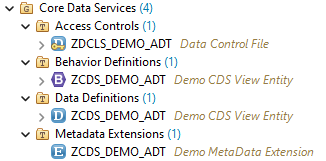
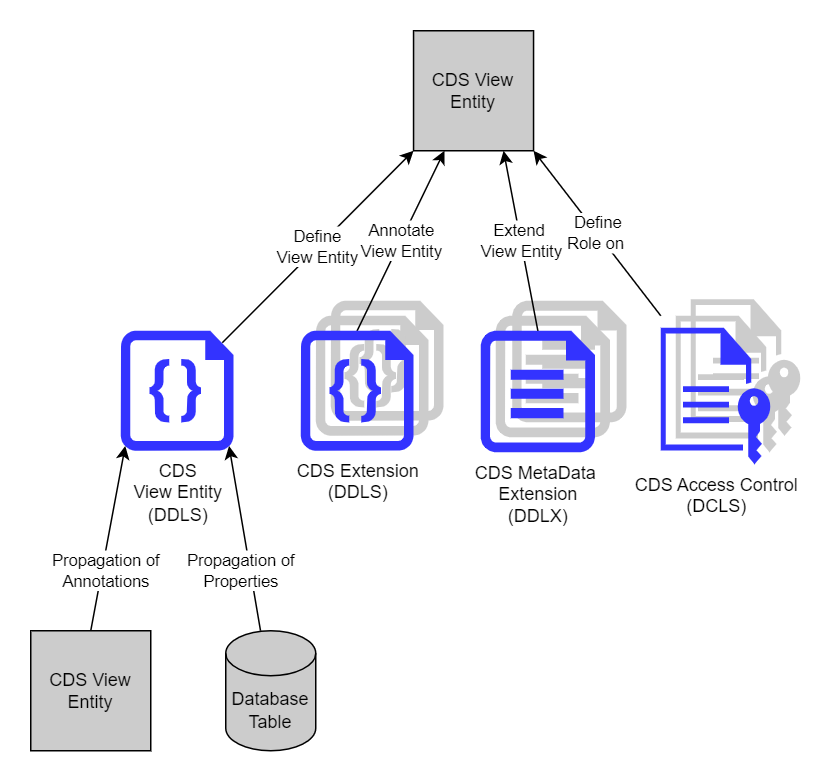
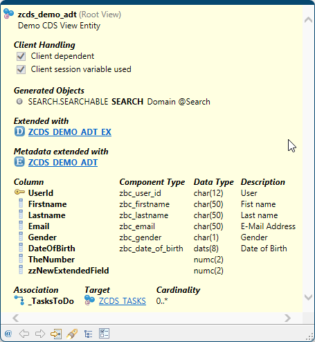
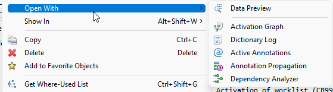
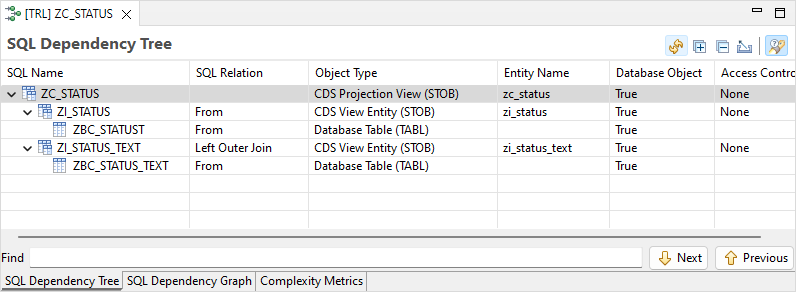
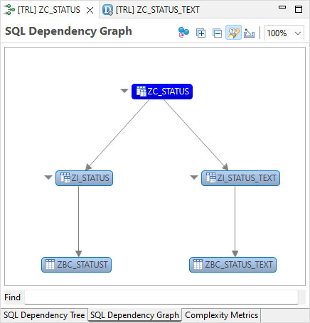
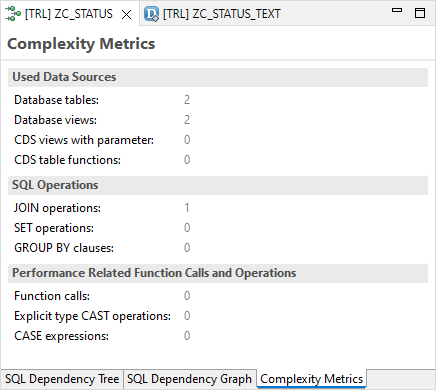
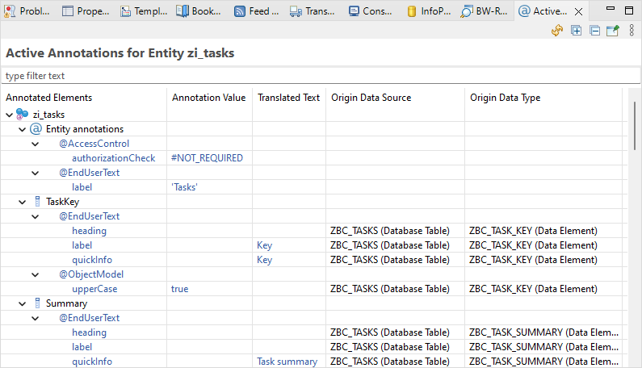

{: .no_toc}
# Core Data Services (CDS)

1. TOC
{:toc}

Im Bereich der Core Data Services (CDS) gibt es unterschiedliche [Dateitypen](https://help.sap.com/docs/ABAP_PLATFORM_NEW/f2e545608079437ab165c105649b89db/4ed280596e391014adc9fffe4e204223.html), die in den ADT angelegt werden können:

- Data Definitions (DDLS) - Quelltextdateien für Datenmodelle in den folgenden Varianten:
  - DDIC Based CDS Views
  - CDS View Entities
  - Abstrakte CDS-Entitäten
  - Hierarchien
  - Erweiterungen der Views
  - CDS Table Functions
- Access-Control-Dateien (DCLS) - Zugriffs-Definitionen
- Metadata Extensions (DDLX) - Auslagerung von Annotationen aus der CDS-Definition
- Behavior Definitions (BDEF) - Verhaltens-Definitionen für RAP-Business-Objekte

  

*Abbildung: Objekttypen der CDS in der Navigation*

Die Quelltext Editoren für die unterschiedlichen Dateitypen der Core Data Services verhalten sich weitgehend wie der Quelltexteditor für ABAP-Code. Unter anderem sind folgende Features enthalten:

- Code Completion (**STRG+SPACE**) - Vorschlagswerte, die im Kontext passen.
- Element Info (**F2**) - Informationen über das Element, auf dem der Cursor steht.
- Pretty Printer (**SHIFT+F1**)

Ein Unterschied sind die Farben, die im Editor verwendet werden.

Ein Grundproblem bei den Core Data Services ist, dass die Eigenschaften eines Objektes (z. B. einer CDS View Entity) aus mehreren Dateien und den Eigenschaften der Datenquellen zusammengesetzt sind. Diese Dateien erklären jeweils ihre Zugehörigkeit, und die Datenquellen propagieren ihre Feldeigenschaften (Annotationen). Das ist für das Erweiterungskonzept sehr praktisch. Aber die Transparenz leidet darunter, denn die Dateien liegen nicht notwendigerweise im gleichen Entwicklungspaket.

  

*Abbildung: Unterschiedliche Dateien legen die Eigenschaften einer CDS View Entity fest*

Um ein vollständiges Bild eines CDS-Objektes unter Berücksichtigung aller Dateien und Propagationen zu bekommen, sind darum Hilfsmittel notwendig. Dazu gehören:

- Element Info
- Dependency Analyzer
- Active Annotations

## Element Info für CDS

Mit **F2**oder der separaten [Element Info View](https://help.sap.com/docs/ABAP_PLATFORM_NEW/f2e545608079437ab165c105649b89db/c2ffbc2fee0c4ceda3bb89bd843ee419.html) bekommen Sie für einen CDS View eine gute Übersicht über die Datenstruktur und Assoziationen, unabhängig davon, wo diese definiert wurden. Außerdem werden alle relevanten Erweiterungsdateien angezeigt.

  

*Abbildung: Übersicht über ein CDS View Entity mit Hilfe von Element Info*

## Dependency Analyzer

Der [Dependency Analyzer](https://help.sap.com/docs/ABAP_PLATFORM_NEW/f2e545608079437ab165c105649b89db/bedc1723e35244e188c5a44a5f4f8340.html) bietet eine gute Übersicht über die Herkunft der Daten. Er wird über das Kontextmenü aufgerufen..

  

*Abbildung: Aufruf des Dependency Analyzers über das Kontextmenü*

Der Dependency Analyzer hat drei Tab-Reiter, die Informationen über eine View anzeigen:

- Der **SQL Dependency Tree** zeigt die hierarchische Struktur in Tabellenform an

  

*Abbildung: SQL Dependency Tree*

- Der **SQL Dependency Graph** zeigt die gleichen Informationen grafisch an.

  

*Abbildung: SQL Dependency Graph*

- Der Tab-Reiter **Complexity Metrics** zeigt zusätzliche Informationen zur Gesamtkomplexität des CDS Views an, inklusive aller Quell-Views.\
    > Gerade bei Performance-Problemen lohnt hier ein Blick.

  

*Abbildung: Complexity Metrics*

## Active Annotations

Die [View Active Annotations](https://help.sap.com/docs/ABAP_PLATFORM_NEW/f2e545608079437ab165c105649b89db/45ba68d3b4924a97ad2dc598e756968e.html) wird ebenfalls über das Kontextmenü in der Navigation aufgerufen. In ihr werden die Werte sämtlicher aktiven Annotationen der Views angezeigt:

- Auf **View-Ebene** sind nur genau die Annotationen sichtbar, die in dem View definiert wurden.
- Auf **Feld-Ebene** sind alle gültigen Annotationen sichtbar. Ihre Herkunft, wie beispielsweise Datenelement, Metadata-Extension oder Datenquelle, wird ebenfalls mit angezeigt.
- Auf **Parameter-Ebene**

Manche Eigenschaften, z. B. Feldtexte, können schon durch die Datenelemente festgelegt und diese dann in die View propagiert werden. Dies ist in folgender Abbildung beispielhaft dargestellt:

  

*Abbildung: Aktive Annotationen eines Views*
