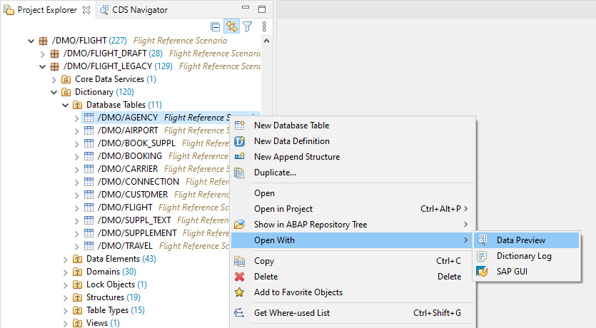
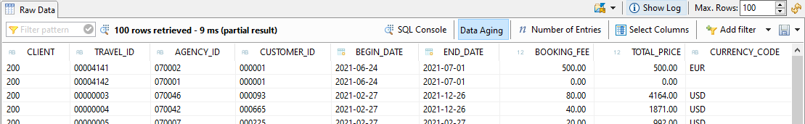
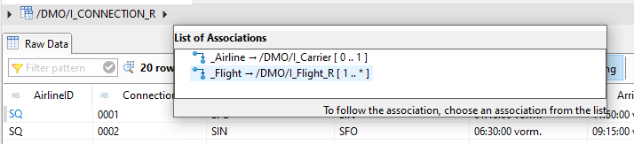
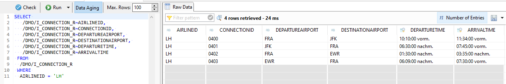

{: .no_toc}
# Data Preview

1. TOC
{:toc}

Die View [Data Preview](https://help.sap.com/docs/ABAP_PLATFORM_NEW/c238d694b825421f940829321ffa326a/2fd1241b187b4d6c989e1ff8b1f00ba1.html) kann man nutzen, um sich Daten von Datenbanktabellen und (CDS-)Views anzeigen zu lassen. Die View öffnet sich, indem man entweder im Project Explorer ein entsprechendes Objekt markiert und den Shortcut <kbd>F8</kbd> drückt, oder das Kontextmenü nutzt.

Starten des Data Preview über die Tabelle
{: .img-caption}

Der Shortcut <kbd>F8</kbd> funktioniert auch, wenn man ein entsprechendes Objekt geöffnet hat und der Fokus auf dem Objekt liegt.

Die View führt beim Öffnen unverzüglich die Datenselektion aus und listet dann die selektierten Daten in Tabellenform auf. Zusätzlich zeigt sie die Anzahl der selektierten Zeilen und die benötigte Zeit dafür an.

Anzeige des Data Preview
{: .img-caption}

Man hat in der View diverse Möglichkeiten, die Selektion anzupassen. Dazu zählen:

- Anzahl der selektierten Zeilen
- Selektierte Spalten
- Filterkriterien
- Sortierung (Anklicken der Spaltenüberschrift)

Außerdem kann man nach einem Muster in den angezeigten Daten suchen (inkl. ? und \* als Joker-Zeichen). Passende Daten werden dann farbig und fett hervorgehoben. Darüber hinaus können die Gesamtanzahl der betroffenen Einträge und ein Log über ausgeführte Aktionen eingesehen werden. Über den Speichern-Button kann man die angezeigten Werte in unterschiedlichen Formaten innerhalb einer Datei speichern. Es ist sogar möglich, ein ABAP Value Statement dadurch zu generieren, was sehr nützlich zur Erstellung von Testdaten sein kann.

Bei [CDS-Views mit Associations](https://help.sap.com/docs/ABAP_PLATFORM_NEW/f2e545608079437ab165c105649b89db/d70c7d8e6e81438e836c96f1aa61a259.html) ist es möglich, den Associations zu folgen und somit die verknüpften Daten anzuzeigen. Dazu markiert man einen der Datensätze und wählt oben über den Pfeil die gewünschte Association aus.

Navigation über Assoziationen
{: .img-caption}

Ein Highlight des Data Preview Views ist die [SQL Console](https://help.sap.com/docs/ABAP_PLATFORM_NEW/c238d694b825421f940829321ffa326a/c672ec1c94964bb8837075f4f4ecea66.html). Anhand der selektierten Spalten, angegebenen Filtern und der Sortierung wird ein SQL Select Statement generiert, welches dann zur Selektion der Daten verwendet wird.

SQL Console
{: .img-caption}

Dieses SQL Statement kann man individuell anpassen, prüfen und ausführen. Dabei gelten folgende Regeln und Einschränkungen:

- Es sind nur SELECT Statements gemäß ABAP Open SQL Syntax erlaubt.
- Es ist möglich, Aggregationen und komplexe Selektionen, wie z. B. mit JOIN und UNION, zu erstellen.
- Es sind nur lesende Zugriffe möglich (keine SQL Statements mit Datenänderung)
- Schlüsselwörter mit Bezug zu internen Tabellen können nicht verwendet werden

Man kann die SQL Console auch direkt aufrufen, indem man im Project Explorer das Kontextmenü für das ABAP Projekt öffnet und den Menüpunkt SQL Console auswählt. Der View zeigt das zuletzt verwendete SQL Statement an und führt es unverzüglich aus.

Alles in allem ist die SQL Console ein mächtiges Tool, mit dem man unkompliziert Selektionen ausführen, Daten auswerten oder Anpassungen an Selects testen kann.

Details zum Data Preview sind in der Eclipse-Hilfe für ADT zu finden.