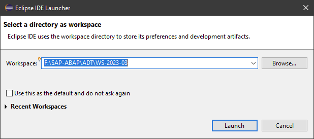
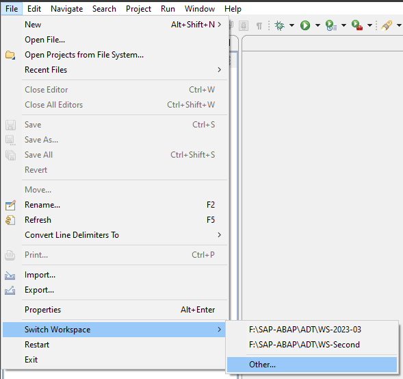
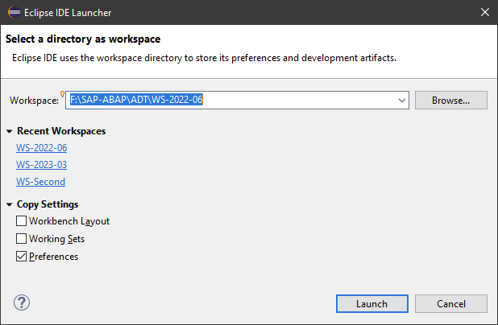
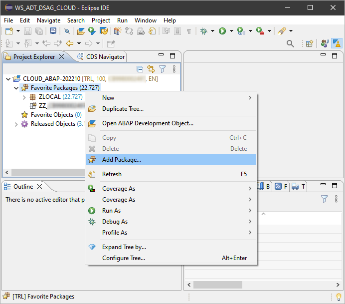
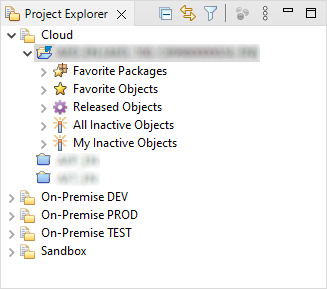
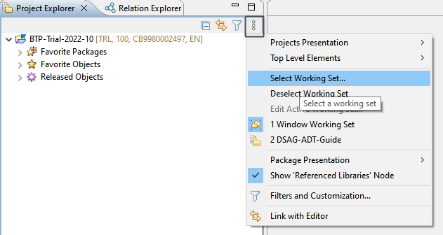
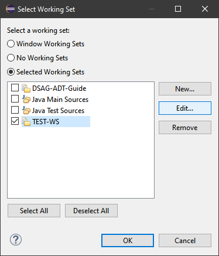
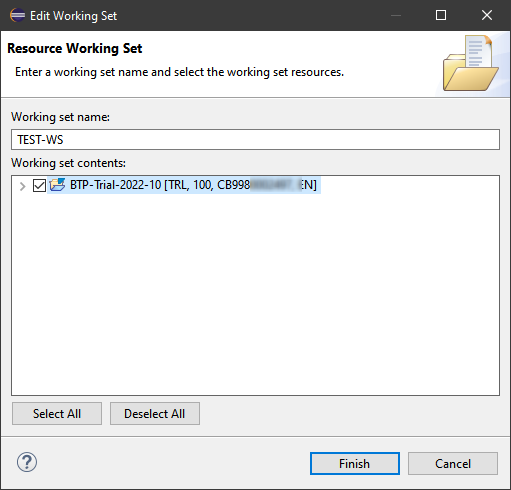
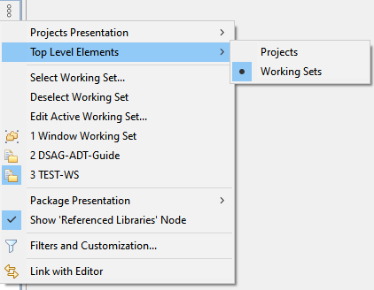
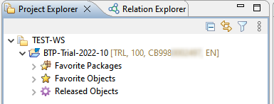

{: .no_toc}
# Übergreifende Features

1. TOC
{:toc}

## Workspaces

Als Hauptebene der Arbeitsstrukturierung und Ablage der Eclipse- und ADT-Konfiguration dienen die sogenannten Workspaces. Beim ersten Start von Eclipse erscheint die Abfrage, in welchem Verzeichnis der Workspaces abgelegt werden soll.

  

*Abbildung: Abfrage des Workspace-Verzeichnisses*

Eine Möglichkeit, wie die Verzeichnisstruktur gestaltet sein kann, findet sich in Kapitel [Best Practices Eclipse-Konfiguration](/ADT-Leitfaden/best-practices-configuration).

In diesem Verzeichnis werden zahlreiche Konfigurationseinstellungen abgelegt. Dies sind u.a.

- die Projekte und damit zugreifbaren SAP-Systeme,
- welche Favorite-Packages in den Projekten verwendet werden,
- welche Perspektiven verwendet werden,
- welche Sichten und Objekte geöffnet sind.

Wer mit einem Workspace auskommt, kann den Haken bei "Use this as default ..." anklicken, damit zukünftig dieser Workspace ohne Nachfrage verwendet wird. Diese Einstellung ist in den Einstellungen jederzeit änderbar.

Für die meisten Fälle ist ein Workspace ausreichend. Arbeiten Sie in mehreren Projekten mit unterschiedlichen Systemlinien oder mit unterschiedlichen Kunden, können die Workspaces helfen, die jeweils genutzte Systemumgebung übersichtlich zu halten und für jede Situation die effizienteste Konfiguration zur Verfügung zu haben.

Falls Bedarf besteht, einen neuen Workspace zu erstellen oder zu wechseln, wird mittels

File → Switch Workspace

entweder ein vormals geöffneter Workspace aus der Liste ausgewählt oder mittels

File → Switch Workspace → Other

der Workspace-Dialog aufgerufen.

  

*Abbildung: Wechseln des Workspace*

  

*Abbildung: Der Workspace-Dialog*

Wenn Sie einen neuen Workspace anlegen möchten, geben Sie im Feld Workspace einen neuen Namen ein. Dadurch wird nach Klick auf Launch ein neuer Workspace mit den aktuellen Einstellungen angelegt. Welche Settings aus dem Quell-Workspace übernommen werden sollen, legen Sie mittels der Copy Settings fest. Alternativ können Sie hier einen der angezeigten Workspaces unter Recent Workspaces direkt über das Anklicken der blau hinterlegten Links aufrufen.

## Project Explorer

Der [Project Explorer](https://help.sap.com/docs/ABAP_PLATFORM_NEW/c238d694b825421f940829321ffa326a/7135530f575b4f87bff9ae9f0fde4488.html) ist ein zentraler Bestandteil zur Navigation in den eingebundenen Systemen. Sobald Sie ein neues System als "ABAP Project" einbinden, taucht es in der Liste auf. Wenn Sie sich an einem System anmelden und aufklappen, erhalten Sie je nach System weitere Informationen zu freigegebenen Objekten, Favoriten, inaktiven Objekten etc. Diese [Repository Trees](https://help.sap.com/docs/ABAP_PLATFORM_NEW/c238d694b825421f940829321ffa326a/c5660c7ea8ae4955bc565a6256ea061d.html) können frei definiert und angepasst werden. Auf Ebene des Pakets verhält sich der View wie die SE80 und bildet Objekt-Hierarchien ab, durch die Sie navigieren können.

## Favorite Packages

Für die tägliche Arbeit empfiehlt es sich, Pakete als Favoriten hinzuzufügen, in denen man regelmäßig tätig ist oder die in die persönliche Zuständigkeit fallen. Damit hat man eine gute Übersicht und findet schnell "seine" Objekte.

  

*Abbildung: Hinzufügen von Packages zu den Favoriten*

Für eine Ablage und Organisation von Favoriten auf Objektebene kann das Plug-in "ABAP Favorites" empfohlen werden, das über den Plug-in-Installationsmechanismus in Eclipse installiert werden kann, siehe Kapitel [Plug-ins](/ADT-Leitfaden/plug-ins).

  

*Abbildung: Detailbild Project Explorer mit Buttonleiste*

In der Buttonleiste gibt es noch einige nützliche Funktionen, mit denen Sie Einstellungen an der View vornehmen können:

- Doppelpfeil (Link with Editor) - Objekte, die im Editor im Fokus sind, werden im Project Explorer angezeigt, es wird dazu die Hierarchie geladen.
- Drei Punkte (View Menü) - Weitere Einstellungen der Views, um zum Beispiel Working Sets anzulegen. Hierbei handelt es sich um Ordner, mit denen man Systeme gruppieren kann (siehe Screenshot oben).

## Working Sets

Wenn Sie als Entwickler mit mehreren Systemlinien arbeiten, empfehlen wir die Verwendung der Working Sets. Diese ermöglichen es, Projekte in Eclipse zu gruppieren und somit mehrere Systeme übersichtlich darzustellen.

Über das Drei-Punkte-Icon in der rechten oberen Ecke des Project Explorer finden sich diverse Einstellungsmöglichkeiten. Unter anderem können hier die Working Sets erstellt und konfiguriert werden.

  

*Abbildung: Working-Sets-Einstellungen*

Über den Dialog können nun Working Sets angelegt werden (New) und die Zuordnungen erfolgen (Edit).

  

*Abbildung: Anlage und Bearbeitung der Working Sets*

Über den Edit-Button können im Folgedialog die gewünschten Projekte dem Working Set zugeordnet werden.

  

*Abbildung: Zuordnung Projekt zu Working Set*

Diese Funktion ermöglicht eine übersichtliche Strukturierung der Systeme nach Systemlandschaft oder ggf. nach Projekt bzw. Kunde. Abschließend muss noch die Anzeige der Top Level Elements auf Working Sets eingestellt werden.

  

*Abbildung: Einstellung der Projekt-Explorer-Anzeige*

  

*Abbildung: Darstellung Projekte in Working Sets*

