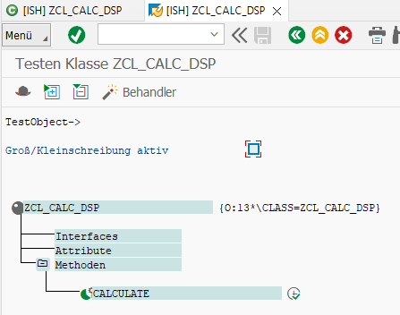
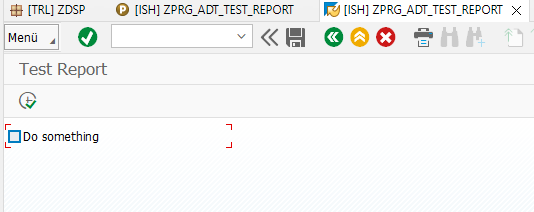
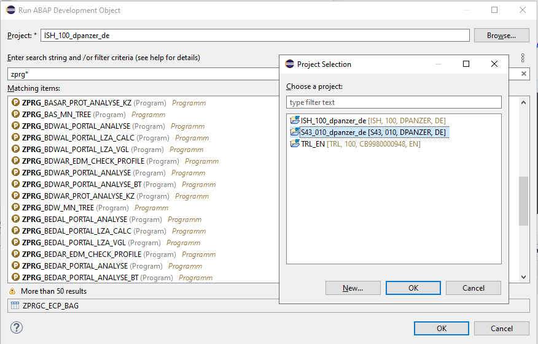
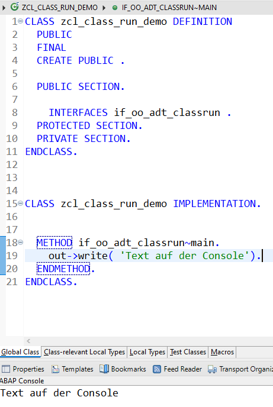

{: .no_toc}
# Ausführen von Source-Code

1. TOC
{:toc}

Auch in den ADT kann geöffneter Source-Code weiterhin komfortabel ausgeführt werden. Über <kbd>F8</kbd> wird eine SAP-GUI-Instanz des jeweiligen Systems initialisiert und das geöffnete Entwicklungsobjekt ausgeführt. Bei Klassen entspricht dies beispielsweise der Funktion "Testen Klasse X", bei Reports wird normal der Report ausgeführt.

Ausführung einer Klasse in SAP GUI
{: .img-caption}

Ergebnis der Ausführung
{: .img-caption}

Soll ein beliebiges Entwicklungsobjekt ausgeführt werden, so kann mit <kbd>Alt</kbd>+<kbd>F8</kbd> ein Objekt über den Object Finder gesucht werden. Dabei kann ein beliebiges Projekt ausgewählt werden, d. h. ein an ADT angebundenes SAP-System. Dies muss nicht das System sein, in dem gerade entwickelt wird -- es kann auch ein Qualitätssicherungssystem sein. Wichtig ist hierbei, dass die ADT-Funktionen für dieses System freigeschaltet sind bzw. die entsprechenden Berechtigungen existieren.

Auswahl des Projekts
{: .img-caption}

Über den Menüpunkt "Run → Run History" stehen zusätzlich Informationen über bereits ausgeführte Objekte zur Verfügung, so dass deren Ausführung komfortabel wiederholt werden kann.

Klassen, die das Interface if_oo_adt_classrun implementieren, können ebenfalls direkt über <kbd>F9</kbd> als [Konsolen-Applikation](https://help.sap.com/docs/ABAP_PLATFORM_NEW/c238d694b825421f940829321ffa326a/520a4e84024b4a96b3793775bf9e6844.html) ausgeführt werden und erzeugen somit Output in der Konsole.

Reports, die eine Write-Ausgabe erzeugen, können über <kbd>F9</kbd> ausgeführt werden. Die WRITE-Ausgabe wird dann ebenfalls in die Konsole umgeleitet.

Ausgabe in die Console
{: .img-caption}
