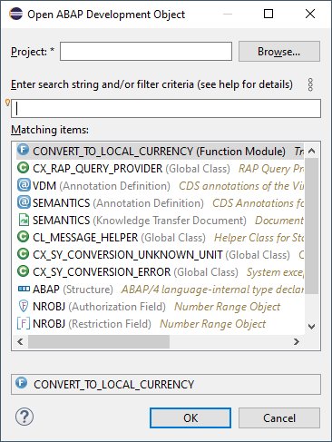
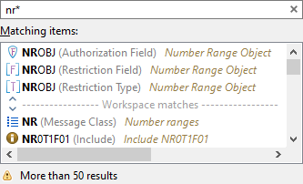
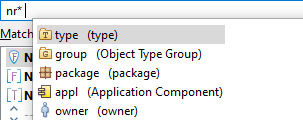
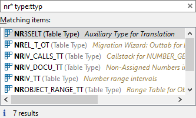

{: .no_toc}
# Suche und Navigation

1. TOC
{:toc}

Die Suche nach Objekten in Eclipse ist zentraler Bestandteil der täglichen Arbeit, ebenso wie die Navigation zwischen den Objekten oder auch die Vorwärtsnavigation. In diesem Abschnitt erfahren Sie mehr über die Suche und Navigation zwischen ABAP-Objekten.

## Objekte suchen

Um ein Objekt im System zu suchen bzw. zu öffnen, können Sie den Dialog\
"Open ABAP Development Object" nutzen (erreichbar über die Tastenkombination **STRG+SHIFT+A**).

  

*Abbildung: Dialog zur Objektsuche*

Im Dialog haben Sie die Möglichkeit, im oberen Teil das ABAP-Projekt zu ändern und damit zu entscheiden, auf welchem System Sie nach dem Objekt suchen möchten. Wurde im Suchfeld nichts eingegeben, erhalten Sie eine Historie der zuletzt geöffneten Objekte. Über das *Fragezeichen* im unteren Bereich erhalten Sie weitere Informationen, Tipps und Tricks zur Nutzung der Suche. Detaillierte Informationen zur Objektsuche finden Sie im [User-Guide](https://help.sap.com/docs/ABAP_PLATFORM_NEW/c238d694b825421f940829321ffa326a/4ec7eed86e391014adc9fffe4e204223.html).

## Objekte filtern

In der Objektsuche haben Sie nun die Möglichkeit, mit Such-Strings und Pattern zu arbeiten, um die Ergebnismenge weiter einzuschränken. Das Feld unterstützt den "Content Assist" (**STRG+LEERTASTE**), um weitere Einschränkungen und Filter zu verwenden. Eine einfache Suche könnte wie folgt aussehen:

  

*Abbildung: Ergebnis der Suche*

Allerdings werden mehr als 50 Ergebnisse (Standardeinstellung) angezeigt und wahrscheinlich ist das gewünschte Ergebnis nicht mit in der Ergebnismenge erhalten. In diesem Fall können Sie den "Content Assist" aufrufen, um weitere Optionen zum Filtern zu erhalten.

  

*Abbildung: Anzeige weiterer Suchoptionen*

Wenn Sie zum Beispiel nun auf Tabellentypen einschränken möchten, dann würden Sie weiter nach dem Typ (TYPE) einschränken. Der "Content Assist" schlägt weiterhin auch die verschiedenen Typen von Objekten vor, sodass Sie auch den Tabellentyp (TTYP) finden.

  

*Abbildung: Ergebnis mit Objekt- und Typfilter*

Die weiteren Filter und Typen können frei miteinander kombiniert werden, um die gewünschte Zielmenge oder das Zielobjekt zu finden. Mit einem Doppelklick auf den gewünschten Eintrag wird das Objekt dann im Editor angezeigt.

Um die Suche zu beschleunigen, empfiehlt es sich, den Typ des gewünschten Objektes vorzugeben, da sonst die Suche -- verglichen mit der gewohnten Geschwindigkeit in der SE80/SE11/etc. -- sehr lange dauert.

## Navigation

In der ABAP Workbench funktioniert die [Navigation](https://help.sap.com/docs/ABAP_PLATFORM_NEW/c238d694b825421f940829321ffa326a/ec2da130ce43409fbb2f6a072f9ba07c.html) zum nächsten Objekt über einen Doppelklick auf den entsprechenden Ausdruck im Quellcode. In Eclipse wird hier lediglich der Quelltext markiert. Um die Vorwärtsnavigation auszulösen, gibt es drei Möglichkeiten:

- Cursor auf dem Objekt platzieren, F3 drücken
- Mit gedrückter **STRG**-Taste das Objekt anklicken
- In der Oberfläche wird ein klickbarer Link angeboten (z. B. Datenelement → Domäne)

Das Objekt wird in einem neuen Tab innerhalb des Editors geöffnet, das Quellobjekt bleibt weiterhin geöffnet und Sie können zwischen den zuletzt geänderten Objekten sehr einfach über die Tastenkombinationen navigieren:

- **ALT+Pfeil rechts**: vorwärts
- **ALT+Pfeil links**: rückwärts

Dies kann analog auch mit den Pfeiltasten im Bereich der Drucktastenleiste durchgeführt werden. Im Bereich der Drucktastenleiste gibt es dafür auch verschiedene Optionen, um zum letzten verwendeten Tab (**ALT+Pfeil links**) zu gelangen.

  

*Abbildung: Navigations-Ikonen*

## ABAP Repository Tree anzeigen

Nachdem Sie ein Objekt gefunden haben, möchten Sie in vielen Fällen in diesem Paket weiter arbeiten oder recherchieren. Dazu können Sie sich den Objektbaum laden lassen, indem Sie im Project Explorer den doppelten Pfeil ("Link with Editor") aktivieren.

  

*Abbildung: Aktionen für den Project Explorer*

In diesem Fall wird die Pakethierarchie zu dem im Editor fokussierten Objekt geladen. Im Anschluss können Sie im Project Explorer über die weiteren Objekte und Strukturen navigieren.

Die Arbeit mit dem Repository Tree ist detailliert im [[User-Guide] beschrieben](https://help.sap.com/docs/ABAP_PLATFORM_NEW/c238d694b825421f940829321ffa326a/f831fc6e18984a8a864da4c0591e996b.html).