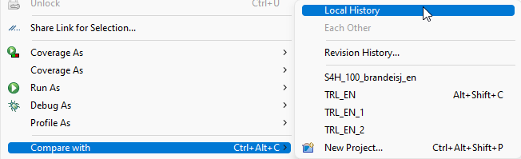
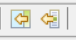
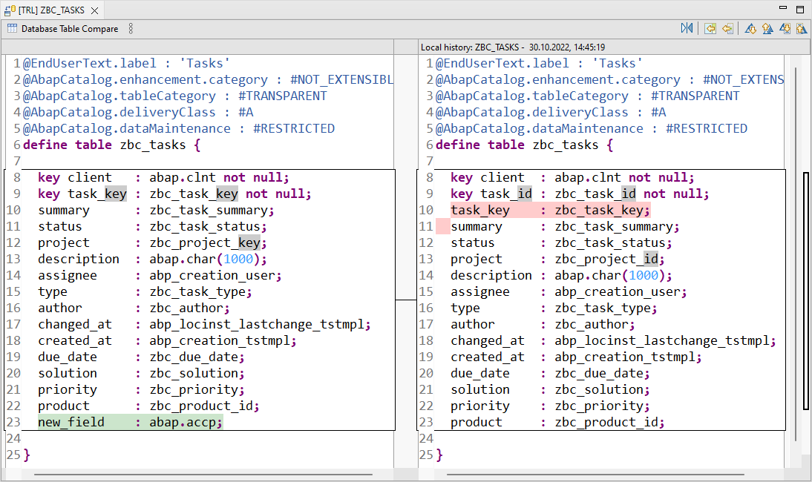
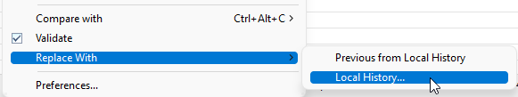

{: .no_toc}
# Versionsverwaltung und Vergleichen

1. TOC
{:toc}

Hinter dem Kontextmenüpunkt "[Compare with](https://help.sap.com/docs/ABAP_PLATFORM_NEW/c238d694b825421f940829321ffa326a/3fbf95542e784e4d9e01ce75386b642b.html)" verstecken sich einige der wichtigsten Features für die tägliche Arbeit. Diese funktionieren bei allen Quelltexteditoren in den ADT, nicht nur bei der Entwicklung von ABAP-Code.

Kontextmenü zum Vergleichen von Versionen
{: .img-caption}

## Local History -- Die lokale Versionsverwaltung

Die Local History ermöglicht den Zugriff auf ältere Versionen des aktuellen Quelltextdokuments aus dem Eclipse Workspace, mit dem der Benutzer gerade arbeitet. Mit jedem Speichern des Objektes wird eine Version gezogen. Das bedeutet, dass man sehr komfortabel seine eigene Arbeit im Laufe der Stunden und Tage nachverfolgen und ohne Weiteres auch wieder auf ältere Versionen zurückwechseln kann.

Da sich die lokale Versionshistorie nur auf den eigenen Eclipse Workspace bezieht, kann es passieren, dass man Änderungen auch auf einem anderen Gerät hat oder ein Kollege zuletzt Änderungen durchgeführt hat.

## Revision History -- Die Versionsverwaltung des ABAP

Unter dem Menüpunkt Revision History erreicht man die "normale" Quelltextverwaltung des ABAP-Servers, die auch schon in der SAP GUI zur Verfügung stand. Hier werden standardmäßig Versionen gezogen, wenn ein Transportauftrag freigegeben wird.

Die Versionen der Revision History sind entsprechend global für alle User zugänglich, unabhängig vom Workspace der Eclipse-Installation.

## Anderer Projektname -- Systemübergreifend vergleichen

Wenn man sich ein Projekt aus der Liste rauspickt, kann man systemübergreifend vergleichen. Das kann ein System aus der gleichen Systemlandschaft sein, z. B. das Produktivsystem oder auch ein ganz anderes System. Somit kann aus ADT heraus Code von unterschiedlichen Systemen miteinander verglichen werden, die keine RFC-Verbindung zueinander haben. Dies bietet in komplexen Systemlandschaften einen großen Vorteil gegenüber den GUI-basierten Vergleichsmöglichkeiten.

## Comparison View

In der Comparsion View kann man links den aktuellen Stand des Quelltextes sehen und rechts die zum Vergleich ausgewählte Version. Die Abweichungen werden hervorgehoben:

- Grün sind die Dinge, die in der aktuellen Version neu sind
- Rot sind die Dinge, die gelöscht wurden und in
- Grau sind die Änderungen hinterlegt

Mit den Buttons  kann der alte Zustand durch Kopieren von rechts nach links wiederhergestellt werden. Es ist aber auch möglich, dass man direkt in dieser Vergleichs-View auf der linken Seite Änderungen durchführt. Nach dem Speichern wird der Vergleich wiederholt.

Comparison View - Vergleich von zwei Versionen
{: .img-caption}

Wenn man eine alte Version vollständig übernehmen will, kann man aus dem Kontextmenü mittels *Replace With → Local History* direkt die passende Version auswählen.

Kontextmenü zum kompletten Übernehmen einer Version aus der lokalen Versionsverwaltung
{: .img-caption}
